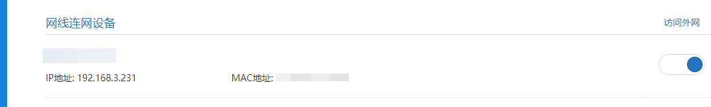

  * [ 前言 ](../../)
  * 物联网平台操作 
    * [ 前言 ](../)
    * 快速开始 
      * [ introduction ](../quick-start/introduction.html)
      * [ demo ](../quick-start/demo.html)
    * 开发指南 
      * [ assets ](../dev-guide/assets.html)
      * [ commons-api ](../dev-guide/commons-api.html)
      * [ crud ](../dev-guide/crud.html)
      * [ custom-sql-term ](../dev-guide/custom-sql-term.html)
      * [ dashboard ](../dev-guide/dashboard.html)
      * [ device-firmware ](../dev-guide/device-firmware.html)
      * [ mqtt-subs ](../dev-guide/mqtt-subs.html)
      * [ multi-tenant ](../dev-guide/multi-tenant.html)
      * [ websocket-subs ](../dev-guide/websocket-subs.html)
    * 最佳实践 
      * [ auto-register ](../best-practices/auto-register.html)
      * [ coap-connection ](../best-practices/coap-connection.html)
      * [ device-alarm ](../best-practices/device-alarm.html)
      * [ device-connection ](../best-practices/device-connection.html)
      * [ device-gateway-connection ](../best-practices/device-gateway-connection.html)
      * [ http-connection ](../best-practices/http-connection.html)
      * [ jetlinks对接其他云平台教程-HTTP方式 ](../best-practices/jetlinks对接其他云平台教程-HTTP方式.html)
      * [ open-api ](../best-practices/open-api.html)
      * [ sort-link ](../best-practices/sort-link.html)
      * [ start ](../best-practices/start.html)
      * [ tcp-connection ](../best-practices/tcp-connection.html)
      * [ udp-connection ](../best-practices/udp-connection.html)
    * 使用手册 
      * [ DemoDevice ](DemoDevice.html)
      * [ device-manager ](device-manager.html)
      * [ protocol-support ](protocol-support.html)
      * [ quick-start ](quick-start.html)
      * [ rule-engine ](rule-engine.html)
      * [ ziduanquanxian ](ziduanquanxian.html)
  * 萌蜂项目规范 
    * [ 前言 ](../../萌蜂项目规范/)
    * 一、开发项 
      * [ 快速开始 ](../../萌蜂项目规范/开发项/idea-start.html)
      * [ 环境维护 ](../../萌蜂项目规范/开发项/环境维护.html)
      * [ 代码管理 ](../../萌蜂项目规范/开发项/代码管理.html)
      * [ 后端开发 ](../../萌蜂项目规范/开发项/后端开发.html)
      * [ 前端开发 ](../../萌蜂项目规范/开发项/前端开发.html)
      * [ 工程专项 ](../../萌蜂项目规范/开发项/工程专项.html)
      * [ 其他规约 ](../../萌蜂项目规范/开发项/其他规约.html)
      * [ 流程管理 ](../../萌蜂项目规范/开发项/流程管理.html)
    * 二、知识点 
      * [ 安装 Centos7 ](../../萌蜂项目规范/知识点/install-centos7.html)
      * [ Centos 创建用户 ](../../萌蜂项目规范/知识点/centos-create-user.html)
      * [ Centos 安装桌面环境 ](../../萌蜂项目规范/知识点/centos-install-gnome.html)
      * [ Centos 安装KVM ](../../萌蜂项目规范/知识点/centos-install-kvm.html)
      * [ Centos 安装VNC ](../../萌蜂项目规范/知识点/centos-install-vnc.html)
      * [ Centos 安装Pip ](../../萌蜂项目规范/知识点/centos-install-pip.html)
      * [ Docker Compose ](../../萌蜂项目规范/知识点/docker-compose.html)
      * [ FFmpeg ](../../萌蜂项目规范/知识点/ffmpeg.html)
      * [ Nginx 代理 ](../../萌蜂项目规范/知识点/nginx-prefix.html)
      * [ Nginx Rtmp ](../../萌蜂项目规范/知识点/nginx-rtmp.html)
      * [ Nohup ](../../萌蜂项目规范/知识点/nohup.html)
      * [ NodeJs ](../../萌蜂项目规范/知识点/nodejs-upgrade.html)
      * [ Http Code ](../../萌蜂项目规范/知识点/http-code.html)
      * [ String.format() ](../../萌蜂项目规范/知识点/string-format.html)
  * JAVA开发规范 
    * [ 前言 ](../../JAVA开发规范/)
    * 一、编程规约 
      * [ （一）命名风格 ](../../JAVA开发规范/编程规约/命名风格.html)
      * [ （二）常量定义 ](../../JAVA开发规范/编程规约/常量定义.html)
      * [ （三）代码格式 ](../../JAVA开发规范/编程规约/代码格式.html)
      * [ （四）OOP规范 ](../../JAVA开发规范/编程规约/OOP规范.html)
      * [ （五）集合处理 ](../../JAVA开发规范/编程规约/集合处理.html)
      * [ （六）并发处理 ](../../JAVA开发规范/编程规约/并发处理.html)
      * [ （七）控制语句 ](../../JAVA开发规范/编程规约/控制语句.html)
      * [ （八）注释规约 ](../../JAVA开发规范/编程规约/注释规约.html)
    * 二、异常日志 
      * [ （一）异常处理 ](../../JAVA开发规范/异常日志/异常处理.html)
      * [ （二）日志规范 ](../../JAVA开发规范/异常日志/日志规约.html)
      * [ （三）其他 ](../../JAVA开发规范/异常日志/其他.html)
    * [ 三、单元测试 ](../../JAVA开发规范/单元测试.html)
    * [ 四、安全规约 ](../../JAVA开发规范/安全规约.html)
    * 五、MySQL数据库 
      * [ （一）建表规约 ](../../JAVA开发规范/MySQL数据库/建表规约.html)
      * [ （二）索引规约 ](../../JAVA开发规范/MySQL数据库/索引规约.html)
      * [ （三）SQL语句 ](../../JAVA开发规范/MySQL数据库/SQL语句.html)
      * [ （四）ORM映射 ](../../JAVA开发规范/MySQL数据库/ORM映射.html)
    * 六、工程结构 
      * [ （一）应用分层 ](../../JAVA开发规范/工程结构/应用分层.html)
      * [ （二）二方库依赖 ](../../JAVA开发规范/工程结构/二方库依赖.html)
      * [ （三）服务器 ](../../JAVA开发规范/工程结构/服务器.html)
    * [ 附：本手册专有名词 ](../../JAVA开发规范/本手册专有名词.html)
  * MIS系统操作手册 
    * [ MIS系统操作手册 ](../../用户操作手册/用户操作手册.html)
  * MIS系统环境临时记录 
    * [ MIS系统环境临时记录 ](../../MIS系统环境临时记录/组态和大屏连接地址配置.html)
  *   * [ Published with GitBook ](https://www.gitbook.com)

#  __[DemoDevice](../..)

# 树莓派演示设备操作手册

通过树莓派来接入传感器到MF-IOT平台。

## 新建

### 新建网络组件

1.进入系统,点击`设备接入` -> `网络组件` -> `新增组件`

2.创建完后启动组件（蓝色为启动成功）

### 新建设备网关

1.点击 `设备接入`-> `设备网关` -> `新建` 

2.创建成功后，找到刚创建的网关，开启网关

### 创建协议

1.点击 `设备接入` -> `协议管理` -> `新建` 上传对应的协议文件,
输入类名org.jetlinks.pisenser.protocol.PiSenserProtocolSupportProvider

（注：jar包在系统 /home/pi 目录下面） 

2.在操作栏中点击点击`发布` 

### 创建产品

1.点击 `设备管理` ->`产品`-> `新建`

2.点击新建过后会跳转到创建产品界面，如下图：

3.点击保存过后会跳转到产品基本信息界面，点击 `发布` -> `应用配置` ，如图下：

4.导入物模型

*下载快速导入物模型的文件,再点击`应用配置`

（注：物模型文件在/home/pi 目录下面，） 

### 创建设备:

1.点击 `设备管理` -> `设备` -> `添加设备`

2.点击保存过后会跳转到设备的基本信息，点击激活设备，如下图：

## 模拟设备接入

1.下载并安装MQTT.fx软件。请访问[MQTT官网](https://mqttfx.jensd.de/index.php/download?spm=a2c4g.11186623.2.16.20ab5800HxuVJR)下载。

2.打开MQTT.fx软件，单击设置图标。 

3.填写相应的信息 

4.点击 `ok` 保存后，测试连接设备，如下图： 

5.返回系统界面,查看设备是否上线，如下图： 

6.断开设备连接，如下图： 
 ::: tip 温馨提示：
如果回到系统，设备还是显示的在线，请刷新一下页面 :::

## 真实设备接入

设备通过网线接入路由器后，会通过DHCP协议自动获取IP地址，在路由器界面查询到设备IP地址。

:::warning 注意: 此处的IP地址根据你的实际地址确认 :::

1.下载并安装Xshell软件。请访问[Xshell官网](https://www.xshellcn.com/xiazai.html)下载。

2.打开软件，新建一个会话，点击连接。（主机：192.168.3.139）

:::warning 注意: 此处的IP地址根据你的实际地址确认 :::

3.登录名和密码（name:pi password: qwer1234 ）

3.连接设备成功后，执行命令 : $vim Senser.py 

4.执行完成后，在最下面修改配置文件（按i键切换为编辑模式）

5.编辑完过后，按ESC键退出编辑，执行命令 ：$:wq保存文件并退出该文件

6.执行$sudo reboot,重启程序,如下图

7.进入系统查看设备是否上线

#  results matching ""

# No results matching ""

[ __](device-manager.html)

