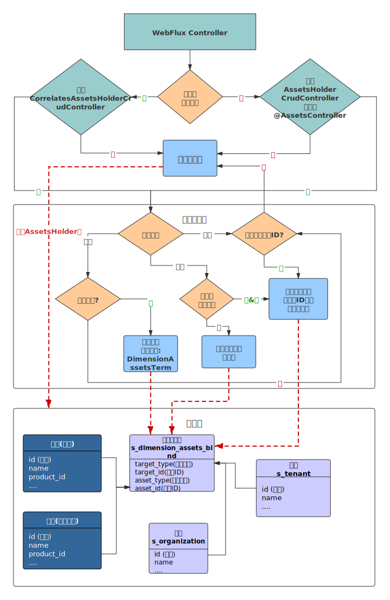

  * [ 前言 ](../../)
  * 物联网平台操作 
    * [ 前言 ](../)
    * 快速开始 
      * [ introduction ](../quick-start/introduction.html)
      * [ demo ](../quick-start/demo.html)
    * 开发指南 
      * [ assets ](assets.html)
      * [ commons-api ](commons-api.html)
      * [ crud ](crud.html)
      * [ custom-sql-term ](custom-sql-term.html)
      * [ dashboard ](dashboard.html)
      * [ device-firmware ](device-firmware.html)
      * [ mqtt-subs ](mqtt-subs.html)
      * [ multi-tenant ](multi-tenant.html)
      * [ websocket-subs ](websocket-subs.html)
    * 最佳实践 
      * [ auto-register ](../best-practices/auto-register.html)
      * [ coap-connection ](../best-practices/coap-connection.html)
      * [ device-alarm ](../best-practices/device-alarm.html)
      * [ device-connection ](../best-practices/device-connection.html)
      * [ device-gateway-connection ](../best-practices/device-gateway-connection.html)
      * [ http-connection ](../best-practices/http-connection.html)
      * [ jetlinks对接其他云平台教程-HTTP方式 ](../best-practices/jetlinks对接其他云平台教程-HTTP方式.html)
      * [ open-api ](../best-practices/open-api.html)
      * [ sort-link ](../best-practices/sort-link.html)
      * [ start ](../best-practices/start.html)
      * [ tcp-connection ](../best-practices/tcp-connection.html)
      * [ udp-connection ](../best-practices/udp-connection.html)
    * 使用手册 
      * [ DemoDevice ](../basics-guide/DemoDevice.html)
      * [ device-manager ](../basics-guide/device-manager.html)
      * [ protocol-support ](../basics-guide/protocol-support.html)
      * [ quick-start ](../basics-guide/quick-start.html)
      * [ rule-engine ](../basics-guide/rule-engine.html)
      * [ ziduanquanxian ](../basics-guide/ziduanquanxian.html)
  * 萌蜂项目规范 
    * [ 前言 ](../../萌蜂项目规范/)
    * 一、开发项 
      * [ 快速开始 ](../../萌蜂项目规范/开发项/idea-start.html)
      * [ 环境维护 ](../../萌蜂项目规范/开发项/环境维护.html)
      * [ 代码管理 ](../../萌蜂项目规范/开发项/代码管理.html)
      * [ 后端开发 ](../../萌蜂项目规范/开发项/后端开发.html)
      * [ 前端开发 ](../../萌蜂项目规范/开发项/前端开发.html)
      * [ 工程专项 ](../../萌蜂项目规范/开发项/工程专项.html)
      * [ 其他规约 ](../../萌蜂项目规范/开发项/其他规约.html)
      * [ 流程管理 ](../../萌蜂项目规范/开发项/流程管理.html)
    * 二、知识点 
      * [ 安装 Centos7 ](../../萌蜂项目规范/知识点/install-centos7.html)
      * [ Centos 创建用户 ](../../萌蜂项目规范/知识点/centos-create-user.html)
      * [ Centos 安装桌面环境 ](../../萌蜂项目规范/知识点/centos-install-gnome.html)
      * [ Centos 安装KVM ](../../萌蜂项目规范/知识点/centos-install-kvm.html)
      * [ Centos 安装VNC ](../../萌蜂项目规范/知识点/centos-install-vnc.html)
      * [ Centos 安装Pip ](../../萌蜂项目规范/知识点/centos-install-pip.html)
      * [ Docker Compose ](../../萌蜂项目规范/知识点/docker-compose.html)
      * [ FFmpeg ](../../萌蜂项目规范/知识点/ffmpeg.html)
      * [ Nginx 代理 ](../../萌蜂项目规范/知识点/nginx-prefix.html)
      * [ Nginx Rtmp ](../../萌蜂项目规范/知识点/nginx-rtmp.html)
      * [ Nohup ](../../萌蜂项目规范/知识点/nohup.html)
      * [ NodeJs ](../../萌蜂项目规范/知识点/nodejs-upgrade.html)
      * [ Http Code ](../../萌蜂项目规范/知识点/http-code.html)
      * [ String.format() ](../../萌蜂项目规范/知识点/string-format.html)
  * JAVA开发规范 
    * [ 前言 ](../../JAVA开发规范/)
    * 一、编程规约 
      * [ （一）命名风格 ](../../JAVA开发规范/编程规约/命名风格.html)
      * [ （二）常量定义 ](../../JAVA开发规范/编程规约/常量定义.html)
      * [ （三）代码格式 ](../../JAVA开发规范/编程规约/代码格式.html)
      * [ （四）OOP规范 ](../../JAVA开发规范/编程规约/OOP规范.html)
      * [ （五）集合处理 ](../../JAVA开发规范/编程规约/集合处理.html)
      * [ （六）并发处理 ](../../JAVA开发规范/编程规约/并发处理.html)
      * [ （七）控制语句 ](../../JAVA开发规范/编程规约/控制语句.html)
      * [ （八）注释规约 ](../../JAVA开发规范/编程规约/注释规约.html)
    * 二、异常日志 
      * [ （一）异常处理 ](../../JAVA开发规范/异常日志/异常处理.html)
      * [ （二）日志规范 ](../../JAVA开发规范/异常日志/日志规约.html)
      * [ （三）其他 ](../../JAVA开发规范/异常日志/其他.html)
    * [ 三、单元测试 ](../../JAVA开发规范/单元测试.html)
    * [ 四、安全规约 ](../../JAVA开发规范/安全规约.html)
    * 五、MySQL数据库 
      * [ （一）建表规约 ](../../JAVA开发规范/MySQL数据库/建表规约.html)
      * [ （二）索引规约 ](../../JAVA开发规范/MySQL数据库/索引规约.html)
      * [ （三）SQL语句 ](../../JAVA开发规范/MySQL数据库/SQL语句.html)
      * [ （四）ORM映射 ](../../JAVA开发规范/MySQL数据库/ORM映射.html)
    * 六、工程结构 
      * [ （一）应用分层 ](../../JAVA开发规范/工程结构/应用分层.html)
      * [ （二）二方库依赖 ](../../JAVA开发规范/工程结构/二方库依赖.html)
      * [ （三）服务器 ](../../JAVA开发规范/工程结构/服务器.html)
    * [ 附：本手册专有名词 ](../../JAVA开发规范/本手册专有名词.html)
  * MIS系统操作手册 
    * [ MIS系统操作手册 ](../../用户操作手册/用户操作手册.html)
  * MIS系统环境临时记录 
    * [ MIS系统环境临时记录 ](../../MIS系统环境临时记录/组态和大屏连接地址配置.html)
  *   * [ Published with GitBook ](https://www.gitbook.com)

#  __[assets](../..)

# 数据权限,资产管理

企业版`1.11`版本增加了权限的数据权限控制,可将任意数据(产品,设备,等业务数据)分配给任意维度(租户,机构,用户等). 实现灵活的数据共享个权限控制.

## 配置

为了兼容之前版本的[租户功能](multi-tenant.html),默认此功能未开启.可根据需求通过配置进行开启.

场景一:

  1. 当用户和任意`org`关联时,用户只能管理和用户关联的`org`下的数据。
  2. 当用户没有和`org`关联时,如果用户不是租户管理员,则只能管理分配给自己的数据.如果是租户管理员则可以管理全部租户下的数据.
  3. 当用户即没有和`org`关联,也没有和租户关联,则能管理平台的所有数据

场景二:

  1. 当用户和任意`org`关联时,用户只能管理自己创建和分配给自己以及用户关联的`org`下的数据。
  2. 当用户没有和`org`关联时,用户只能管理自己创建和分配给自己的数据

## 实现原理

通过`Authentication#getDimensions`来获取当前用户已绑定的维度`Dimension`信息,并根据维度信息创建对应的资产持有人`AssetsHolder`信息.

利用`AOP`,拦截对应的`controller`方法,根据注解`AssetsController`中的相关配置进行控制:



  1. 动态查询(QueryParamEntity)将被注入条件`DimensionAssetsTerm`.查询数据时，会自动添加数据权限控制查询条件.(仅支持关系型数据库)
  2. 默认会将方法的第一个参数当成资产ID,使用注解`AssetsController.type`值作为资产类型,获取资产绑定`AssetsHolder.getBindings`信息并进行权限控制.
  3. 可通过`AssetsController.assetIdIndex`来修改方法上资产ID参数索引.
  4. 如果设置了`AssetsController.assetObjectIndex`,则会将对应索引的方法参数当成资产对象进行处理，使用`AssetsController.property`当作资产ID属性从资产对象中获取资产ID进行控制.

## 默认维度,资产

平台已有的维度类型:

  1. `user`: 用户
  2. `tenant`: 租户
  3. `org`: 机构

平台已有的资产类型:

  1. `organization`: 机构也是一种资产
  2. `product`: 产品
  3. `device`:设备
  4. `deviceGroup`:设备分组
  5. `deviceCategory`:设备分类

其他实现`AssetType`接口的枚举.

## 自定义维度

实现接口`DimensionProvider`并注入到spring.

## 自定义资产

  1. 定义资产类型: 实现接口`AssetType`或者`EnumAssetType`.例如: ```java @AllArgsConstructor @Getter public enum MyAssetType implements EnumAssetType { custom("自定义资产类型", Arrays.asList(CrudAssetPermission.values())) ; private final String name;

private final List permissions;

@Override public String getId() {

    
         return name();
    

} }

    
    
    2. 定义资产提供者:实现接口`AssetSupplier`
    ```java
    @Component
    @AllArgsConstructor
    public class MyAssetSupplier implements AssetSupplier {
    
        private final ReactiveRepository<CustomEntity, String> repository;
    
        @Override
        public List<AssetType> getTypes() {
            return Arrays.asList(MyAssetType.values());
        }
    
        @Override
        @SuppressWarnings("unchecked")
        public Flux<DefaultAsset> getAssets(AssetType type, Collection<?> assetId) {
            return repository
                .findById((Collection<String>) assetId)
                .map(data -> new DefaultAsset(data.getId(), data.getName(), MyAssetType.custom));
        }
    }
    

  1. 声明式数据权限控制

    
    
    @RestController
    @RequestMapping("/my-controller")
    @Resource(id = "my-controller", name = "自定义操作")
    @AssetsController(type = "custom")//声明资产类型
    @AllArgsConstructor
    //实现AssetsHolderCrudController通用增删改查接口,在进行相关操作时自动控制数据权限
    public class CustomController implements AssetsHolderCrudController<CustomEntity, String> {
    
        private final CustomService service;
    
        @Override
        public CustomService getService() {
            return service;
        }
    }
    

  1. 编程式权限控制

    
    
    public Mono<Void> method(MyEntity entity){
      //更多操作看AssetsHolder接口
      return AssetsHolder
            .assertPermission(MyAssetType.custom,Arrays.asList(entity.getId()))
            .then(doSomeThing(entity));
    }
    

## 自定义资产权限控制

实现`AssetsHolderProvider`接口,并根据用户信息返回`AssetsHolder`.

## 对ElasticSearch的支持

ElasticSearch直接使用对应的字段(`tenantId`,`members`,`bindins`,)进行查询,字段说明:

  1. `tenantId`: 租户ID,当用户为租户管理员时,以此字段进行查询
  2. `members`: 租户成员ID,当用户为非租户管理员时,以`tenantId`和`members`组合查询
  3. `bindins`: 维度绑定信息,当用户绑定了维度,并且开启了资产维度数据权限控制时,以此字段进行查询

`bindins`的值规则为: `md5(dimensionType+"|"+dimensionId)`.

如果需要对`ElasticSearch`存储的相关数据进行数据权限控制,可以在存储数据时，添加对应的字段.
平台已经对[设备数据统计](micrometer.md#设备统计)支持了数据权限控制.

查询时的权限控制: 可以利用`AssetsHolder.injectQueryParam`来注入数据权限控制条件.例如:

    
    
    AssetsHolder
        .injectQueryParam(param,"device", "deviceId")//资产类型和id属性可以为任意值,因为最终会被替换为实际的字段
        .flatMapMany(this::doQuery)
        ...
    

也支持嵌套类型字段

    
    
    AssetsHolder
        .injectQueryParam(param,"device", "tags.deviceId")//资产类型和id属性可以为任意值,因为最终会被替换为实际的字段
        .flatMapMany(this::doQuery)
        ...
    

## 注意

平台内对大部分功能都默认开启了数据权限控制,但是部分功能 如:
设备接入，规则引擎中的脚本等面向开发运维人员的功能,可能会对系统造成安全问题,不建议开放终端用户.

#  results matching ""

# No results matching ""

[ __](commons-api.html)

