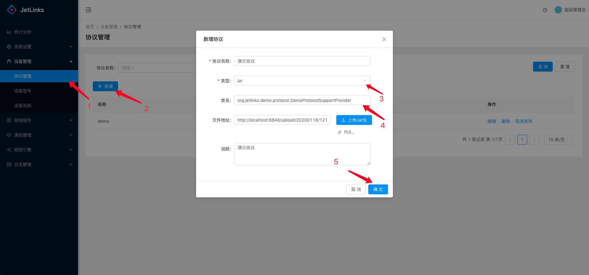
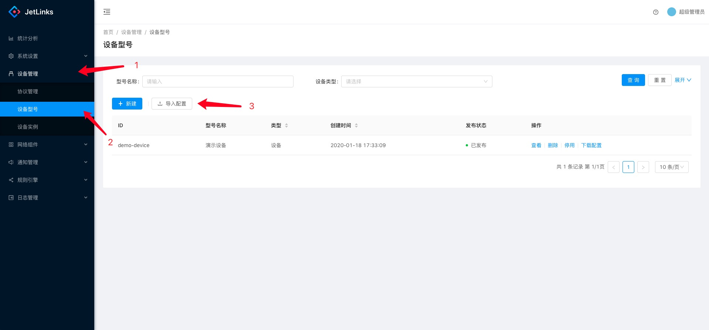
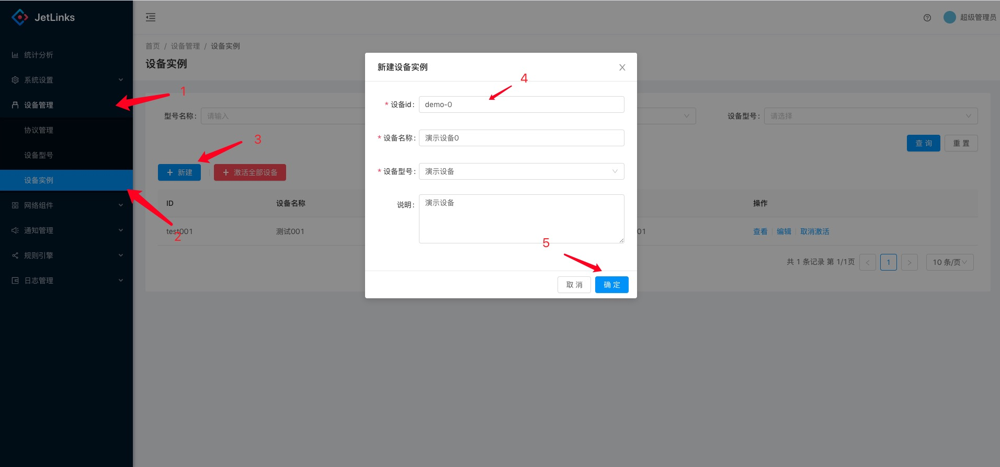
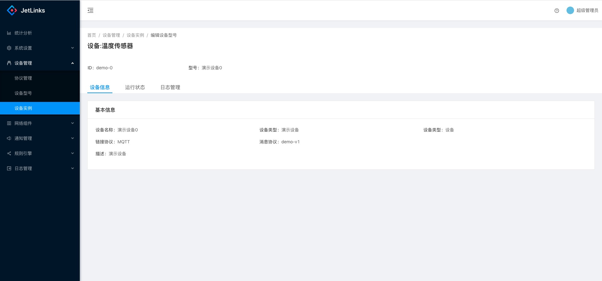
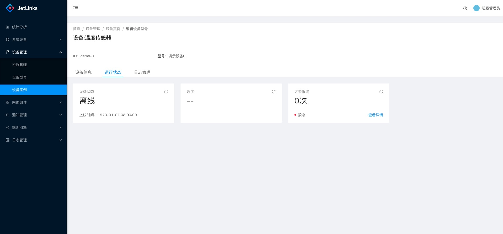
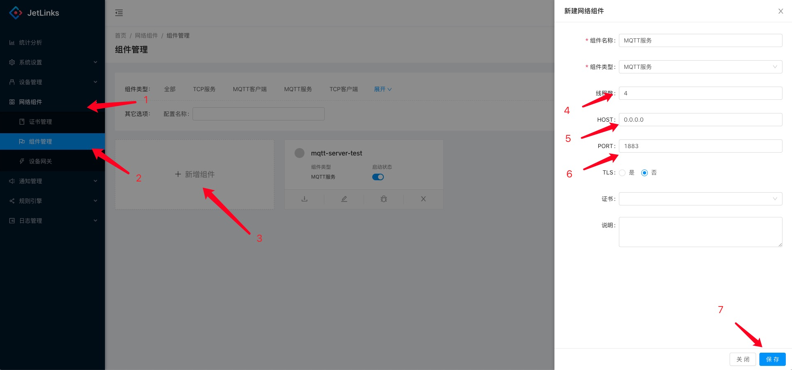
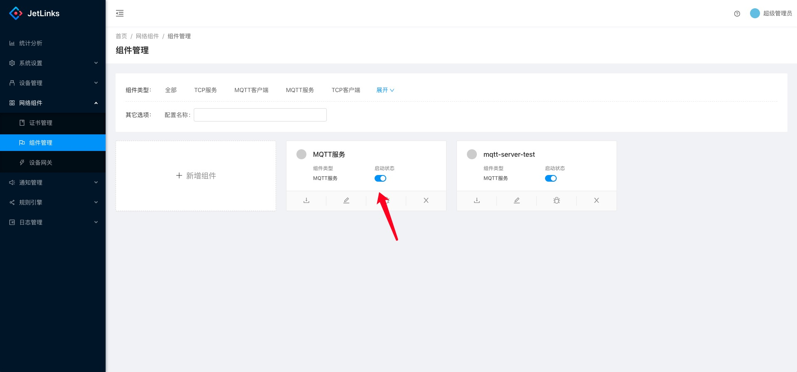
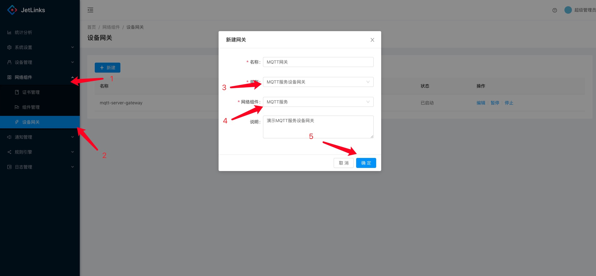
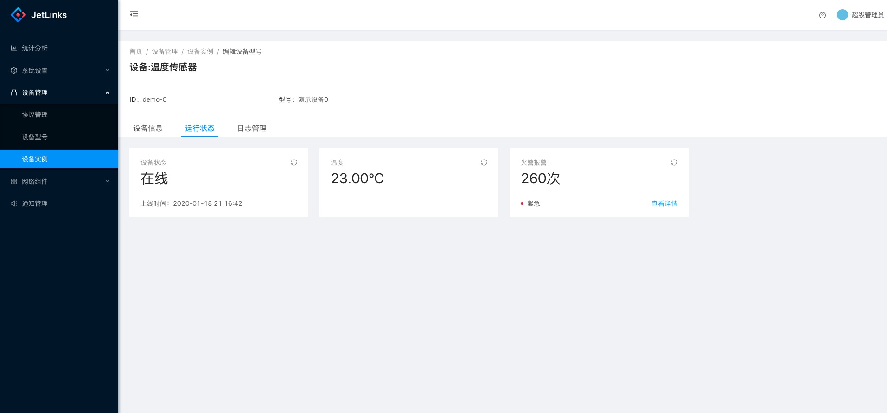
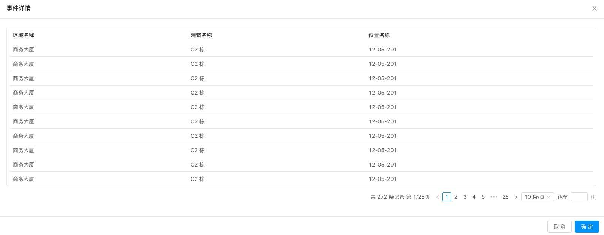

  * [ 前言 ](../../)
  * 物联网平台操作 
    * [ 前言 ](../)
    * 快速开始 
      * [ introduction ](introduction.html)
      * [ demo ](demo.html)
    * 开发指南 
      * [ assets ](../dev-guide/assets.html)
      * [ commons-api ](../dev-guide/commons-api.html)
      * [ crud ](../dev-guide/crud.html)
      * [ custom-sql-term ](../dev-guide/custom-sql-term.html)
      * [ dashboard ](../dev-guide/dashboard.html)
      * [ device-firmware ](../dev-guide/device-firmware.html)
      * [ mqtt-subs ](../dev-guide/mqtt-subs.html)
      * [ multi-tenant ](../dev-guide/multi-tenant.html)
      * [ websocket-subs ](../dev-guide/websocket-subs.html)
    * 最佳实践 
      * [ auto-register ](../best-practices/auto-register.html)
      * [ coap-connection ](../best-practices/coap-connection.html)
      * [ device-alarm ](../best-practices/device-alarm.html)
      * [ device-connection ](../best-practices/device-connection.html)
      * [ device-gateway-connection ](../best-practices/device-gateway-connection.html)
      * [ http-connection ](../best-practices/http-connection.html)
      * [ jetlinks对接其他云平台教程-HTTP方式 ](../best-practices/jetlinks对接其他云平台教程-HTTP方式.html)
      * [ open-api ](../best-practices/open-api.html)
      * [ sort-link ](../best-practices/sort-link.html)
      * [ start ](../best-practices/start.html)
      * [ tcp-connection ](../best-practices/tcp-connection.html)
      * [ udp-connection ](../best-practices/udp-connection.html)
    * 使用手册 
      * [ DemoDevice ](../basics-guide/DemoDevice.html)
      * [ device-manager ](../basics-guide/device-manager.html)
      * [ protocol-support ](../basics-guide/protocol-support.html)
      * [ quick-start ](../basics-guide/quick-start.html)
      * [ rule-engine ](../basics-guide/rule-engine.html)
      * [ ziduanquanxian ](../basics-guide/ziduanquanxian.html)
  * 萌蜂项目规范 
    * [ 前言 ](../../萌蜂项目规范/)
    * 一、开发项 
      * [ 快速开始 ](../../萌蜂项目规范/开发项/idea-start.html)
      * [ 环境维护 ](../../萌蜂项目规范/开发项/环境维护.html)
      * [ 代码管理 ](../../萌蜂项目规范/开发项/代码管理.html)
      * [ 后端开发 ](../../萌蜂项目规范/开发项/后端开发.html)
      * [ 前端开发 ](../../萌蜂项目规范/开发项/前端开发.html)
      * [ 工程专项 ](../../萌蜂项目规范/开发项/工程专项.html)
      * [ 其他规约 ](../../萌蜂项目规范/开发项/其他规约.html)
      * [ 流程管理 ](../../萌蜂项目规范/开发项/流程管理.html)
    * 二、知识点 
      * [ 安装 Centos7 ](../../萌蜂项目规范/知识点/install-centos7.html)
      * [ Centos 创建用户 ](../../萌蜂项目规范/知识点/centos-create-user.html)
      * [ Centos 安装桌面环境 ](../../萌蜂项目规范/知识点/centos-install-gnome.html)
      * [ Centos 安装KVM ](../../萌蜂项目规范/知识点/centos-install-kvm.html)
      * [ Centos 安装VNC ](../../萌蜂项目规范/知识点/centos-install-vnc.html)
      * [ Centos 安装Pip ](../../萌蜂项目规范/知识点/centos-install-pip.html)
      * [ Docker Compose ](../../萌蜂项目规范/知识点/docker-compose.html)
      * [ FFmpeg ](../../萌蜂项目规范/知识点/ffmpeg.html)
      * [ Nginx 代理 ](../../萌蜂项目规范/知识点/nginx-prefix.html)
      * [ Nginx Rtmp ](../../萌蜂项目规范/知识点/nginx-rtmp.html)
      * [ Nohup ](../../萌蜂项目规范/知识点/nohup.html)
      * [ NodeJs ](../../萌蜂项目规范/知识点/nodejs-upgrade.html)
      * [ Http Code ](../../萌蜂项目规范/知识点/http-code.html)
      * [ String.format() ](../../萌蜂项目规范/知识点/string-format.html)
  * JAVA开发规范 
    * [ 前言 ](../../JAVA开发规范/)
    * 一、编程规约 
      * [ （一）命名风格 ](../../JAVA开发规范/编程规约/命名风格.html)
      * [ （二）常量定义 ](../../JAVA开发规范/编程规约/常量定义.html)
      * [ （三）代码格式 ](../../JAVA开发规范/编程规约/代码格式.html)
      * [ （四）OOP规范 ](../../JAVA开发规范/编程规约/OOP规范.html)
      * [ （五）集合处理 ](../../JAVA开发规范/编程规约/集合处理.html)
      * [ （六）并发处理 ](../../JAVA开发规范/编程规约/并发处理.html)
      * [ （七）控制语句 ](../../JAVA开发规范/编程规约/控制语句.html)
      * [ （八）注释规约 ](../../JAVA开发规范/编程规约/注释规约.html)
    * 二、异常日志 
      * [ （一）异常处理 ](../../JAVA开发规范/异常日志/异常处理.html)
      * [ （二）日志规范 ](../../JAVA开发规范/异常日志/日志规约.html)
      * [ （三）其他 ](../../JAVA开发规范/异常日志/其他.html)
    * [ 三、单元测试 ](../../JAVA开发规范/单元测试.html)
    * [ 四、安全规约 ](../../JAVA开发规范/安全规约.html)
    * 五、MySQL数据库 
      * [ （一）建表规约 ](../../JAVA开发规范/MySQL数据库/建表规约.html)
      * [ （二）索引规约 ](../../JAVA开发规范/MySQL数据库/索引规约.html)
      * [ （三）SQL语句 ](../../JAVA开发规范/MySQL数据库/SQL语句.html)
      * [ （四）ORM映射 ](../../JAVA开发规范/MySQL数据库/ORM映射.html)
    * 六、工程结构 
      * [ （一）应用分层 ](../../JAVA开发规范/工程结构/应用分层.html)
      * [ （二）二方库依赖 ](../../JAVA开发规范/工程结构/二方库依赖.html)
      * [ （三）服务器 ](../../JAVA开发规范/工程结构/服务器.html)
    * [ 附：本手册专有名词 ](../../JAVA开发规范/本手册专有名词.html)
  * MIS系统操作手册 
    * [ MIS系统操作手册 ](../../用户操作手册/用户操作手册.html)
  * MIS系统环境临时记录 
    * [ MIS系统环境临时记录 ](../../MIS系统环境临时记录/组态和大屏连接地址配置.html)
  *   * [ Published with GitBook ](https://www.gitbook.com)

#  __[demo](../..)

# 快速体验设备接入

成功启动系统后，启动模拟器模拟MQTT客户端与平台交互。

## 添加协议

进入`设备接入`-`协议管理`,点击`新建`.

  * 协议名称: `演示协议`.
  * 类型: `jar`.
  * 类名: `org.jetlinks.demo.protocol.DemoProtocolSupportProvider`.
  * 上传jar包: 选择项目内文件: `simulator/demo-protocol-1.0.jar`.
  * 回到列表页点击操作列中的`发布`按钮发布协议.(修改后也需要重新发布)

## 添加产品

进入`设备管理`-`产品`,点击`导入配置`. 选择项目内文件: `simulator/设备型号-演示设备.json`.

导入成功后,点击`操作列`-`发布`,如果状态为`已发布`,则点击`停用`后重新发布.

## 添加设备

进入`设备管理`-`设备`,点击`新建`.

  * 设备id: `demo-0`
  * 设备名称: `演示设备0`
  * 产品: `演示设备`

点击确定,保存成功后, 点击`操作列`-`激活`. 点击`查看`可查看设备的基本信息以及`运行状态`

设备基本信息

运行状态

## 启动MQTT服务

进入`设备接入`-`网络组件`,点击`新增组件`.

  * 组件名称: `MQTT服务`
  * 组件类型: `MQTT服务`
  * 线程数: `4` 可根据实际情况调整,一般`不大于主机CPU核心数*2`
  * HOST: `0.0.0.0`
  * PORT: `1883`
  * TLS: `否`

点击保存,保存成功后,点击`启动状态`切换启动状态为启动.

## 启动设备网关

进入`设备接入`-`设备网关`,点击`新建`.

  * 名称: `MQTT网关`
  * 类型: `MQTT服务设备网关`
  * 网络组件: `MQTT服务` 选择上一步创建的网络组件

点击确定,保存成功后,点击操作列中的`启动`.

## 启动模拟器

进入项目目录:`simulator`.

    
    
       $ cd simulator
       $ ./start.sh
    

启动成功后控制台应该会输出:

    
    
    ...
    create mqtt client: 1 ok
    ...
    开始上报设备事件
    成功推送设备事件:1
    

## 查看设备数据

进入`设备`,点击查看`demo-0`设备,点击`运行状态`,可看到设备上报的数据.

设备运行状态信息

设备上报的事件数据

#  results matching ""

# No results matching ""

[ __](introduction.html)

