  * [ 前言 ](../../)
  * 物联网平台操作 
    * [ 前言 ](../)
    * 快速开始 
      * [ introduction ](../quick-start/introduction.html)
      * [ demo ](../quick-start/demo.html)
    * 开发指南 
      * [ assets ](assets.html)
      * [ commons-api ](commons-api.html)
      * [ crud ](crud.html)
      * [ custom-sql-term ](custom-sql-term.html)
      * [ dashboard ](dashboard.html)
      * [ device-firmware ](device-firmware.html)
      * [ mqtt-subs ](mqtt-subs.html)
      * [ multi-tenant ](multi-tenant.html)
      * [ websocket-subs ](websocket-subs.html)
    * 最佳实践 
      * [ auto-register ](../best-practices/auto-register.html)
      * [ coap-connection ](../best-practices/coap-connection.html)
      * [ device-alarm ](../best-practices/device-alarm.html)
      * [ device-connection ](../best-practices/device-connection.html)
      * [ device-gateway-connection ](../best-practices/device-gateway-connection.html)
      * [ http-connection ](../best-practices/http-connection.html)
      * [ jetlinks对接其他云平台教程-HTTP方式 ](../best-practices/jetlinks对接其他云平台教程-HTTP方式.html)
      * [ open-api ](../best-practices/open-api.html)
      * [ sort-link ](../best-practices/sort-link.html)
      * [ start ](../best-practices/start.html)
      * [ tcp-connection ](../best-practices/tcp-connection.html)
      * [ udp-connection ](../best-practices/udp-connection.html)
    * 使用手册 
      * [ DemoDevice ](../basics-guide/DemoDevice.html)
      * [ device-manager ](../basics-guide/device-manager.html)
      * [ protocol-support ](../basics-guide/protocol-support.html)
      * [ quick-start ](../basics-guide/quick-start.html)
      * [ rule-engine ](../basics-guide/rule-engine.html)
      * [ ziduanquanxian ](../basics-guide/ziduanquanxian.html)
  * 萌蜂项目规范 
    * [ 前言 ](../../萌蜂项目规范/)
    * 一、开发项 
      * [ 快速开始 ](../../萌蜂项目规范/开发项/idea-start.html)
      * [ 环境维护 ](../../萌蜂项目规范/开发项/环境维护.html)
      * [ 代码管理 ](../../萌蜂项目规范/开发项/代码管理.html)
      * [ 后端开发 ](../../萌蜂项目规范/开发项/后端开发.html)
      * [ 前端开发 ](../../萌蜂项目规范/开发项/前端开发.html)
      * [ 工程专项 ](../../萌蜂项目规范/开发项/工程专项.html)
      * [ 其他规约 ](../../萌蜂项目规范/开发项/其他规约.html)
      * [ 流程管理 ](../../萌蜂项目规范/开发项/流程管理.html)
    * 二、知识点 
      * [ 安装 Centos7 ](../../萌蜂项目规范/知识点/install-centos7.html)
      * [ Centos 创建用户 ](../../萌蜂项目规范/知识点/centos-create-user.html)
      * [ Centos 安装桌面环境 ](../../萌蜂项目规范/知识点/centos-install-gnome.html)
      * [ Centos 安装KVM ](../../萌蜂项目规范/知识点/centos-install-kvm.html)
      * [ Centos 安装VNC ](../../萌蜂项目规范/知识点/centos-install-vnc.html)
      * [ Centos 安装Pip ](../../萌蜂项目规范/知识点/centos-install-pip.html)
      * [ Docker Compose ](../../萌蜂项目规范/知识点/docker-compose.html)
      * [ FFmpeg ](../../萌蜂项目规范/知识点/ffmpeg.html)
      * [ Nginx 代理 ](../../萌蜂项目规范/知识点/nginx-prefix.html)
      * [ Nginx Rtmp ](../../萌蜂项目规范/知识点/nginx-rtmp.html)
      * [ Nohup ](../../萌蜂项目规范/知识点/nohup.html)
      * [ NodeJs ](../../萌蜂项目规范/知识点/nodejs-upgrade.html)
      * [ Http Code ](../../萌蜂项目规范/知识点/http-code.html)
      * [ String.format() ](../../萌蜂项目规范/知识点/string-format.html)
  * JAVA开发规范 
    * [ 前言 ](../../JAVA开发规范/)
    * 一、编程规约 
      * [ （一）命名风格 ](../../JAVA开发规范/编程规约/命名风格.html)
      * [ （二）常量定义 ](../../JAVA开发规范/编程规约/常量定义.html)
      * [ （三）代码格式 ](../../JAVA开发规范/编程规约/代码格式.html)
      * [ （四）OOP规范 ](../../JAVA开发规范/编程规约/OOP规范.html)
      * [ （五）集合处理 ](../../JAVA开发规范/编程规约/集合处理.html)
      * [ （六）并发处理 ](../../JAVA开发规范/编程规约/并发处理.html)
      * [ （七）控制语句 ](../../JAVA开发规范/编程规约/控制语句.html)
      * [ （八）注释规约 ](../../JAVA开发规范/编程规约/注释规约.html)
    * 二、异常日志 
      * [ （一）异常处理 ](../../JAVA开发规范/异常日志/异常处理.html)
      * [ （二）日志规范 ](../../JAVA开发规范/异常日志/日志规约.html)
      * [ （三）其他 ](../../JAVA开发规范/异常日志/其他.html)
    * [ 三、单元测试 ](../../JAVA开发规范/单元测试.html)
    * [ 四、安全规约 ](../../JAVA开发规范/安全规约.html)
    * 五、MySQL数据库 
      * [ （一）建表规约 ](../../JAVA开发规范/MySQL数据库/建表规约.html)
      * [ （二）索引规约 ](../../JAVA开发规范/MySQL数据库/索引规约.html)
      * [ （三）SQL语句 ](../../JAVA开发规范/MySQL数据库/SQL语句.html)
      * [ （四）ORM映射 ](../../JAVA开发规范/MySQL数据库/ORM映射.html)
    * 六、工程结构 
      * [ （一）应用分层 ](../../JAVA开发规范/工程结构/应用分层.html)
      * [ （二）二方库依赖 ](../../JAVA开发规范/工程结构/二方库依赖.html)
      * [ （三）服务器 ](../../JAVA开发规范/工程结构/服务器.html)
    * [ 附：本手册专有名词 ](../../JAVA开发规范/本手册专有名词.html)
  * MIS系统操作手册 
    * [ MIS系统操作手册 ](../../用户操作手册/用户操作手册.html)
  * MIS系统环境临时记录 
    * [ MIS系统环境临时记录 ](../../MIS系统环境临时记录/组态和大屏连接地址配置.html)
  *   * [ Published with GitBook ](https://www.gitbook.com)

#  __[device-firmware](../..)

# 设备固件管理

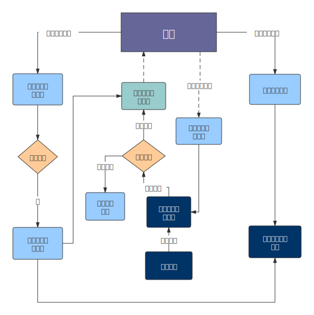

## 固件管理

用于设备固件新建、编辑、查看、删除、发布升级任务、推送固件消息。

### 新增

**操 作步骤**

  1. 进入系统: `设备管理`-`固件升级`-`新建`。

  2. 输入固件版本信息。

  3. 点击`确定`进行保存。  
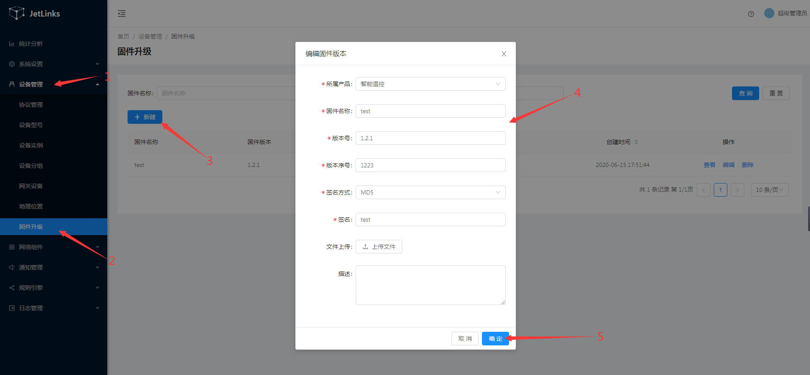

### 编辑

**操 作步骤**

  1. 进入系统: `设备管理`-`固件升级`，在操作列点击`编辑`。
  2. 编辑固件版本信息。
  3. 点击`确定`进行保存。  
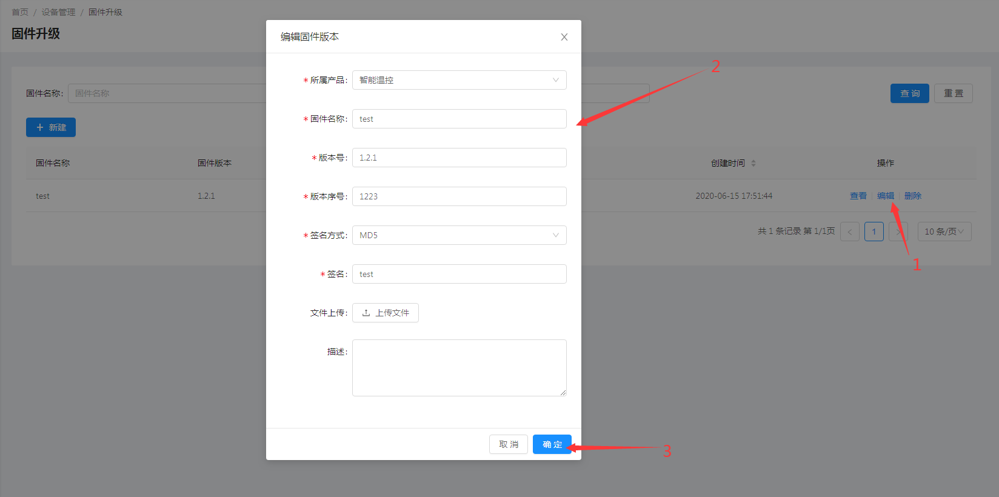

### 删除

**操 作步骤** 进入系统: `设备管理`-`固件升级`，在操作列点击`删除`。

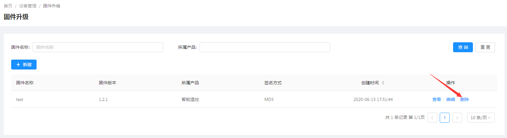

## 操作流程

### 创建固件信息

  1. 进入系统: `设备管理`-`固件升级`-`新建`。

  2. 输入固件版本信息。

  3. 点击`确定`进行保存。  
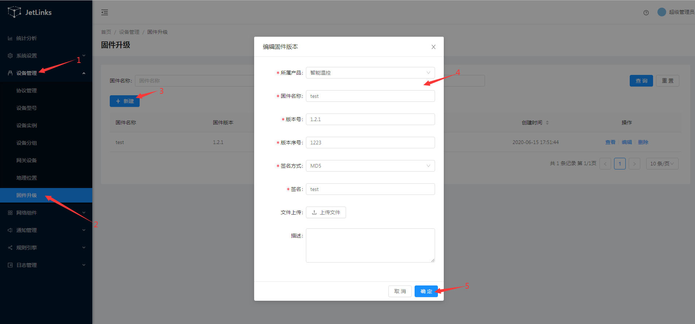

### 发布升级任务

1.在固件升级列表页选择需要升级的固件，单击操作列中`查看`。  

2.在固件详情页面单击`升级任务`-`新建`。  
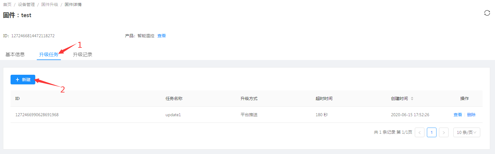

3.创建任务信息  
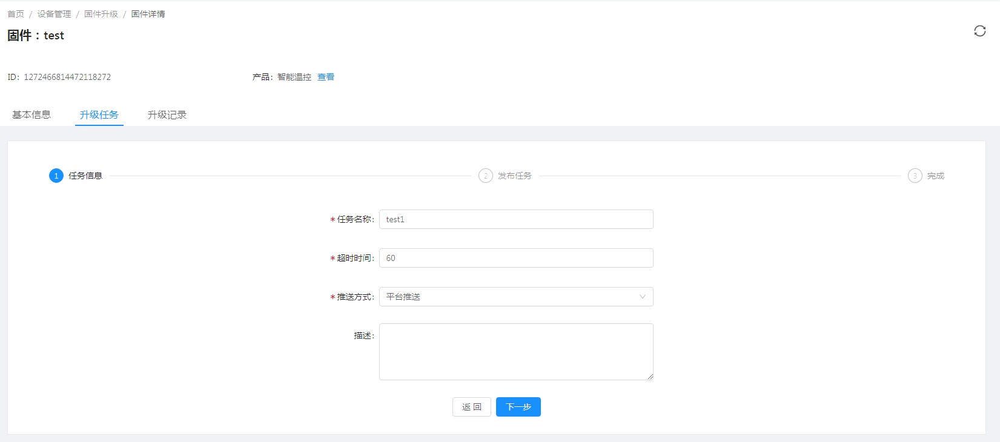

  1. 发布任务 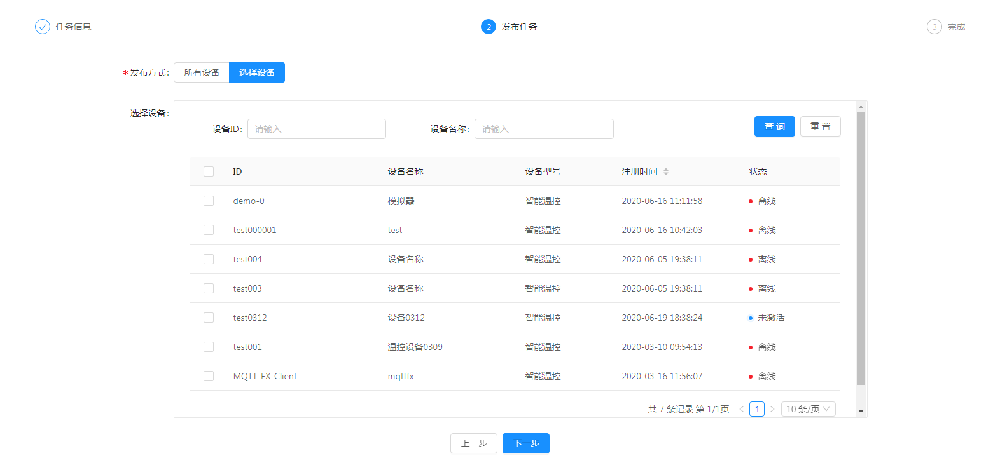

::: tip 注意： 发布任务时可以选择所有设备或者指定部分设备。 :::

### 推送固件消息

  1. 在发布任务界面，`等待升级`框中选择`推送升级`。  
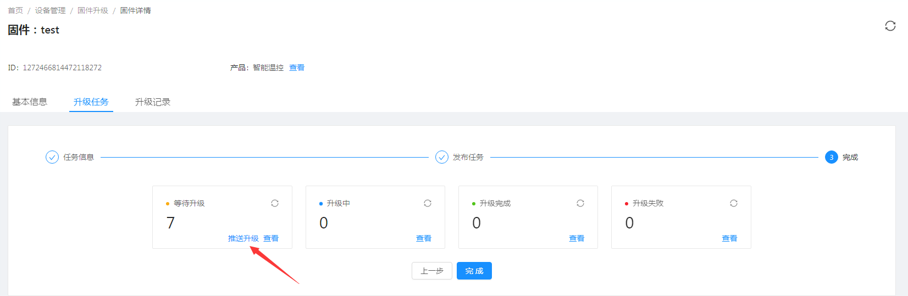

  2. 任务将自动跳转到`升级中`。  
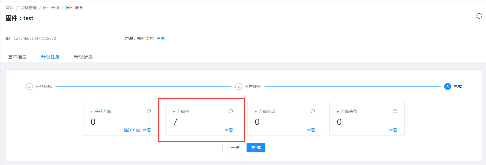

可在此框中点击`查看`各升级任务详情  
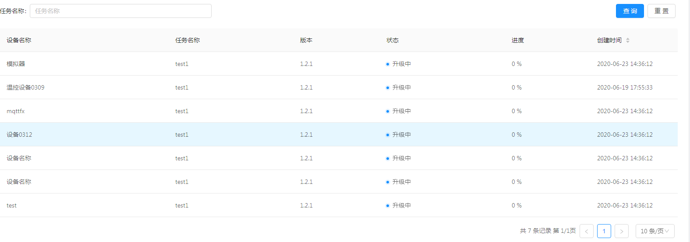

  1. 升级完成或升级失败。  
升级完成后任务会跳转到`升级完成`框，升级失败的任务则跳转到`升级失败`中。

### 自定义协议解析发送到设备

推送的升级任务通过协议解析后发送到设备，参考[自定义协议开发](../advancement-guide/custom-protocol.md)

### 平台修改进度信息

设备收到升级任务指令后发起并推送更新进度。  
任务升级完成或升级失败后，在任务升级界面任务会跳转到`升级完成`框，升级失败的任务则跳转到`升级失败`中。

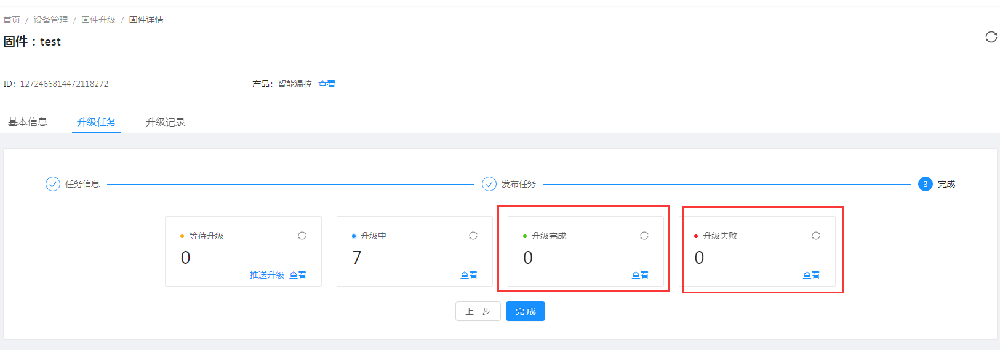

## 推送更新

## 固件相关消息

`消息协议`解析`设备上报`的消息为指定的类型即触发对应的操作.

### 上报固件信息

消息类型: `ReportFirmwareMessage`

    
    
    {
        "deviceId":"设备ID",
        "version":"固件版本号",
        "properties":{"key":"value"}, //其他拓展信息
        "timestampe":"毫秒时间戳",
    }
    

上报固件信息后,会更新设备固件信息记录.

### 设备拉取固件更新

前提: 消息协议解析设备上报的消息为:`RequestFirmwareMessage`.

    
    
    {
        "headers":{
            "force":false, //是否强制拉取更新. 为true时强制拉取固件更新信息
            "latest":false //是否拉取最新的固件,false为从头开始拉取
        },
        "deviceId":"设备ID",
        "timestampe":"毫秒时间戳",
        "messageId":"消息ID",
        "requestVersion":"请求更新的版本"//可留空
    }
    

平台收到此消息后, 会获取更新任务中对应的固件更新记录.找出对应设备`等待升级`的固件信息.
并发送消息`RequestFirmwareMessageReply`给协议包解析并发送到设备.

    
    
    {
        "sign": "文件签名",
        "signMethod": "文件签名方式",
        "messageId": "消息ID",//与拉取固件中到消息ID一致
        "deviceId": "设备ID",
        "version": "版本号",
        "url": "固件文件下载地址",
        "parameters": {},//其他拓展参数
        "timestamp": 1589277368209 //毫秒时间戳
    }
    

### 平台推送固件更新

平台可推送固件更新给设备,需要消息协议处理消息:`UpgradeFirmwareMessage`.

    
    
    {
        "sign": "文件签名",
        "signMethod": "文件签名方式",
        "deviceId": "设备ID",
        "version": "版本号",
        "url": "固件文件下载地址",
        "success": true,
        "parameters": {},//其他拓展参数
        "timestamp": 1589277368209 //毫秒时间戳
    }
    

### 设备上报固件更新结果

设备可以上报固件更新进度以及更新结果. 消息类型:`UpgradeFirmwareProgressMessage`

更新结果(进度)消息:

    
    
    {
        "success": true, //是否成功
        "message":"失败时传的消息",
        "progress": 10, //更新进度: 0-100
        "complete": false,//是否完成,如果只是上报进度,则设置为false,完成更新则设置为true
        "deviceId": "设备ID",
        "version": "1.0", //更新的版本号(必填)
        "timestamp": 1589277369268
    }
    

#  results matching ""

# No results matching ""

[ __](dashboard.html) [ __](mqtt-subs.html)

