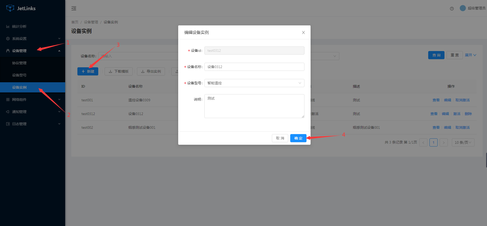

  * [ 前言 ](../../)
  * 物联网平台操作 
    * [ 前言 ](../)
    * 快速开始 
      * [ introduction ](../quick-start/introduction.html)
      * [ demo ](../quick-start/demo.html)
    * 开发指南 
      * [ assets ](../dev-guide/assets.html)
      * [ commons-api ](../dev-guide/commons-api.html)
      * [ crud ](../dev-guide/crud.html)
      * [ custom-sql-term ](../dev-guide/custom-sql-term.html)
      * [ dashboard ](../dev-guide/dashboard.html)
      * [ device-firmware ](../dev-guide/device-firmware.html)
      * [ mqtt-subs ](../dev-guide/mqtt-subs.html)
      * [ multi-tenant ](../dev-guide/multi-tenant.html)
      * [ websocket-subs ](../dev-guide/websocket-subs.html)
    * 最佳实践 
      * [ auto-register ](auto-register.html)
      * [ coap-connection ](coap-connection.html)
      * [ device-alarm ](device-alarm.html)
      * [ device-connection ](device-connection.html)
      * [ device-gateway-connection ](device-gateway-connection.html)
      * [ http-connection ](http-connection.html)
      * [ jetlinks对接其他云平台教程-HTTP方式 ](jetlinks对接其他云平台教程-HTTP方式.html)
      * [ open-api ](open-api.html)
      * [ sort-link ](sort-link.html)
      * [ start ](start.html)
      * [ tcp-connection ](tcp-connection.html)
      * [ udp-connection ](udp-connection.html)
    * 使用手册 
      * [ DemoDevice ](../basics-guide/DemoDevice.html)
      * [ device-manager ](../basics-guide/device-manager.html)
      * [ protocol-support ](../basics-guide/protocol-support.html)
      * [ quick-start ](../basics-guide/quick-start.html)
      * [ rule-engine ](../basics-guide/rule-engine.html)
      * [ ziduanquanxian ](../basics-guide/ziduanquanxian.html)
  * 萌蜂项目规范 
    * [ 前言 ](../../萌蜂项目规范/)
    * 一、开发项 
      * [ 快速开始 ](../../萌蜂项目规范/开发项/idea-start.html)
      * [ 环境维护 ](../../萌蜂项目规范/开发项/环境维护.html)
      * [ 代码管理 ](../../萌蜂项目规范/开发项/代码管理.html)
      * [ 后端开发 ](../../萌蜂项目规范/开发项/后端开发.html)
      * [ 前端开发 ](../../萌蜂项目规范/开发项/前端开发.html)
      * [ 工程专项 ](../../萌蜂项目规范/开发项/工程专项.html)
      * [ 其他规约 ](../../萌蜂项目规范/开发项/其他规约.html)
      * [ 流程管理 ](../../萌蜂项目规范/开发项/流程管理.html)
    * 二、知识点 
      * [ 安装 Centos7 ](../../萌蜂项目规范/知识点/install-centos7.html)
      * [ Centos 创建用户 ](../../萌蜂项目规范/知识点/centos-create-user.html)
      * [ Centos 安装桌面环境 ](../../萌蜂项目规范/知识点/centos-install-gnome.html)
      * [ Centos 安装KVM ](../../萌蜂项目规范/知识点/centos-install-kvm.html)
      * [ Centos 安装VNC ](../../萌蜂项目规范/知识点/centos-install-vnc.html)
      * [ Centos 安装Pip ](../../萌蜂项目规范/知识点/centos-install-pip.html)
      * [ Docker Compose ](../../萌蜂项目规范/知识点/docker-compose.html)
      * [ FFmpeg ](../../萌蜂项目规范/知识点/ffmpeg.html)
      * [ Nginx 代理 ](../../萌蜂项目规范/知识点/nginx-prefix.html)
      * [ Nginx Rtmp ](../../萌蜂项目规范/知识点/nginx-rtmp.html)
      * [ Nohup ](../../萌蜂项目规范/知识点/nohup.html)
      * [ NodeJs ](../../萌蜂项目规范/知识点/nodejs-upgrade.html)
      * [ Http Code ](../../萌蜂项目规范/知识点/http-code.html)
      * [ String.format() ](../../萌蜂项目规范/知识点/string-format.html)
  * JAVA开发规范 
    * [ 前言 ](../../JAVA开发规范/)
    * 一、编程规约 
      * [ （一）命名风格 ](../../JAVA开发规范/编程规约/命名风格.html)
      * [ （二）常量定义 ](../../JAVA开发规范/编程规约/常量定义.html)
      * [ （三）代码格式 ](../../JAVA开发规范/编程规约/代码格式.html)
      * [ （四）OOP规范 ](../../JAVA开发规范/编程规约/OOP规范.html)
      * [ （五）集合处理 ](../../JAVA开发规范/编程规约/集合处理.html)
      * [ （六）并发处理 ](../../JAVA开发规范/编程规约/并发处理.html)
      * [ （七）控制语句 ](../../JAVA开发规范/编程规约/控制语句.html)
      * [ （八）注释规约 ](../../JAVA开发规范/编程规约/注释规约.html)
    * 二、异常日志 
      * [ （一）异常处理 ](../../JAVA开发规范/异常日志/异常处理.html)
      * [ （二）日志规范 ](../../JAVA开发规范/异常日志/日志规约.html)
      * [ （三）其他 ](../../JAVA开发规范/异常日志/其他.html)
    * [ 三、单元测试 ](../../JAVA开发规范/单元测试.html)
    * [ 四、安全规约 ](../../JAVA开发规范/安全规约.html)
    * 五、MySQL数据库 
      * [ （一）建表规约 ](../../JAVA开发规范/MySQL数据库/建表规约.html)
      * [ （二）索引规约 ](../../JAVA开发规范/MySQL数据库/索引规约.html)
      * [ （三）SQL语句 ](../../JAVA开发规范/MySQL数据库/SQL语句.html)
      * [ （四）ORM映射 ](../../JAVA开发规范/MySQL数据库/ORM映射.html)
    * 六、工程结构 
      * [ （一）应用分层 ](../../JAVA开发规范/工程结构/应用分层.html)
      * [ （二）二方库依赖 ](../../JAVA开发规范/工程结构/二方库依赖.html)
      * [ （三）服务器 ](../../JAVA开发规范/工程结构/服务器.html)
    * [ 附：本手册专有名词 ](../../JAVA开发规范/本手册专有名词.html)
  * MIS系统操作手册 
    * [ MIS系统操作手册 ](../../用户操作手册/用户操作手册.html)
  * MIS系统环境临时记录 
    * [ MIS系统环境临时记录 ](../../MIS系统环境临时记录/组态和大屏连接地址配置.html)
  *   * [ Published with GitBook ](https://www.gitbook.com)

#  __[device-gateway-connection](../..)

# 通过网关设备接入多个下挂设备

场景: 网关设备与平台进行连接,传感器连接到网关设备. 平台可对网关以及网关下的所有设备进行管理.

## 协议解析

以下操作基于[快速体验](../quick-start/demo.html).
中使用的[demo协议包](https://github.com/jetlinks/demo-protocol)
以及[模拟器脚本](https://github.com/jetlinks/jetlinks-
community/tree/master/simulator).

流程:

  1. 父设备通过MQTT等方式接入平台,子设备自动上线.
  2. 平台下发子设备消息.网关使用协议的编解码器会收到`ChildDeviceMessage`,将其编码为网关设备能识别的消息即可.
  3. 父设备上报子设备数据,解码器将收到的设备报文解码为`ChildDeviceMessage`或者`ChildDeviceMessageReply`. 注意:`ChildDeviceMessage.deviceId`为 父设备ID,`ChildDeviceMessage.message.deviceId`为子设备ID.
  4. 如果配置了状态自管理,在检查子设备状态时,会发送指令`ChildDeviceMessage<DeviceStateCheckMessage>`,网关需要返回`ChildDeviceMessageReply<DeviceStateCheckMessageReply>`

::: tip 可根据[设备消息协议解析SDK](../basics-guide/protocol-support.html).修改协议解析方式.
子设备消息请重点关注: `ChildDeviceMessage`以及`ChildDeviceMessageReply` :::

## 创建设备型号

  1. 进入系统: `设备管理`-`设备型号`-`新建`。
  2. 输入设备型号信息，设备类型选择`网关`。
  3. 点击`确定`进行保存。  


**导 入设备型号:**[设备型号-演示型号.json](files/设备型号-演示型号.json)

## 创建网关设备

  1. 进入系统: `设备管理`-`设备实例`-`新建`。
  2. 输入设备信息。
  3. 点击`确定`进行保存。  


**导 入设备实例:**[设备实例.xlsx](files/设备实例.xlsx)

## 创建子设备

创建步骤同创建设备型号、创建网关设备，设备型号中设备类型选择`设备`。

**导 入子设备型号:**[设备型号-子设备型号.json](files/设备型号-子设备型号.json) **导 入子设备实例:**[设备实例-
自设备.xlsx](files/设备实例-子设备.xlsx)

## 关联网关设备和子设备

### 自动关联

在某些场景下,子设备是动态和网关绑定的,此时,需要在自定义协议作用解析消息为`ChildDeviceMessage<DeviceRegsiterMessage>`即可.
如果是自动关联的,设备状态也将更新为和网关设备状态一致.

### 手动关联

  1. 进入系统: `设备管理`-`网关设备`。  


  2. 选择需要绑定子设备的网关设备，绑定子设备。


## 设备上线

网关与平台建立连接时,会自动修改所有子设备的状态.
如果要单独更新子设备上下线状态.请根据协议解析为`ChildDeviceMessage<DeviceOnlineMessage>`或者`ChildDeviceMessage<DeviceOfflineMessage>`.

### 模拟网关设备上线（下线），子设备上线（下线）

使用[模拟器](https://github.com/jetlinks/device-simulator)模拟网关设备。

  1. 进入项目目录:`simulator`([获取源代码](../install-deployment/docker-start.md#获取源代码))。

  2. 运行device-simulator.jar。

```shell script java -jar -Dfile.encoding=UTF-8 device-simulator.jar \
mqtt.limit=1 \ mqtt.start=0 \ mqtt.enableEvent=true \ mqtt.eventLimit=1 \
mqtt.eventRate=1000 \ mqtt.scriptFile=./scripts/demo-children-device.js \
mqtt.address=127.0.0.1 \ mqtt.port=1889

    
    
    
    
    3.运行成功后可在平台看到网关以及子设备都已上线。
    
      
    
      
    
    4.断开连接网关下线，子设备下线。  
    
      
    
      
    
    ### 模拟事件上报
    
    在项目目录：`simulator/scripts`中的demo-children-device.js文件中模拟了子设备事件上报。  
    
    ```js
    var events = {
        reportProperty: function (index, session) {
            var deviceId = "child-device-1";//子设备id
            var topic = "/children/report-property";//属性上报topic
            var json = JSON.stringify({
                "deviceId": deviceId,
                "success": true,
                "timestamp": new Date().getTime(),
                properties: {"temperature": java.util.concurrent.ThreadLocalRandom.current().nextDouble(20, 40)},
            });
            session.sendMessage(topic, json)
        },
        fireAlarm: function (index, session) {
            var deviceId = "child-device-1";
            var topic = "/children/fire_alarm";//事件上报topic
            var json = JSON.stringify({
                "deviceId": deviceId, // 设备编号 "pid": "TBS-110", // 设备编号
                "a_name": "商务大厦", // 区域名称 "bid": 2, // 建筑 ID
                "b_name": "C2 栋", // 建筑名称
                "l_name": "12-05-201", // 位置名称
                "timestamp": new Date().getTime() // 消息时间
            });
    
            session.sendMessage(topic, json)
        }
    };
    

运行[模拟器](https://github.com/jetlinks/device-simulator)后会定时上报。


属性上报日志：


时间上报日志：


## 消息下行

平台已经自动处理了下行的子设备消息.直接调用设备消息接口即可. 如果出现无法下行消息,或者状态不同步时,尝试重新激活一下设备.

#  results matching ""

# No results matching ""

[ __](device-connection.html) [ __](http-connection.html)

