  * [ 前言 ](../../)
  * 物联网平台操作 
    * [ 前言 ](../)
    * 快速开始 
      * [ introduction ](../quick-start/introduction.html)
      * [ demo ](../quick-start/demo.html)
    * 开发指南 
      * [ assets ](../dev-guide/assets.html)
      * [ commons-api ](../dev-guide/commons-api.html)
      * [ crud ](../dev-guide/crud.html)
      * [ custom-sql-term ](../dev-guide/custom-sql-term.html)
      * [ dashboard ](../dev-guide/dashboard.html)
      * [ device-firmware ](../dev-guide/device-firmware.html)
      * [ mqtt-subs ](../dev-guide/mqtt-subs.html)
      * [ multi-tenant ](../dev-guide/multi-tenant.html)
      * [ websocket-subs ](../dev-guide/websocket-subs.html)
    * 最佳实践 
      * [ auto-register ](auto-register.html)
      * [ coap-connection ](coap-connection.html)
      * [ device-alarm ](device-alarm.html)
      * [ device-connection ](device-connection.html)
      * [ device-gateway-connection ](device-gateway-connection.html)
      * [ http-connection ](http-connection.html)
      * [ jetlinks对接其他云平台教程-HTTP方式 ](jetlinks对接其他云平台教程-HTTP方式.html)
      * [ open-api ](open-api.html)
      * [ sort-link ](sort-link.html)
      * [ start ](start.html)
      * [ tcp-connection ](tcp-connection.html)
      * [ udp-connection ](udp-connection.html)
    * 使用手册 
      * [ DemoDevice ](../basics-guide/DemoDevice.html)
      * [ device-manager ](../basics-guide/device-manager.html)
      * [ protocol-support ](../basics-guide/protocol-support.html)
      * [ quick-start ](../basics-guide/quick-start.html)
      * [ rule-engine ](../basics-guide/rule-engine.html)
      * [ ziduanquanxian ](../basics-guide/ziduanquanxian.html)
  * 萌蜂项目规范 
    * [ 前言 ](../../萌蜂项目规范/)
    * 一、开发项 
      * [ 快速开始 ](../../萌蜂项目规范/开发项/idea-start.html)
      * [ 环境维护 ](../../萌蜂项目规范/开发项/环境维护.html)
      * [ 代码管理 ](../../萌蜂项目规范/开发项/代码管理.html)
      * [ 后端开发 ](../../萌蜂项目规范/开发项/后端开发.html)
      * [ 前端开发 ](../../萌蜂项目规范/开发项/前端开发.html)
      * [ 工程专项 ](../../萌蜂项目规范/开发项/工程专项.html)
      * [ 其他规约 ](../../萌蜂项目规范/开发项/其他规约.html)
      * [ 流程管理 ](../../萌蜂项目规范/开发项/流程管理.html)
    * 二、知识点 
      * [ 安装 Centos7 ](../../萌蜂项目规范/知识点/install-centos7.html)
      * [ Centos 创建用户 ](../../萌蜂项目规范/知识点/centos-create-user.html)
      * [ Centos 安装桌面环境 ](../../萌蜂项目规范/知识点/centos-install-gnome.html)
      * [ Centos 安装KVM ](../../萌蜂项目规范/知识点/centos-install-kvm.html)
      * [ Centos 安装VNC ](../../萌蜂项目规范/知识点/centos-install-vnc.html)
      * [ Centos 安装Pip ](../../萌蜂项目规范/知识点/centos-install-pip.html)
      * [ Docker Compose ](../../萌蜂项目规范/知识点/docker-compose.html)
      * [ FFmpeg ](../../萌蜂项目规范/知识点/ffmpeg.html)
      * [ Nginx 代理 ](../../萌蜂项目规范/知识点/nginx-prefix.html)
      * [ Nginx Rtmp ](../../萌蜂项目规范/知识点/nginx-rtmp.html)
      * [ Nohup ](../../萌蜂项目规范/知识点/nohup.html)
      * [ NodeJs ](../../萌蜂项目规范/知识点/nodejs-upgrade.html)
      * [ Http Code ](../../萌蜂项目规范/知识点/http-code.html)
      * [ String.format() ](../../萌蜂项目规范/知识点/string-format.html)
  * JAVA开发规范 
    * [ 前言 ](../../JAVA开发规范/)
    * 一、编程规约 
      * [ （一）命名风格 ](../../JAVA开发规范/编程规约/命名风格.html)
      * [ （二）常量定义 ](../../JAVA开发规范/编程规约/常量定义.html)
      * [ （三）代码格式 ](../../JAVA开发规范/编程规约/代码格式.html)
      * [ （四）OOP规范 ](../../JAVA开发规范/编程规约/OOP规范.html)
      * [ （五）集合处理 ](../../JAVA开发规范/编程规约/集合处理.html)
      * [ （六）并发处理 ](../../JAVA开发规范/编程规约/并发处理.html)
      * [ （七）控制语句 ](../../JAVA开发规范/编程规约/控制语句.html)
      * [ （八）注释规约 ](../../JAVA开发规范/编程规约/注释规约.html)
    * 二、异常日志 
      * [ （一）异常处理 ](../../JAVA开发规范/异常日志/异常处理.html)
      * [ （二）日志规范 ](../../JAVA开发规范/异常日志/日志规约.html)
      * [ （三）其他 ](../../JAVA开发规范/异常日志/其他.html)
    * [ 三、单元测试 ](../../JAVA开发规范/单元测试.html)
    * [ 四、安全规约 ](../../JAVA开发规范/安全规约.html)
    * 五、MySQL数据库 
      * [ （一）建表规约 ](../../JAVA开发规范/MySQL数据库/建表规约.html)
      * [ （二）索引规约 ](../../JAVA开发规范/MySQL数据库/索引规约.html)
      * [ （三）SQL语句 ](../../JAVA开发规范/MySQL数据库/SQL语句.html)
      * [ （四）ORM映射 ](../../JAVA开发规范/MySQL数据库/ORM映射.html)
    * 六、工程结构 
      * [ （一）应用分层 ](../../JAVA开发规范/工程结构/应用分层.html)
      * [ （二）二方库依赖 ](../../JAVA开发规范/工程结构/二方库依赖.html)
      * [ （三）服务器 ](../../JAVA开发规范/工程结构/服务器.html)
    * [ 附：本手册专有名词 ](../../JAVA开发规范/本手册专有名词.html)
  * MIS系统操作手册 
    * [ MIS系统操作手册 ](../../用户操作手册/用户操作手册.html)
  * MIS系统环境临时记录 
    * [ MIS系统环境临时记录 ](../../MIS系统环境临时记录/组态和大屏连接地址配置.html)
  *   * [ Published with GitBook ](https://www.gitbook.com)

#  __[http-connection](../..)

# 使用HTTP 接入设备消息

## 创建协议

请参考[创建协议](../advancement-guide/mqtt-connection.md#创建协议)

## 创建产品

参考[tcp接入设备示例中的创建产品](tcp-connection.html#创建产品),创建id为 **http-test** 的产品

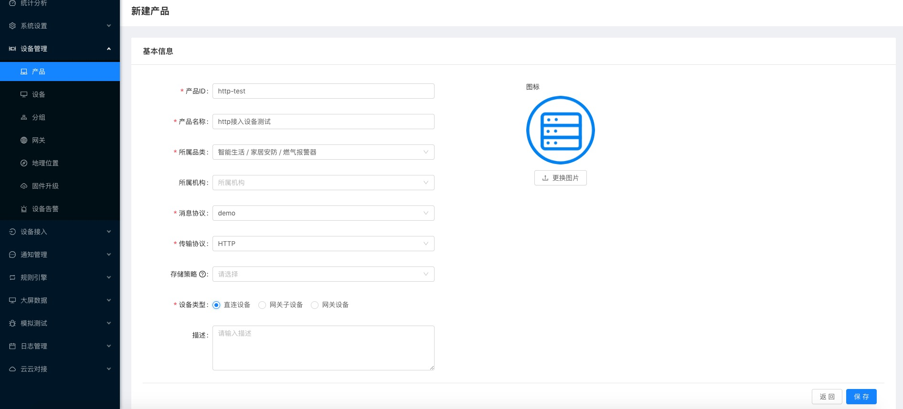

并 **发 布**。

## 创建设备实例

参考[tcp接入设备示例中的创建设备](tcp-connection.html#创建设备),创建 **id 为http-test-001**的设备并 **激
活**。

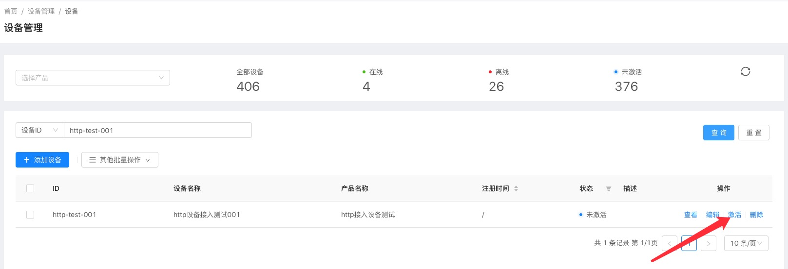

## 创建网络组件

  1. 选择 `设备接入`\-->`网络组件`\--> 点击`新增组件`按钮。

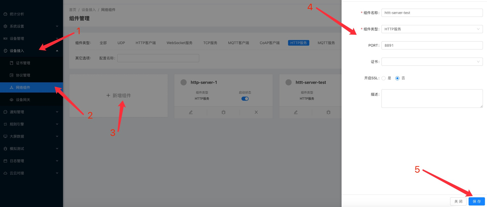

  1. 在创建完成的模块上点击`启动`按钮。

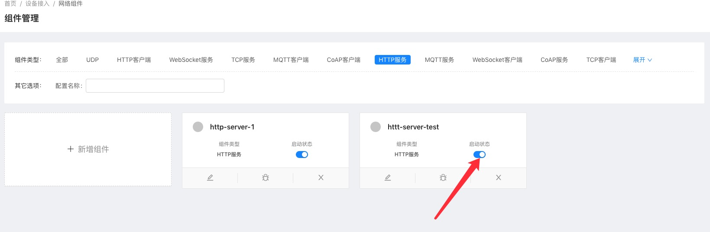

## 创建设备网关

  1. 选择 `设备接入`\-->`设备网关`\--> 点击`新建`按钮。

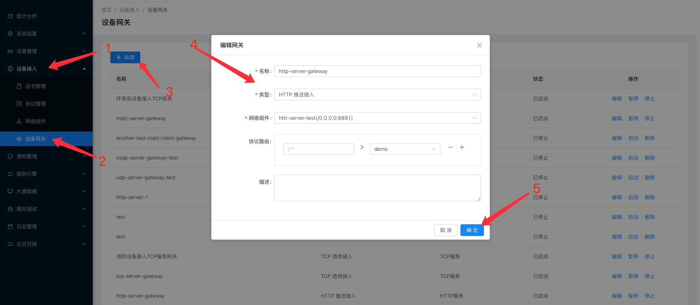  
::: tip 注意 和MQTT服务设备网关不同的是,http必须指定消息协议,因为无法通过消息识别出对应的设备标识.
同时多个协议可共用一个网关，通过上面配置中的协议路由来进行分发.  
在消息解码时也无法通过上下文(`MessageDecodeContext`)获取到设备操作接口(`DeviceOperator`).
此处使用`demo`协议. :::

  1. 在操作列点击`启动`按钮启动网关。

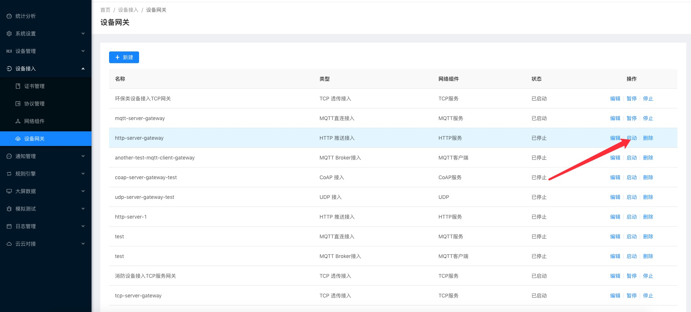

## 推送消息

此处使用postman模拟设备请求。

### 模拟设备上报属性

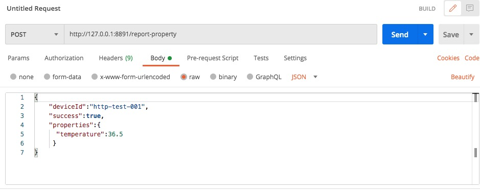

::: tip 注意： 请求时路径中带的/report-property相当于mqtt中的topic，在demo协议将中根据路径来判断消息类型。  
:::

设备运行状态中查看：

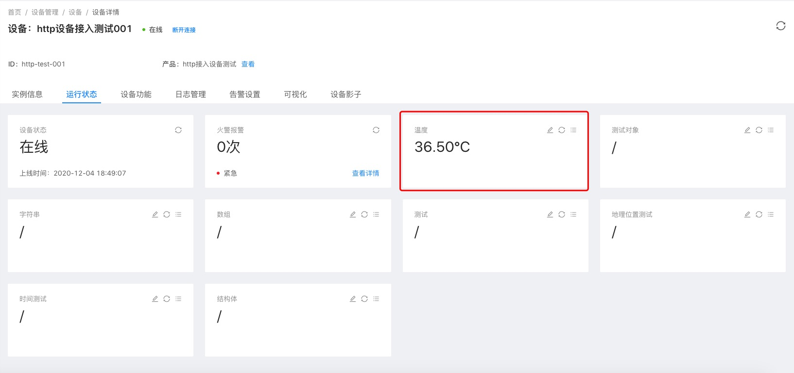

### 模拟设备事件上报

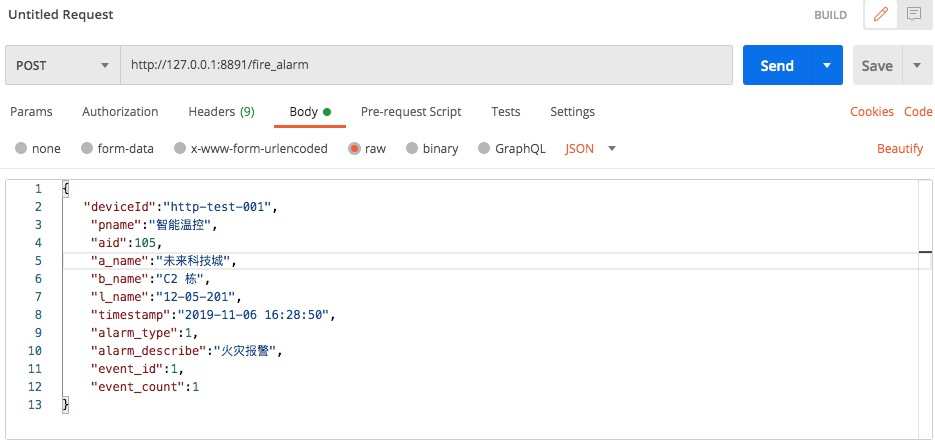

::: tip 注意： 请求时路径中带的/fire-alarm相当于mqtt中的topic，在demo协议将中根据路径来判断消息类型。  
:::

设备运行状态中查看：

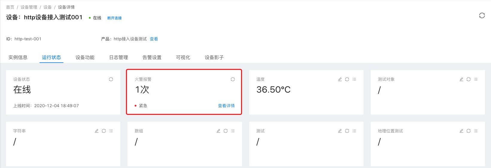

事件详情：

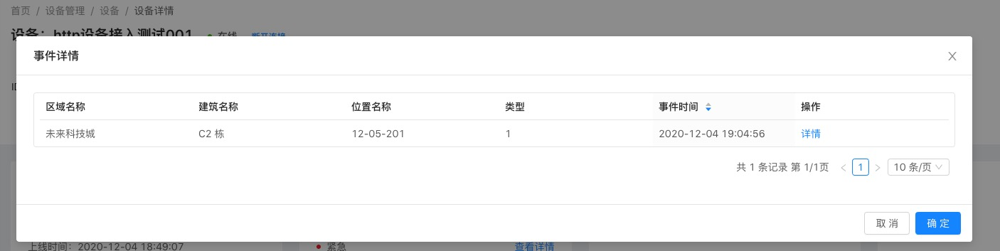

## 指令下发

由于http是短链接,无法直接下发指令,可以在`消息拦截器中`或者`编码时`通过将消息设置到`device.setConfig`中,在收到
http请求拉取消息时，通过`device.getSelfConfig`获取配置,并返回。

#  results matching ""

# No results matching ""

[ __](device-gateway-connection.html) [ __](jetlinks对接其他云平台教程-HTTP方式.html)

