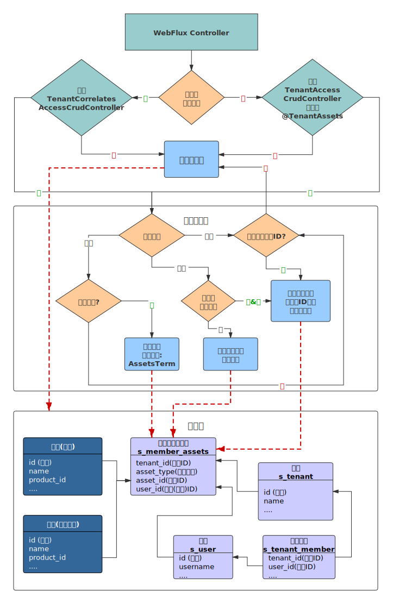

  * [ 前言 ](../../)
  * 物联网平台操作 
    * [ 前言 ](../)
    * 快速开始 
      * [ introduction ](../quick-start/introduction.html)
      * [ demo ](../quick-start/demo.html)
    * 开发指南 
      * [ assets ](assets.html)
      * [ commons-api ](commons-api.html)
      * [ crud ](crud.html)
      * [ custom-sql-term ](custom-sql-term.html)
      * [ dashboard ](dashboard.html)
      * [ device-firmware ](device-firmware.html)
      * [ mqtt-subs ](mqtt-subs.html)
      * [ multi-tenant ](multi-tenant.html)
      * [ websocket-subs ](websocket-subs.html)
    * 最佳实践 
      * [ auto-register ](../best-practices/auto-register.html)
      * [ coap-connection ](../best-practices/coap-connection.html)
      * [ device-alarm ](../best-practices/device-alarm.html)
      * [ device-connection ](../best-practices/device-connection.html)
      * [ device-gateway-connection ](../best-practices/device-gateway-connection.html)
      * [ http-connection ](../best-practices/http-connection.html)
      * [ jetlinks对接其他云平台教程-HTTP方式 ](../best-practices/jetlinks对接其他云平台教程-HTTP方式.html)
      * [ open-api ](../best-practices/open-api.html)
      * [ sort-link ](../best-practices/sort-link.html)
      * [ start ](../best-practices/start.html)
      * [ tcp-connection ](../best-practices/tcp-connection.html)
      * [ udp-connection ](../best-practices/udp-connection.html)
    * 使用手册 
      * [ DemoDevice ](../basics-guide/DemoDevice.html)
      * [ device-manager ](../basics-guide/device-manager.html)
      * [ protocol-support ](../basics-guide/protocol-support.html)
      * [ quick-start ](../basics-guide/quick-start.html)
      * [ rule-engine ](../basics-guide/rule-engine.html)
      * [ ziduanquanxian ](../basics-guide/ziduanquanxian.html)
  * 萌蜂项目规范 
    * [ 前言 ](../../萌蜂项目规范/)
    * 一、开发项 
      * [ 快速开始 ](../../萌蜂项目规范/开发项/idea-start.html)
      * [ 环境维护 ](../../萌蜂项目规范/开发项/环境维护.html)
      * [ 代码管理 ](../../萌蜂项目规范/开发项/代码管理.html)
      * [ 后端开发 ](../../萌蜂项目规范/开发项/后端开发.html)
      * [ 前端开发 ](../../萌蜂项目规范/开发项/前端开发.html)
      * [ 工程专项 ](../../萌蜂项目规范/开发项/工程专项.html)
      * [ 其他规约 ](../../萌蜂项目规范/开发项/其他规约.html)
      * [ 流程管理 ](../../萌蜂项目规范/开发项/流程管理.html)
    * 二、知识点 
      * [ 安装 Centos7 ](../../萌蜂项目规范/知识点/install-centos7.html)
      * [ Centos 创建用户 ](../../萌蜂项目规范/知识点/centos-create-user.html)
      * [ Centos 安装桌面环境 ](../../萌蜂项目规范/知识点/centos-install-gnome.html)
      * [ Centos 安装KVM ](../../萌蜂项目规范/知识点/centos-install-kvm.html)
      * [ Centos 安装VNC ](../../萌蜂项目规范/知识点/centos-install-vnc.html)
      * [ Centos 安装Pip ](../../萌蜂项目规范/知识点/centos-install-pip.html)
      * [ Docker Compose ](../../萌蜂项目规范/知识点/docker-compose.html)
      * [ FFmpeg ](../../萌蜂项目规范/知识点/ffmpeg.html)
      * [ Nginx 代理 ](../../萌蜂项目规范/知识点/nginx-prefix.html)
      * [ Nginx Rtmp ](../../萌蜂项目规范/知识点/nginx-rtmp.html)
      * [ Nohup ](../../萌蜂项目规范/知识点/nohup.html)
      * [ NodeJs ](../../萌蜂项目规范/知识点/nodejs-upgrade.html)
      * [ Http Code ](../../萌蜂项目规范/知识点/http-code.html)
      * [ String.format() ](../../萌蜂项目规范/知识点/string-format.html)
  * JAVA开发规范 
    * [ 前言 ](../../JAVA开发规范/)
    * 一、编程规约 
      * [ （一）命名风格 ](../../JAVA开发规范/编程规约/命名风格.html)
      * [ （二）常量定义 ](../../JAVA开发规范/编程规约/常量定义.html)
      * [ （三）代码格式 ](../../JAVA开发规范/编程规约/代码格式.html)
      * [ （四）OOP规范 ](../../JAVA开发规范/编程规约/OOP规范.html)
      * [ （五）集合处理 ](../../JAVA开发规范/编程规约/集合处理.html)
      * [ （六）并发处理 ](../../JAVA开发规范/编程规约/并发处理.html)
      * [ （七）控制语句 ](../../JAVA开发规范/编程规约/控制语句.html)
      * [ （八）注释规约 ](../../JAVA开发规范/编程规约/注释规约.html)
    * 二、异常日志 
      * [ （一）异常处理 ](../../JAVA开发规范/异常日志/异常处理.html)
      * [ （二）日志规范 ](../../JAVA开发规范/异常日志/日志规约.html)
      * [ （三）其他 ](../../JAVA开发规范/异常日志/其他.html)
    * [ 三、单元测试 ](../../JAVA开发规范/单元测试.html)
    * [ 四、安全规约 ](../../JAVA开发规范/安全规约.html)
    * 五、MySQL数据库 
      * [ （一）建表规约 ](../../JAVA开发规范/MySQL数据库/建表规约.html)
      * [ （二）索引规约 ](../../JAVA开发规范/MySQL数据库/索引规约.html)
      * [ （三）SQL语句 ](../../JAVA开发规范/MySQL数据库/SQL语句.html)
      * [ （四）ORM映射 ](../../JAVA开发规范/MySQL数据库/ORM映射.html)
    * 六、工程结构 
      * [ （一）应用分层 ](../../JAVA开发规范/工程结构/应用分层.html)
      * [ （二）二方库依赖 ](../../JAVA开发规范/工程结构/二方库依赖.html)
      * [ （三）服务器 ](../../JAVA开发规范/工程结构/服务器.html)
    * [ 附：本手册专有名词 ](../../JAVA开发规范/本手册专有名词.html)
  * MIS系统操作手册 
    * [ MIS系统操作手册 ](../../用户操作手册/用户操作手册.html)
  * MIS系统环境临时记录 
    * [ MIS系统环境临时记录 ](../../MIS系统环境临时记录/组态和大屏连接地址配置.html)
  *   * [ Published with GitBook ](https://www.gitbook.com)

#  __[multi-tenant](../..)

## 典型场景

  1. 不同部门只能管理自己部门下的数据.
  2. 同一个租户下,不同成员对同一个资产有不同的操作权限.
  3. 给OpenAPI划分租户,控制数据访问权限.

## 名词说明

租户: 租户指使用系统的组织,如: 厂商,企业部门等.

资产类型: 系统内的各个资源即资产,如: 产品,设备,规则配置等.

资产: 资产类型下某个具体的数据则为租户的资产,资产最终需要绑定到成员,成员则有对应资产的操作权限.

间接资产: 与另外的资产进行间接绑定的数据,如: 网关设备,设备固件等.

成员: 具体使用系统的用户,一个租户下可以有多个成员,不同的成员可以有不同的权限.
成员类型分为管理员和普通成员,管理员可以管理租户下所有成员的资产.其他成员只能管理分配给自己的资产.

## 权限控制

例:

    
    
    public Flux<MyData> getTenantData(){
     return TenantMember
            .current()
            .flatMapMany(member->{
                return this.service.findTenantData(member.getTenant().getId());
            });
    }
    

更多API请查看`TenantMember`接口定义.

::: tip 注意 当前用户没有绑定租户信息时,会忽略租户权限控制. :::

### 声明式控制

在`Controller`上添加注解`@TenantAssets(type="资产类型ID")`
(推荐使用`注解继承`的方式,参照:`@DeviceAsset`).
如果之前使用了通用增删改查(`ReactiveServiceCrudController`).则需要重新实现接口:`TenantAccessCrudController`.

如果类上和方法上都有注解,会合并注解. 如果想要关闭控制,注解:`@TenantAssets(ignore=true)`即可

例:

    
    
    @RestController
    @RequestMapping("/device/instance")
    @DeviceAsset //使用注解继承了@TenantAssets
    public class DeviceInstanceController implements TenantAccessCrudController<DeviceInstanceEntity, String> {
    
    }
    

约束:

  1. 如果当前不是动态查询,则会默认第一个参数作为资产ID进行权限控制,支持`reactor`类型参数.
  2. 如果参数是对象时,需要设置注解属性:`@TenantAssets(assetObjectIndex = 参数索引 ,property="id")`,将获取对象中的id属性作为资产ID进行权限控制.支持`reactor`类型参数

::: tip 注意 以上方式仅适用直接与租户成员绑定的资产数据. :::

关联资产权限控制.

例:

    
    
    @RestController
    @RequestMapping("/firmware")
    @Resource(id = "firmware-manager", name = "固件管理")
    public class FirmwareController implements TenantCorrelatesAccessCrudController<FirmwareEntity, String> {
    
        @Nonnull
        @Override
        public AssetType getAssetType() {//关联的资产类型
            return DeviceAssetType.product;
        }
    
        @Nonnull
        @Override
        public Function<FirmwareEntity, ?> getAssetIdMapper() {
            //关联资产ID映射器
            return FirmwareEntity::getProductId;
        }
    
        @Nonnull
        @Override
        public String getAssetProperty() {
            //关联字段
            return "productId";
        }
    }
    

### 编程式控制

`TenantMember`提供了判断资产权限的接口.

例:

    
    
        @PostMapping("/{gatewayId}/bind/{deviceId}")
        @SaveAction
        @DeviceAsset
        public Mono<GatewayDeviceInfo> bindDevice(@PathVariable String gatewayId,
                                                  @PathVariable String deviceId) {
            return TenantMember
                .assertPermission(
                    Flux.just(gatewayId, deviceId), //资产列表
                    DeviceAssetType.device, //资产类型
                    Function.identity() //资产列表转换为资产ID
                )
                //验证通过后的逻辑
                .then(service.doBind(gatewayId,deviceId));
        }
    

#  results matching ""

# No results matching ""

[ __](mqtt-subs.html) [ __](websocket-subs.html)

