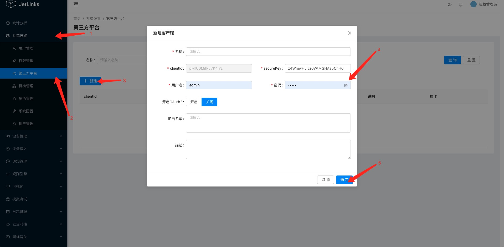

  * [ 前言 ](../../)
  * 物联网平台操作 
    * [ 前言 ](../)
    * 快速开始 
      * [ introduction ](../quick-start/introduction.html)
      * [ demo ](../quick-start/demo.html)
    * 开发指南 
      * [ assets ](../dev-guide/assets.html)
      * [ commons-api ](../dev-guide/commons-api.html)
      * [ crud ](../dev-guide/crud.html)
      * [ custom-sql-term ](../dev-guide/custom-sql-term.html)
      * [ dashboard ](../dev-guide/dashboard.html)
      * [ device-firmware ](../dev-guide/device-firmware.html)
      * [ mqtt-subs ](../dev-guide/mqtt-subs.html)
      * [ multi-tenant ](../dev-guide/multi-tenant.html)
      * [ websocket-subs ](../dev-guide/websocket-subs.html)
    * 最佳实践 
      * [ auto-register ](auto-register.html)
      * [ coap-connection ](coap-connection.html)
      * [ device-alarm ](device-alarm.html)
      * [ device-connection ](device-connection.html)
      * [ device-gateway-connection ](device-gateway-connection.html)
      * [ http-connection ](http-connection.html)
      * [ jetlinks对接其他云平台教程-HTTP方式 ](jetlinks对接其他云平台教程-HTTP方式.html)
      * [ open-api ](open-api.html)
      * [ sort-link ](sort-link.html)
      * [ start ](start.html)
      * [ tcp-connection ](tcp-connection.html)
      * [ udp-connection ](udp-connection.html)
    * 使用手册 
      * [ DemoDevice ](../basics-guide/DemoDevice.html)
      * [ device-manager ](../basics-guide/device-manager.html)
      * [ protocol-support ](../basics-guide/protocol-support.html)
      * [ quick-start ](../basics-guide/quick-start.html)
      * [ rule-engine ](../basics-guide/rule-engine.html)
      * [ ziduanquanxian ](../basics-guide/ziduanquanxian.html)
  * 萌蜂项目规范 
    * [ 前言 ](../../萌蜂项目规范/)
    * 一、开发项 
      * [ 快速开始 ](../../萌蜂项目规范/开发项/idea-start.html)
      * [ 环境维护 ](../../萌蜂项目规范/开发项/环境维护.html)
      * [ 代码管理 ](../../萌蜂项目规范/开发项/代码管理.html)
      * [ 后端开发 ](../../萌蜂项目规范/开发项/后端开发.html)
      * [ 前端开发 ](../../萌蜂项目规范/开发项/前端开发.html)
      * [ 工程专项 ](../../萌蜂项目规范/开发项/工程专项.html)
      * [ 其他规约 ](../../萌蜂项目规范/开发项/其他规约.html)
      * [ 流程管理 ](../../萌蜂项目规范/开发项/流程管理.html)
    * 二、知识点 
      * [ 安装 Centos7 ](../../萌蜂项目规范/知识点/install-centos7.html)
      * [ Centos 创建用户 ](../../萌蜂项目规范/知识点/centos-create-user.html)
      * [ Centos 安装桌面环境 ](../../萌蜂项目规范/知识点/centos-install-gnome.html)
      * [ Centos 安装KVM ](../../萌蜂项目规范/知识点/centos-install-kvm.html)
      * [ Centos 安装VNC ](../../萌蜂项目规范/知识点/centos-install-vnc.html)
      * [ Centos 安装Pip ](../../萌蜂项目规范/知识点/centos-install-pip.html)
      * [ Docker Compose ](../../萌蜂项目规范/知识点/docker-compose.html)
      * [ FFmpeg ](../../萌蜂项目规范/知识点/ffmpeg.html)
      * [ Nginx 代理 ](../../萌蜂项目规范/知识点/nginx-prefix.html)
      * [ Nginx Rtmp ](../../萌蜂项目规范/知识点/nginx-rtmp.html)
      * [ Nohup ](../../萌蜂项目规范/知识点/nohup.html)
      * [ NodeJs ](../../萌蜂项目规范/知识点/nodejs-upgrade.html)
      * [ Http Code ](../../萌蜂项目规范/知识点/http-code.html)
      * [ String.format() ](../../萌蜂项目规范/知识点/string-format.html)
  * JAVA开发规范 
    * [ 前言 ](../../JAVA开发规范/)
    * 一、编程规约 
      * [ （一）命名风格 ](../../JAVA开发规范/编程规约/命名风格.html)
      * [ （二）常量定义 ](../../JAVA开发规范/编程规约/常量定义.html)
      * [ （三）代码格式 ](../../JAVA开发规范/编程规约/代码格式.html)
      * [ （四）OOP规范 ](../../JAVA开发规范/编程规约/OOP规范.html)
      * [ （五）集合处理 ](../../JAVA开发规范/编程规约/集合处理.html)
      * [ （六）并发处理 ](../../JAVA开发规范/编程规约/并发处理.html)
      * [ （七）控制语句 ](../../JAVA开发规范/编程规约/控制语句.html)
      * [ （八）注释规约 ](../../JAVA开发规范/编程规约/注释规约.html)
    * 二、异常日志 
      * [ （一）异常处理 ](../../JAVA开发规范/异常日志/异常处理.html)
      * [ （二）日志规范 ](../../JAVA开发规范/异常日志/日志规约.html)
      * [ （三）其他 ](../../JAVA开发规范/异常日志/其他.html)
    * [ 三、单元测试 ](../../JAVA开发规范/单元测试.html)
    * [ 四、安全规约 ](../../JAVA开发规范/安全规约.html)
    * 五、MySQL数据库 
      * [ （一）建表规约 ](../../JAVA开发规范/MySQL数据库/建表规约.html)
      * [ （二）索引规约 ](../../JAVA开发规范/MySQL数据库/索引规约.html)
      * [ （三）SQL语句 ](../../JAVA开发规范/MySQL数据库/SQL语句.html)
      * [ （四）ORM映射 ](../../JAVA开发规范/MySQL数据库/ORM映射.html)
    * 六、工程结构 
      * [ （一）应用分层 ](../../JAVA开发规范/工程结构/应用分层.html)
      * [ （二）二方库依赖 ](../../JAVA开发规范/工程结构/二方库依赖.html)
      * [ （三）服务器 ](../../JAVA开发规范/工程结构/服务器.html)
    * [ 附：本手册专有名词 ](../../JAVA开发规范/本手册专有名词.html)
  * MIS系统操作手册 
    * [ MIS系统操作手册 ](../../用户操作手册/用户操作手册.html)
  * MIS系统环境临时记录 
    * [ MIS系统环境临时记录 ](../../MIS系统环境临时记录/组态和大屏连接地址配置.html)
  *   * [ Published with GitBook ](https://www.gitbook.com)

#  __[open-api](../..)

# OpenApi使用

基于数据签名的OpenApi模块.用于对外提供接口.

::: tip 注意 本功能仅在企业版中提供. :::

## 创建客户端

进入平台:[系统设置]-[OpenApi客户端]

点击新建按钮:

填写对应的内容保存.

::: tip 注意 `clientId`和`secureKey`需要提供给客户端开发者.
用户名和密码是系统统一的用户主体,会自动创建到用户管理中.使用此用户名密码也能登录到系统中. 与其他用户相同,可以将用户绑定到机构实现数据权限控制. :::

## 赋权

点击操作列中的赋权按钮对客户端进行赋权.大部分情况下只需要勾选: `设备操作API`和`设备数据API`权限即可.

::: tip 注意 此赋权操作实际上是对`OpenAPI客户端`对应对`用户主体`进行赋权. :::

## 验证流程

::: tip 说明

  1. 图中`Signature`函数为客户端设置的签名方式,支持`MD5`和`Sha256`.
  2. 发起请求的签名信息都需要放到请求头中,而不是请求体.
  3. OpenApi对开发是透明的,开发只需要关心权限控制即可.OpenAPI和后台接口使用的是相同的权限控制API. 因此开发一个`OpenAPI接口`就是写一个`WebFlux Controller`. [查看使用方式](../dev-guide/crud.html#web)

:::

## 签名

平台使用签名来校验客户端请求的完整性以及合法性.

例1（GET请求）:

ClientId为`testId`, SecureKey为:`testSecure`. 客户端请求接口:
`/api/v1/device/dev0001/log/_query`,参数为`pageSize=20&pageIndex=0`,签名方式为`md5`.

  1. 将参数key按ascii排序得到: pageIndex=0&pageSize=20
  2. 使用拼接时间戳以及密钥得到: pageIndex=0&pageSize=201574993804802testSecure
  3. 使用`md5("pageIndex=0&pageSize=201574993804802testSecure")`得到`837fe7fa29e7a5e4852d447578269523`

最终发起http请求为:

    
    
    GET /api/device?pageIndex=0&pageSize=20
    X-Client-Id: testId
    X-Timestamp: 1574993804802
    X-Sign: 837fe7fa29e7a5e4852d447578269523
    

响应结果:

    
    
    HTTP/1.1 200 OK
    X-Timestamp: 1574994269075
    X-Sign: c23faa3c46784ada64423a8bba433f25
    
    {"status":200,result:[]}
    

例2（POST请求）:

ClientId为`MmXnSF4Wba7eMf6n`, SecureKey为:`eajQWkGa4DHRxwJCQRtkfCpe`. 客户端请求接口:
`/api/v1/device/_query`,参数为`{"paging":false}`,签名方式为`md5`.

  1. 将body参数整体直接传入
  2. 使用拼接时间戳以及密钥得到: {"paging":false}1626666148780eajQWkGa4DHRxwJCQRtkfCpe
  3. 使用md5("{"paging":false}1626666148780eajQWkGa4DHRxwJCQRtkfCpe")得到签名串af686d000a31978c1e6c7a9d59c0012a

最终发起http请求为:

    
    
    POST /api/v1/device/_query
    X-Client-Id: MmXnSF4Wba7eMf6n
    X-Timestamp: 1626666148780
    X-Sign: af686d000a31978c1e6c7a9d59c0012a
    
    {"paging":false}
    

响应结果:

    
    
    HTTP/1.1 200 OK
    X-Timestamp: 1626666148780
    X-Sign: af686d000a31978c1e6c7a9d59c0012a
    
    {
        "result": {
            "total": 7,
            "data": [{
                "productId": "gb28181-pro",
                "registerTime": 1625820354503,
                "createTime": 1625820354515,
                "name": "34020000001110000001",
                "id": "34020000001110000001",
                "state": {
                    "text": "离线",
                    "value": "offline"
                },
                "productName": "国标产品",
                "parentId": "jetlinks-agent"
            }, {
                "productId": "gateway1",
                "registerTime": 1625448767613,
                "createTime": 1625447824635,
                "name": "网关设备",
                "id": "gateway1",
                "state": {
                    "text": "离线",
                    "value": "offline"
                },
                "productName": "网关设备"
            }, {
                "productId": "edge-gateway",
                "registerTime": 1625565370567,
                "createTime": 1625564667544,
                "name": "测试",
                "id": "jetlinks-agent",
                "state": {
                    "text": "离线",
                    "value": "offline"
                },
                "productName": "测试"
            }, {
                "productId": "mqtt_pro",
                "registerTime": 1626161777107,
                "createTime": 1626161652399,
                "name": "test",
                "id": "233",
                "state": {
                    "text": "离线",
                    "value": "offline"
                },
                "productName": "mqtt产品"
            }, {
                "productId": "udp-pro",
                "registerTime": 1626322047249,
                "createTime": 1626322044526,
                "name": "测试upd设备",
                "id": "udp-1",
                "state": {
                    "text": "离线",
                    "value": "offline"
                },
                "productName": "udp产品"
            }, {
                "productId": "coap-pro",
                "registerTime": 1626225975637,
                "createTime": 1626225972273,
                "name": "coap设备001",
                "id": "coap-test-001",
                "state": {
                    "text": "离线",
                    "value": "offline"
                },
                "productName": "coap产品"
            }, {
                "productId": "sx-smart-pro",
                "registerTime": 1626258298747,
                "createTime": 1626244562681,
                "name": "烟雾报警器(智慧社区)",
                "id": "7ecc817877ad434a97f6110a95e2ae97",
                "state": {
                    "text": "离线",
                    "value": "offline"
                },
                "productName": "陕西省建筑设计研究院-智慧产品-烟雾报警器(智慧社区)"
            }],
            "pageIndex": 0,
            "pageSize": 25
        },
        "message": "success",
        "status": 200,
        "timestamp": 1626666148826
    }
    

::: tip 参考示例[协议代码](https://github.com/jetlinks/jetlinks-openapi-demo) :::

## 验签

使用和签名相同的算法(不需要对响应结果排序):

    
    
    String secureKey = ...; //密钥
    String responseBody = ...;//服务端响应结果
    String timestampHeader = ...;//响应头: X-Timestamp
    String signHeader = ...; //响应头: X-Sign
    
    String sign = DigestUtils.md5Hex(responseBody+timestampHeader+secureKey);
    if(sign.equalsIgnoreCase(signHeader)){
        //验签通过
    
    }
    

#  results matching ""

# No results matching ""

[ __](jetlinks对接其他云平台教程-HTTP方式.html) [ __](sort-link.html)

