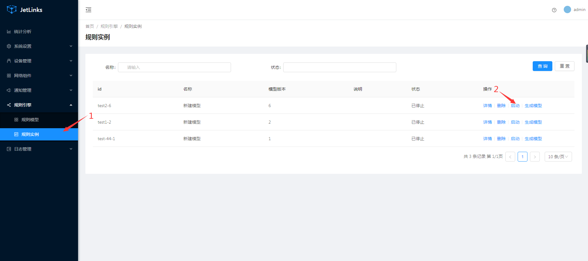
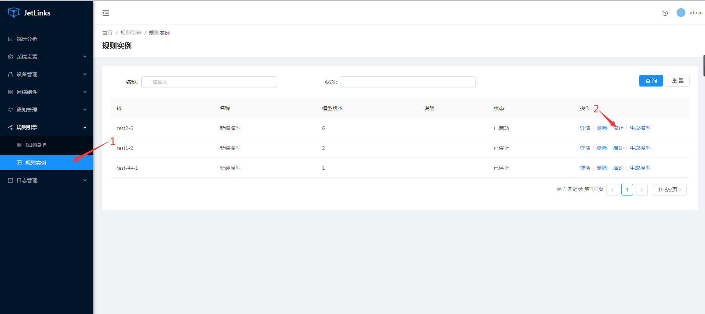

  * [ 前言 ](../../)
  * 物联网平台操作 
    * [ 前言 ](../)
    * 快速开始 
      * [ introduction ](../quick-start/introduction.html)
      * [ demo ](../quick-start/demo.html)
    * 开发指南 
      * [ assets ](../dev-guide/assets.html)
      * [ commons-api ](../dev-guide/commons-api.html)
      * [ crud ](../dev-guide/crud.html)
      * [ custom-sql-term ](../dev-guide/custom-sql-term.html)
      * [ dashboard ](../dev-guide/dashboard.html)
      * [ device-firmware ](../dev-guide/device-firmware.html)
      * [ mqtt-subs ](../dev-guide/mqtt-subs.html)
      * [ multi-tenant ](../dev-guide/multi-tenant.html)
      * [ websocket-subs ](../dev-guide/websocket-subs.html)
    * 最佳实践 
      * [ auto-register ](../best-practices/auto-register.html)
      * [ coap-connection ](../best-practices/coap-connection.html)
      * [ device-alarm ](../best-practices/device-alarm.html)
      * [ device-connection ](../best-practices/device-connection.html)
      * [ device-gateway-connection ](../best-practices/device-gateway-connection.html)
      * [ http-connection ](../best-practices/http-connection.html)
      * [ jetlinks对接其他云平台教程-HTTP方式 ](../best-practices/jetlinks对接其他云平台教程-HTTP方式.html)
      * [ open-api ](../best-practices/open-api.html)
      * [ sort-link ](../best-practices/sort-link.html)
      * [ start ](../best-practices/start.html)
      * [ tcp-connection ](../best-practices/tcp-connection.html)
      * [ udp-connection ](../best-practices/udp-connection.html)
    * 使用手册 
      * [ DemoDevice ](DemoDevice.html)
      * [ device-manager ](device-manager.html)
      * [ protocol-support ](protocol-support.html)
      * [ quick-start ](quick-start.html)
      * [ rule-engine ](rule-engine.html)
      * [ ziduanquanxian ](ziduanquanxian.html)
  * 萌蜂项目规范 
    * [ 前言 ](../../萌蜂项目规范/)
    * 一、开发项 
      * [ 快速开始 ](../../萌蜂项目规范/开发项/idea-start.html)
      * [ 环境维护 ](../../萌蜂项目规范/开发项/环境维护.html)
      * [ 代码管理 ](../../萌蜂项目规范/开发项/代码管理.html)
      * [ 后端开发 ](../../萌蜂项目规范/开发项/后端开发.html)
      * [ 前端开发 ](../../萌蜂项目规范/开发项/前端开发.html)
      * [ 工程专项 ](../../萌蜂项目规范/开发项/工程专项.html)
      * [ 其他规约 ](../../萌蜂项目规范/开发项/其他规约.html)
      * [ 流程管理 ](../../萌蜂项目规范/开发项/流程管理.html)
    * 二、知识点 
      * [ 安装 Centos7 ](../../萌蜂项目规范/知识点/install-centos7.html)
      * [ Centos 创建用户 ](../../萌蜂项目规范/知识点/centos-create-user.html)
      * [ Centos 安装桌面环境 ](../../萌蜂项目规范/知识点/centos-install-gnome.html)
      * [ Centos 安装KVM ](../../萌蜂项目规范/知识点/centos-install-kvm.html)
      * [ Centos 安装VNC ](../../萌蜂项目规范/知识点/centos-install-vnc.html)
      * [ Centos 安装Pip ](../../萌蜂项目规范/知识点/centos-install-pip.html)
      * [ Docker Compose ](../../萌蜂项目规范/知识点/docker-compose.html)
      * [ FFmpeg ](../../萌蜂项目规范/知识点/ffmpeg.html)
      * [ Nginx 代理 ](../../萌蜂项目规范/知识点/nginx-prefix.html)
      * [ Nginx Rtmp ](../../萌蜂项目规范/知识点/nginx-rtmp.html)
      * [ Nohup ](../../萌蜂项目规范/知识点/nohup.html)
      * [ NodeJs ](../../萌蜂项目规范/知识点/nodejs-upgrade.html)
      * [ Http Code ](../../萌蜂项目规范/知识点/http-code.html)
      * [ String.format() ](../../萌蜂项目规范/知识点/string-format.html)
  * JAVA开发规范 
    * [ 前言 ](../../JAVA开发规范/)
    * 一、编程规约 
      * [ （一）命名风格 ](../../JAVA开发规范/编程规约/命名风格.html)
      * [ （二）常量定义 ](../../JAVA开发规范/编程规约/常量定义.html)
      * [ （三）代码格式 ](../../JAVA开发规范/编程规约/代码格式.html)
      * [ （四）OOP规范 ](../../JAVA开发规范/编程规约/OOP规范.html)
      * [ （五）集合处理 ](../../JAVA开发规范/编程规约/集合处理.html)
      * [ （六）并发处理 ](../../JAVA开发规范/编程规约/并发处理.html)
      * [ （七）控制语句 ](../../JAVA开发规范/编程规约/控制语句.html)
      * [ （八）注释规约 ](../../JAVA开发规范/编程规约/注释规约.html)
    * 二、异常日志 
      * [ （一）异常处理 ](../../JAVA开发规范/异常日志/异常处理.html)
      * [ （二）日志规范 ](../../JAVA开发规范/异常日志/日志规约.html)
      * [ （三）其他 ](../../JAVA开发规范/异常日志/其他.html)
    * [ 三、单元测试 ](../../JAVA开发规范/单元测试.html)
    * [ 四、安全规约 ](../../JAVA开发规范/安全规约.html)
    * 五、MySQL数据库 
      * [ （一）建表规约 ](../../JAVA开发规范/MySQL数据库/建表规约.html)
      * [ （二）索引规约 ](../../JAVA开发规范/MySQL数据库/索引规约.html)
      * [ （三）SQL语句 ](../../JAVA开发规范/MySQL数据库/SQL语句.html)
      * [ （四）ORM映射 ](../../JAVA开发规范/MySQL数据库/ORM映射.html)
    * 六、工程结构 
      * [ （一）应用分层 ](../../JAVA开发规范/工程结构/应用分层.html)
      * [ （二）二方库依赖 ](../../JAVA开发规范/工程结构/二方库依赖.html)
      * [ （三）服务器 ](../../JAVA开发规范/工程结构/服务器.html)
    * [ 附：本手册专有名词 ](../../JAVA开发规范/本手册专有名词.html)
  * MIS系统操作手册 
    * [ MIS系统操作手册 ](../../用户操作手册/用户操作手册.html)
  * MIS系统环境临时记录 
    * [ MIS系统环境临时记录 ](../../MIS系统环境临时记录/组态和大屏连接地址配置.html)
  *   * [ Published with GitBook ](https://www.gitbook.com)

#  __[rule-engine](../..)

# 规则引擎

提供可视化,流程化的数据(逻辑)处理工具.

## 规则模型

新建规则模型

  * 登录物联网管理平台。
  * 选择左侧导航栏，选择规则引擎 > 规则模型。
  * 在规则模型板块中，单击`新建模型`操作按钮。
  * 在弹出设计器中，拖拽节点和连线生成相应规则，填写模型id和名称点击`保存`。
  * 规则模型提供配置的导出、导入（支持批量导入）、复制功能

### 规则节点

  * 数据的处理逻辑由规则节点执行. 不同的节点类型需要不同的配置.
  * 节点就像一个java方法,接收上一个节点的参数,处理之后输出到下一个节点.
  * 节点之间使用`连线`进行连接,组成一个完整到流程.
  * 节点可以不接收数据,只生产数据.如: `定时任务`,`消息网关`.
  * 节点可分布在不同的服务器上执行(企业版支持).

### 输入输出

规则节点的输入和输出数据均为`RuleData`格式为:

    
    
        {
            "data": {},//输入参数或者输出结果
            "attributes": {}//拓展属性,通常用于传递节点产生的特殊变量,如异常信息等.
        }
    

在一些节点里,会将`RuleData`转为内置变量以进行一些自定义操作,比如脚本执行,表达式判断等.
通常情况下,内置变量与`RuleData`格式一致.例如:

上一节点输出`RuleData.data`为`{"username":"admin","password":"m123"}`
内置变量会被转为`Map`,变成:

    
    
    {
        "attr":{}, //attributes的简写
        "data":{
            "username":"admin",
            "password":"m123"
        },
        "username":"admin", //data里的数据被平铺里
        "password":"m123"
    }
    

::: tip 注意

在规则引擎节点中,大部分表达式使用的是`SpEL表达式`,所以要注意引用内置变量的方式为: `${#data[username]}`
而不是`${#data.username}`.

:::

### 连线

节点之间通过`连线`连接，`连线`保证多个节点连续执行和有序执行.连线类型分为: `连接`和`事件`.

`连接`表示当上一个节点输出数据后,数据会流入下一个节点. `事件`表示当上一个节点触发一下事件时,数据才会流入下一个节点.

`连线`可以指定条件,当满足条件表达式时,数据才会流入下一个节点. 条件表达式为`javascript`. 表达式返回`true`则表示满足条件.

### 调试

  * 单击相应的节点，在右侧节点对应的功能表单中，填写好对应的数据。
  * 点击运行，填写运行时需要的执行参数。
  * 点击确认。
  * 在下方日志展示栏中，查看节点对应的调试日志

## 规则实例

生成规则实例

  * 在规则模型列表中，选择对应的模型。
  * 在对应的模型列表中，单击操作列中的发布操作，用该规则模型生成规则实例。

### 启动

选择规则引擎 > 规则实例。选择规则实例发布生成的规则实例，单击操作列中启动操作 用以启动该规则。  

### 停止

选择规则引擎 > 规则实例。选择已启动的规则实例，单击操作列中停止操作 用以停止该规则。  

### 执行

  * 点击规则实例列表操作列中的查看详情操作
  * 在弹出的界面中点击执行按钮
  * 点击执行按钮后弹出的界面中选择开始节点、结束节点（开始、结束节点来自于规则 实例中的所有节点，且开始、结束节点可选择相同节点），填写执行参数。单击确认按钮， 在弹窗下方响应栏查看执行结果。
  * 节点执行日志：执行日志主要记录节点在执行过程中的错误信息或主动输出打印的日志信息。  
在第二步界面中，选择日志栏查看规则实例所有日志。

    * 选中规则实例中不同节点用以查看该节点对应的日志。
    * 选中规则实例页空白处，重新查看该规则实例所有节点日志。
  * 节点执行事件：执行事件主要记录节点执行前后节点中的数据 在第二步界面中，选择事件栏查看规则实例所有事件记录。
    * 选中规则实例中不同节点用以查看该节点对应的事件记录。
    * 选中规则实例页空白处，重新查看该规则实例所有节点事件记录。

# 节点支持

通用说明

  * 节点会在设计器中展示节点自身所需要的参数表单。
  * 每个节点通用的表单参数有 节点ID、节点类型、节点名称、节点大小、节点颜色、调度规则
  * 节点ID: 规则模型中每个节点的独立标识（自动生成不可修改）
  * 节点类型: 节点所对应的功能类型（自动生成不可修改）
  * 节点名称: 节点方块在设计器中所展示的名称
  * 节点大小: 节点方块在设计器中的尺寸大小
  * 节点颜色: 节点方块在设计器中展示的颜色
  * 调度规则: 节点在集群中的哪些主机中运行（企业版支持）。

## 定时任务

定时任务节点用于需要周期性执行某业务规则。如定时同步数据

### 定时器配置项

参数 | 用途 | 是否必须 | 用例  
---|---|---|---  
cron表达式 | 生成定时任务规则 | 是 | cron表达式([在线cron表达式](http://cron.qqe2.com/))  
  
## 通知

通过此节点可调用消息通知组件进行消息发送.

### 参数说明

参数 | 用途 | 是否必须 | 用例  
---|---|---|---  
通知类型 | 设置通知类型 | 是 | 短信通知  
通知器 | 设置通知类型对应的配置 | 是 | 选择通知器  
通知模板 | 设置通知需要发送的内容 | 是 | 选择通知模板  
  
::: tip 注意 在通知模版中可使用规则引擎节点的内置变量,具体是否支持需要看通知器实现是否支持. :::

## 路由

路由节点将数据转发到多个节点,通过连线条件可实现同一个数据进行不同的处理逻辑.

## 消息网关

消息网关为平台内部的一个`消息总线`,统称`消息网关`,是一个基于`topic`实现消息的消息订阅与发布功能.通常用于订阅设备消息,进行处理.

::: tip 注意 topic是一个以/分割的字符,与MQTT的topic类似. 支持通配符`**`和`*`, 例如:
`/device/*/online` 表示所有的设备上线消息. `/device/**`表示所有设备的所有消息.

注意: 通配符不支持前后匹配. 例如`/device/dev*/` 是不支持的. :::

### 消息网关配置项

参数 | 用途 | 是否必须 | 用例  
---|---|---|---  
网关 | 选择要订阅的网关 | 是 | 默认网关  
类型 | 设置推送消息还是订阅消息 | 是 | 订阅消息  
Topic | 订阅主题,多个主题使用逗号(,)分割 | 是 | /device/**  
  
### 常用topic

不同的Topic返回的消息格式不同,具体格式请查看对用topic定义文档.

  * 设备消息Topic (TODO)

## MQTT客户端

该节点使用网络组件中的Mqtt客户端进行消息订阅和消息推送。 可使用此功能,将消息处理后通知给第三方MQTT服务.

### MQTT客户端配置项

参数 | 用途 | 是否必须 | 用例  
---|---|---|---  
mqtt客户端 | 设置客户端基本配置 | 是 | 选择MQTT客户端  
操作 | 定义mqtt客户端操作类型 | 是 | 订阅消息  
消息体类型 | 根据不同的类型解析为对应的数据 | 是 | JSON  
主题Topic | 定义推送或订阅消息的主题 | 是 | /topic/${#data.id}  
主题变量 | 将把topic中的占位符提取为变量传递到下一个节点(仅订阅生效) | 否 |
/{productId}/{deviceId}/event/{eventId}  
  
### MQTT客户端内置变量

推送数据格式(由上一个节点传入):

    
    
    {
        "topic":"/1/a/event/temp", //可选,如果传递了topic则配置中的topic失效.
        "payloadType":"JSON",//可选,如果未设置则以配置项中的为准.
        "payload": {}, //要推送的消息内容
    }
    

订阅数据格式(将传入下一个节点):

    
    
        {
            "topic":"/1/a/event/temp", //主题topic
            "will":false,
            "qos":0,
            "dup":false,
            "retain":false,
            "clientId":"客户端Id",
            "payloadType":"JSON",//接收消息类型
            "payload": {}, //接收的消息内容,不同的消息类型,格式不同
            "vars":{//topic占位符变量
                "productId":"型号Id",
                "deviceId":"设备Id",
                "eventId":"事件Id"
            }
        }
    

## TCP客户端

该节点使用网络组件中的TCP客户端进行消息订阅和消息推送

### TCP客户端配置项

参数 | 用途 | 是否必须 | 用例  
---|---|---|---  
tcp客户端 | 设置客户端基本配置 | 是 | 弹出框选择  
操作 | 定义tcp客户端操作类型 | 是 | 订阅消息  
消息体类型 | 订阅或发送消息体类型 | 否 | JSON  
  
#### TCP客户端内置变量

推送数据格式(由上一步传入):

    
    
    {
        "payloadType":"BINARY",//消息类型
        "payload": "BASE64" //发送的消息
    }
    

订阅数据格式:

    
    
    {
        "payloadType":"BINARY",//消息类型
        "payload": "BASE64" //接收的消息
    }
    

## WebSocket客户端

(企业版支持)

该节点使用网络组件中的Websocket客户端进行消息订阅和发布.

### WebSocket客户端参数说明

参数 | 用途 | 是否必须 | 用例  
---|---|---|---  
WebSocket客户端 | 设置客户端基本配置 | 是 | 弹出框中选择  
操作 | 定义WebSocket客户端操作类型 | 是 | 订阅消息  
消息体类型 | 定义WebSocket客户端消息类型 | 否 | JSON  
  
### WebSocket客户端内置变量

推送数据格式(由上一步传入):

    
    
    {
        "payloadType":"JSON",//消息类型
        "payload": {} //发送的消息
    }
    

订阅数据格式:

    
    
    {
        "payloadType":"JSON",//消息类型
        "payload": {} //接收的消息
    }
    

## HTTP客户端

(企业版支持)

使用网络组件中的HTTP客户端发起HTTP请求

### HTTP客户端参数说明

参数 | 用途 | 是否必须 | 用例  
---|---|---|---  
Http客户端 | 设置客户端基本配置 | 是 | 弹出框中选择  
uri | 资源详细路径 | 是 | /demo/user/${#data[id]}  
请求方式 | 定义Http请求方式 | 是 | GET  
contentType | 定义Http contentType | 是 | application/json  
请求消息体类型 | 定义Http客户端请求体的消息类型 | 是 | JSON  
响应消息体类型 | 定义Http服务端响应的消息类型 | 是 | JSON  
  
### HTTP客户端内置变量

请求(通过上一步传入):

    
    
    {
        "headers":[{"name":"header","value":["value"]}],
        "queryParameters":{}, //URL 参数
        "payload":{} //消息体
    }
    

响应:

    
    
    {
        "payload":{}, //接收的消息
        "payloadType":"JSON",//接收消息类型 
        "status":200,
        "headers":[
            {
                "name":"请求头名称",
                "value":[
                    "请求头值1",
                    "请求头值2"
                ]
            }
        ],
        "contentType":"application/json"
    }
    

## CoAP客户端

该节点使用网络组件中的CoAP客户端进行CoAP讲求

### CoAP客户端参数说明

参数 | 用途 | 是否必须 | 用例  
---|---|---|---  
CoAP客户端 | 设置客户端基本配置 | 是 | 弹出框中选择  
uri | 资源详细路径 | 是 | /demo/user/{id}  
请求方法 | 定义CoAP请求方式 | 是 | GET  
消息体类型 | 定义CoAP客户端消息类型 | 是 | JSON  
  
### CoAP客户端内置变量

请求参数(由上一节点传入):

    
    
    {
      "payload":{},//消息内容
      "options":{},//自定义Options
      "payloadType":"JSON",//可选,消息体类型
      "path":""//可选,请求路径  
    }
    

响应结果:

    
    
    {
        "payload":{ //接收的消息
    
        },
        "path":"/demo/user/{id}",//请求路径
        "code":200, //响应状态码
        "options":{},//options
        "success":true //响应结果
    }
    

## 执行SQL

该节点执行SQL语句.

### 执行SQL配置项

参数 | 用途 | 是否必须 | 用例  
---|---|---|---  
sql | 定义所选择数据源支持的sql语句 | 是 | select 1  
  
### 执行SQL说明

当sql为查询时,查询的每一条结果都会被传入下一个节点.而不是传入整个结果集.

## 字段转换

该节点可转换数据的字段。如 source：a=1 target:b=1

### 字段转换配置项

参数 | 用途 | 是否必须 | 用例  
---|---|---|---  
保留源字段 | 源字段是否保留在转换结果中 | 否 | 是  
转换规则 | 配置转换方式 | 否  
  
  1. 单击转换规则
  2. 在弹出框中，单击添加字段
  3. 输入原字段、目标字段、类型
    * 原字段：需要转换的字段
    * 目标字段：转换后生成的字段
    * 字段类型： 该字段的数据类型
  4. 点击保存生成字段转换配置

::: tip 注意 源字段支持SpEL表达式 :::

## 动态脚本

该节点可执行脚本,通过脚本进行一些自定义的逻辑.

### 动态脚本配置项

参数 | 用途 | 是否必须 | 用例  
---|---|---|---  
脚本语言 | 定于将要执行的脚本语言类型 | 是 | javascript  
脚本 | 定于将要执行的脚本 | 是  
  
#### 脚本案例

javascrpt:

    
    
    handler.onMessage(function(ruleData){
        var map = new java.utils.HashMap();
        map.put("payload":"hello js");
        return map;
    }));
    

groovy:

    
    
    handler.onMessage({ ruleData ->
         return [
            "messageType":"READ_PROPERTY_REPLY",
            "deviceId":ruleData.data.payload.deviceId,
            "messageId":ruleData.data.payload.messageId,
            "success":true,
            "properties":[name:"test"]
        ]
    });
    

#  results matching ""

# No results matching ""

[ __](quick-start.html) [ __](ziduanquanxian.html)

