  * [ 前言 ](../../)
  * 物联网平台操作 
    * [ 前言 ](../)
    * 快速开始 
      * [ introduction ](../quick-start/introduction.html)
      * [ demo ](../quick-start/demo.html)
    * 开发指南 
      * [ assets ](../dev-guide/assets.html)
      * [ commons-api ](../dev-guide/commons-api.html)
      * [ crud ](../dev-guide/crud.html)
      * [ custom-sql-term ](../dev-guide/custom-sql-term.html)
      * [ dashboard ](../dev-guide/dashboard.html)
      * [ device-firmware ](../dev-guide/device-firmware.html)
      * [ mqtt-subs ](../dev-guide/mqtt-subs.html)
      * [ multi-tenant ](../dev-guide/multi-tenant.html)
      * [ websocket-subs ](../dev-guide/websocket-subs.html)
    * 最佳实践 
      * [ auto-register ](auto-register.html)
      * [ coap-connection ](coap-connection.html)
      * [ device-alarm ](device-alarm.html)
      * [ device-connection ](device-connection.html)
      * [ device-gateway-connection ](device-gateway-connection.html)
      * [ http-connection ](http-connection.html)
      * [ jetlinks对接其他云平台教程-HTTP方式 ](jetlinks对接其他云平台教程-HTTP方式.html)
      * [ open-api ](open-api.html)
      * [ sort-link ](sort-link.html)
      * [ start ](start.html)
      * [ tcp-connection ](tcp-connection.html)
      * [ udp-connection ](udp-connection.html)
    * 使用手册 
      * [ DemoDevice ](../basics-guide/DemoDevice.html)
      * [ device-manager ](../basics-guide/device-manager.html)
      * [ protocol-support ](../basics-guide/protocol-support.html)
      * [ quick-start ](../basics-guide/quick-start.html)
      * [ rule-engine ](../basics-guide/rule-engine.html)
      * [ ziduanquanxian ](../basics-guide/ziduanquanxian.html)
  * 萌蜂项目规范 
    * [ 前言 ](../../萌蜂项目规范/)
    * 一、开发项 
      * [ 快速开始 ](../../萌蜂项目规范/开发项/idea-start.html)
      * [ 环境维护 ](../../萌蜂项目规范/开发项/环境维护.html)
      * [ 代码管理 ](../../萌蜂项目规范/开发项/代码管理.html)
      * [ 后端开发 ](../../萌蜂项目规范/开发项/后端开发.html)
      * [ 前端开发 ](../../萌蜂项目规范/开发项/前端开发.html)
      * [ 工程专项 ](../../萌蜂项目规范/开发项/工程专项.html)
      * [ 其他规约 ](../../萌蜂项目规范/开发项/其他规约.html)
      * [ 流程管理 ](../../萌蜂项目规范/开发项/流程管理.html)
    * 二、知识点 
      * [ 安装 Centos7 ](../../萌蜂项目规范/知识点/install-centos7.html)
      * [ Centos 创建用户 ](../../萌蜂项目规范/知识点/centos-create-user.html)
      * [ Centos 安装桌面环境 ](../../萌蜂项目规范/知识点/centos-install-gnome.html)
      * [ Centos 安装KVM ](../../萌蜂项目规范/知识点/centos-install-kvm.html)
      * [ Centos 安装VNC ](../../萌蜂项目规范/知识点/centos-install-vnc.html)
      * [ Centos 安装Pip ](../../萌蜂项目规范/知识点/centos-install-pip.html)
      * [ Docker Compose ](../../萌蜂项目规范/知识点/docker-compose.html)
      * [ FFmpeg ](../../萌蜂项目规范/知识点/ffmpeg.html)
      * [ Nginx 代理 ](../../萌蜂项目规范/知识点/nginx-prefix.html)
      * [ Nginx Rtmp ](../../萌蜂项目规范/知识点/nginx-rtmp.html)
      * [ Nohup ](../../萌蜂项目规范/知识点/nohup.html)
      * [ NodeJs ](../../萌蜂项目规范/知识点/nodejs-upgrade.html)
      * [ Http Code ](../../萌蜂项目规范/知识点/http-code.html)
      * [ String.format() ](../../萌蜂项目规范/知识点/string-format.html)
  * JAVA开发规范 
    * [ 前言 ](../../JAVA开发规范/)
    * 一、编程规约 
      * [ （一）命名风格 ](../../JAVA开发规范/编程规约/命名风格.html)
      * [ （二）常量定义 ](../../JAVA开发规范/编程规约/常量定义.html)
      * [ （三）代码格式 ](../../JAVA开发规范/编程规约/代码格式.html)
      * [ （四）OOP规范 ](../../JAVA开发规范/编程规约/OOP规范.html)
      * [ （五）集合处理 ](../../JAVA开发规范/编程规约/集合处理.html)
      * [ （六）并发处理 ](../../JAVA开发规范/编程规约/并发处理.html)
      * [ （七）控制语句 ](../../JAVA开发规范/编程规约/控制语句.html)
      * [ （八）注释规约 ](../../JAVA开发规范/编程规约/注释规约.html)
    * 二、异常日志 
      * [ （一）异常处理 ](../../JAVA开发规范/异常日志/异常处理.html)
      * [ （二）日志规范 ](../../JAVA开发规范/异常日志/日志规约.html)
      * [ （三）其他 ](../../JAVA开发规范/异常日志/其他.html)
    * [ 三、单元测试 ](../../JAVA开发规范/单元测试.html)
    * [ 四、安全规约 ](../../JAVA开发规范/安全规约.html)
    * 五、MySQL数据库 
      * [ （一）建表规约 ](../../JAVA开发规范/MySQL数据库/建表规约.html)
      * [ （二）索引规约 ](../../JAVA开发规范/MySQL数据库/索引规约.html)
      * [ （三）SQL语句 ](../../JAVA开发规范/MySQL数据库/SQL语句.html)
      * [ （四）ORM映射 ](../../JAVA开发规范/MySQL数据库/ORM映射.html)
    * 六、工程结构 
      * [ （一）应用分层 ](../../JAVA开发规范/工程结构/应用分层.html)
      * [ （二）二方库依赖 ](../../JAVA开发规范/工程结构/二方库依赖.html)
      * [ （三）服务器 ](../../JAVA开发规范/工程结构/服务器.html)
    * [ 附：本手册专有名词 ](../../JAVA开发规范/本手册专有名词.html)
  * MIS系统操作手册 
    * [ MIS系统操作手册 ](../../用户操作手册/用户操作手册.html)
  * MIS系统环境临时记录 
    * [ MIS系统环境临时记录 ](../../MIS系统环境临时记录/组态和大屏连接地址配置.html)
  *   * [ Published with GitBook ](https://www.gitbook.com)

#  __[tcp-connection](../..)

# 使用TCP服务网关接入设备

本文档使用[Packet Sender](https://packetsender.com/download#show)工具模拟tcp客户端接入平台。

## 创建协议

请参考[创建协议](../advancement-guide/mqtt-connection.md#创建协议)

::: tip 本文使用到协议仅作为演示,请根据实际情况参照协议实现.在设备未确定协议的情况下,建议使用mqtt方式接入. :::

## 创建产品

  1. 选择 `设备管理`\-->`产品`\--> 点击`新建`按钮。

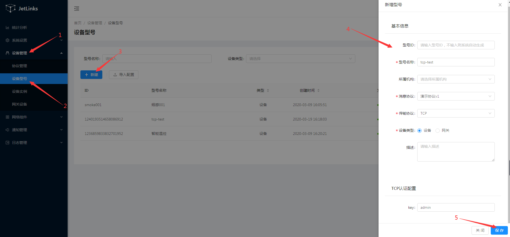

  1. 在操作列点击`查看`，选择功能定义，点击`添加`按钮添加属性和事件。  
i. 属性定义  
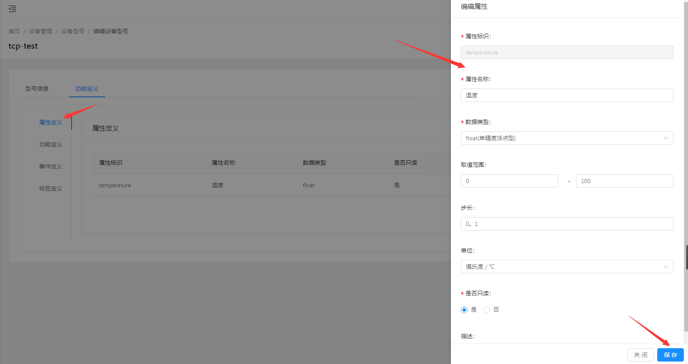  
ii. 事件定义  
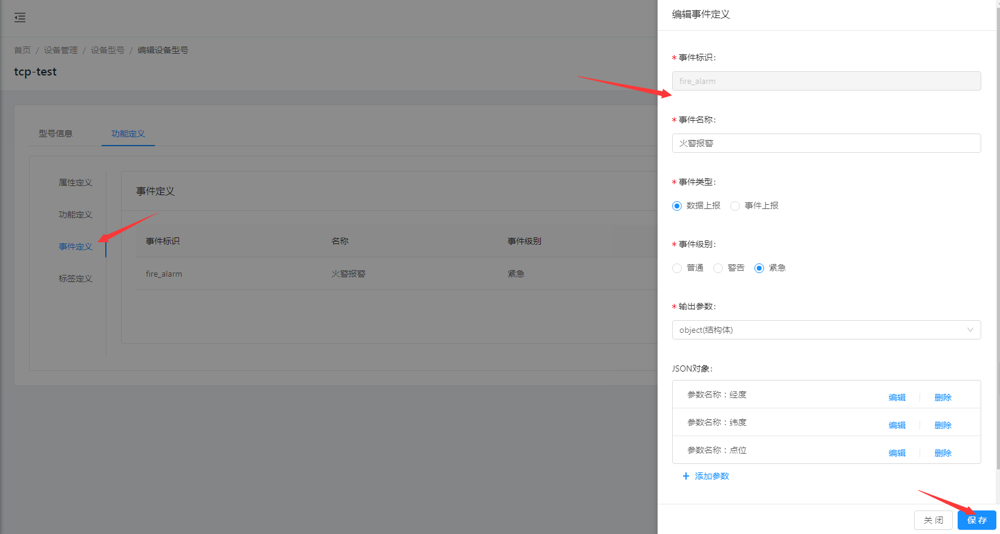

json对象-经度：  
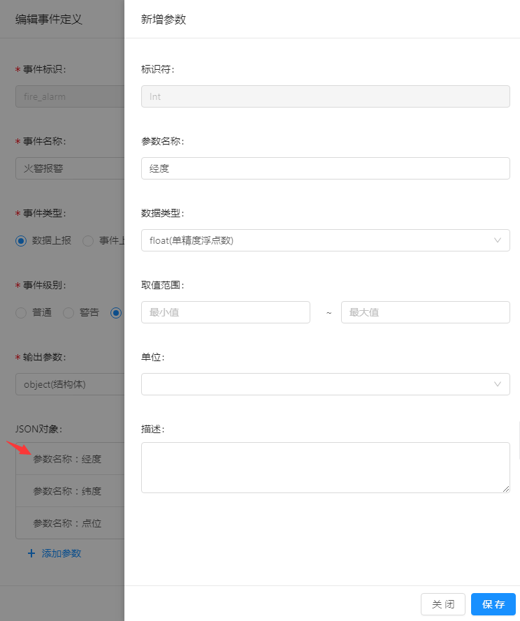

json对象-维度：  
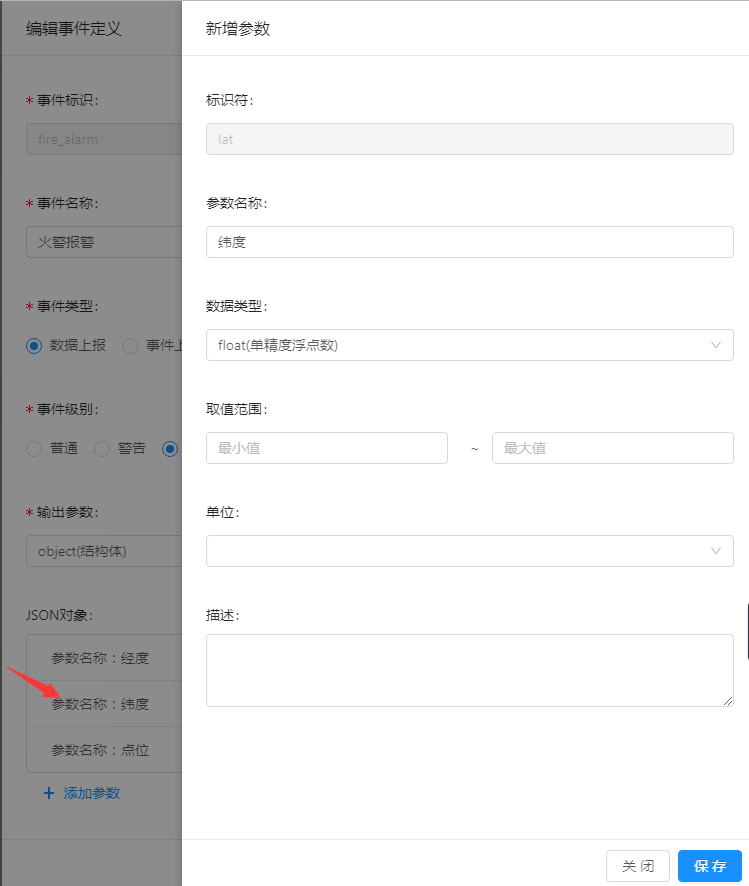

json对象-点位：  
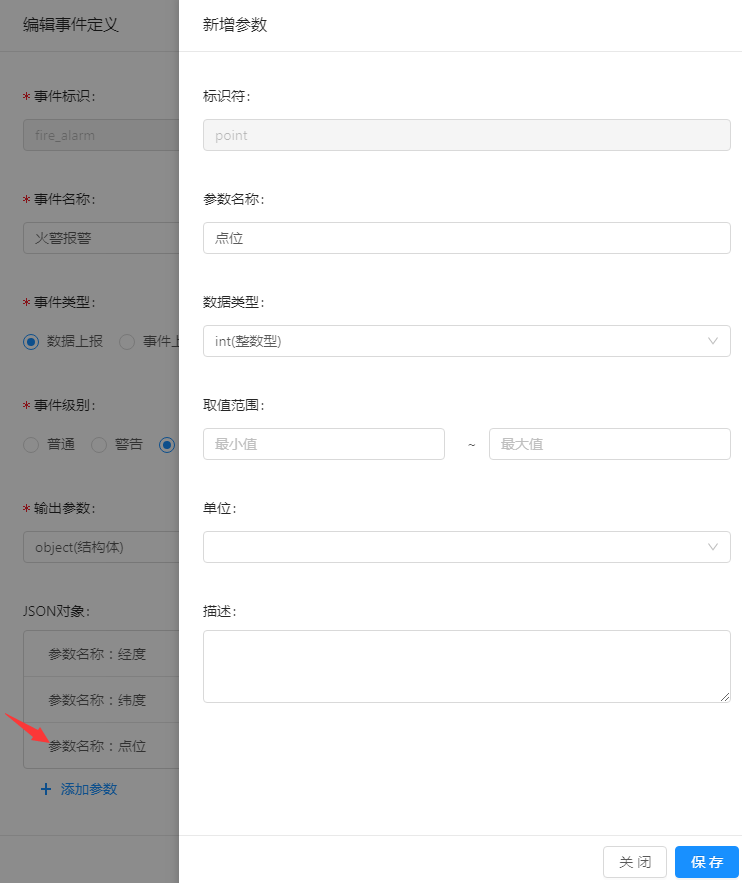

  2. 在操作列点击`发布`按钮，发布新增的型号。

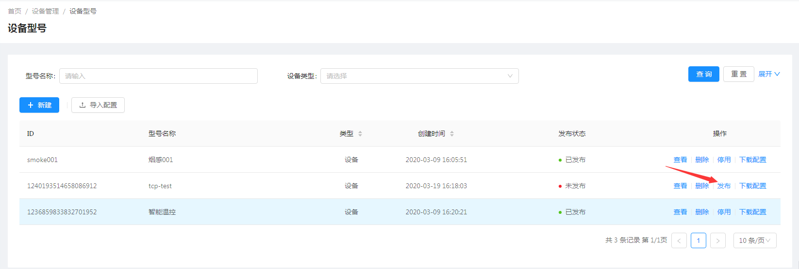

## 创建设备

  1. 选择 `设备管理`\-->`设备`\--> 点击`添加设备`按钮。

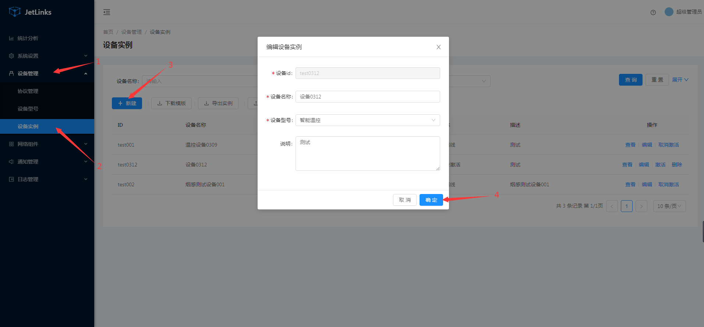

  1. 在操作列点击`激活`按钮，激活新增的设备实例。

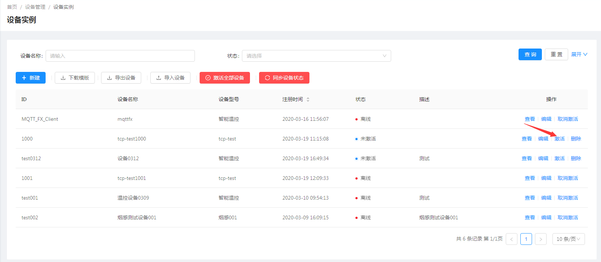

## 创建TCP服务网络组件

  1. 选择 `设备接入`\-->`网络组件`\--> 点击`新增组件`按钮。  
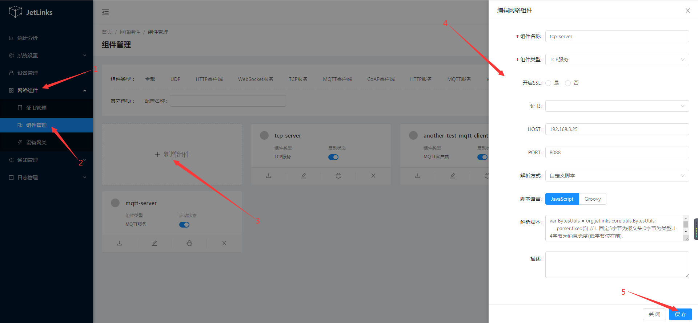  
::: tip 注意 本文档使用javascript自定义脚本的方式解析消息。用于处理tcp的粘拆包。 ::: 自定义脚本：

    
        var BytesUtils = org.jetlinks.core.utils.BytesUtils;
      parser.fixed(5) //1. 固定5字节为报文头,0字节为类型,1-4字节为消息长度(低字节位在前).
        .handler(function(buffer){
             var len = BytesUtils.leToInt(buffer.getBytes(),1,4);//2. 获取消息长度.
             parser
                .fixed(len)//3. 设置下一个包要读取固定长度的数据.
                .result(buffer); //4. 设置当前解析的结果
         })
        .handler(function(buffer){
             parser.result(buffer) //5. 收到了新的包,则为消息体,设置到结果中,完成后将与步骤4的数据合并为完整的数据包.
                    .complete(); //6. 完成解析(消息将进入协议中进行解析(DemoTcpMessageCodec)),重置解析器,下一个数据包将从步骤1开始解析.
         });
    

  2. 在创建完成的模块上点击`启动`按钮。  
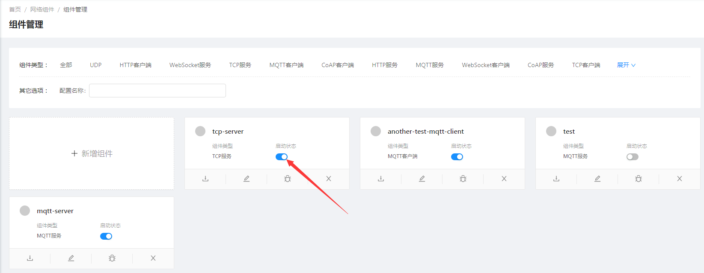

## 创建TCP服务设备网关

  1. 选择 `设备接入`\-->`设备网关`\--> 点击`新建`按钮。 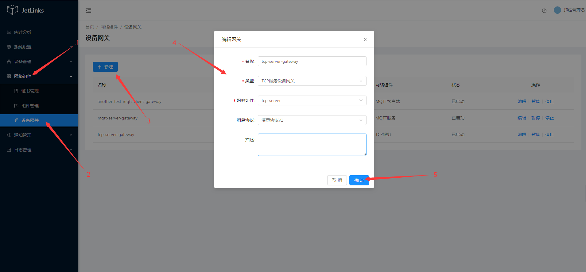  
::: tip 注意 和MQTT服务设备网关不同的是,TCP必须指定消息协议,因为无法通过消息识别出对应的设备标识.
在消息解码时也无法通过上下文(`MessageDecodeContext`)获取到设备操作接口(`DeviceOperator`).
此处使用`demo`协议. :::

  2. 在操作列点击`启动`按钮启动网关。  
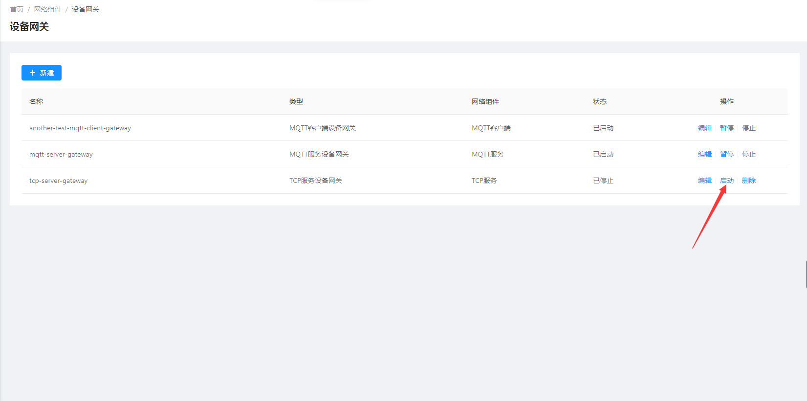

## 使用tcp工具接入

  1. 下载并安装[Packet Sender](https://packetsender.com/download#show)。

::: tip 注意 TCP协议以二进制的数据包传输数据，此处使用Packet Sender工具将发送的消息先转成十六进制，
再通过该工具自动转换成二进制发送到平台。 :::

  1. 生成所需的十六进制字符串。  
i. 检出[协议代码](https://github.com/jetlinks/demo-protocol.git)  
ii.
执行测试包org.jetlinks.demo.protocol.tcp下DemoTcpMessageTest的test方法生成设备认证所需的十六进制字符串  
代码如下：  
```java @Test void test() {

    
         DemoTcpMessage message = DemoTcpMessage.of(MessageType.AUTH_REQ, AuthRequest.of(1000, "admin"));
    
     byte[] data = message.toBytes();
     System.out.println(Hex.encodeHexString(data));
    
     DemoTcpMessage decode = DemoTcpMessage.of(data);
    
     System.out.println(decode);
    
     Assertions.assertEquals(message.getType(), decode.getType());
     Assertions.assertArrayEquals(message.getData().toBytes(), decode.getData().toBytes());
    

}

    
    
    结果：`000d000000e80300000000000061646d696e`
    
    ::: tip 注意
    AuthRequest.of(deviceId,key) 第一个参数为设备id，第二参数为设备型号中配置的TCP认证配置。  
    :::   
    
       iii. 在测试类中执行如下代码生成事件上报所需的十六进制字符串：  
    
    ```java
        @Test
        void encodeEvent() {
            DemoTcpMessage demoTcpMessage = DemoTcpMessage.of(MessageType.FIRE_ALARM,
                    FireAlarm.builder()
                            .point(ThreadLocalRandom.current().nextInt())
                            .lat(36.5F)
                            .lnt(122.3F)
                            .deviceId(1000)
                            .build());
            byte[] data = demoTcpMessage.toBytes();
            System.out.println(demoTcpMessage);
            System.out.println(Hex.encodeHexString(data));
        }
    

结果：`0614000000e8030000000000009a99f4420000124222b7c94c`

  1. 设置参数

i. 设置基本信息 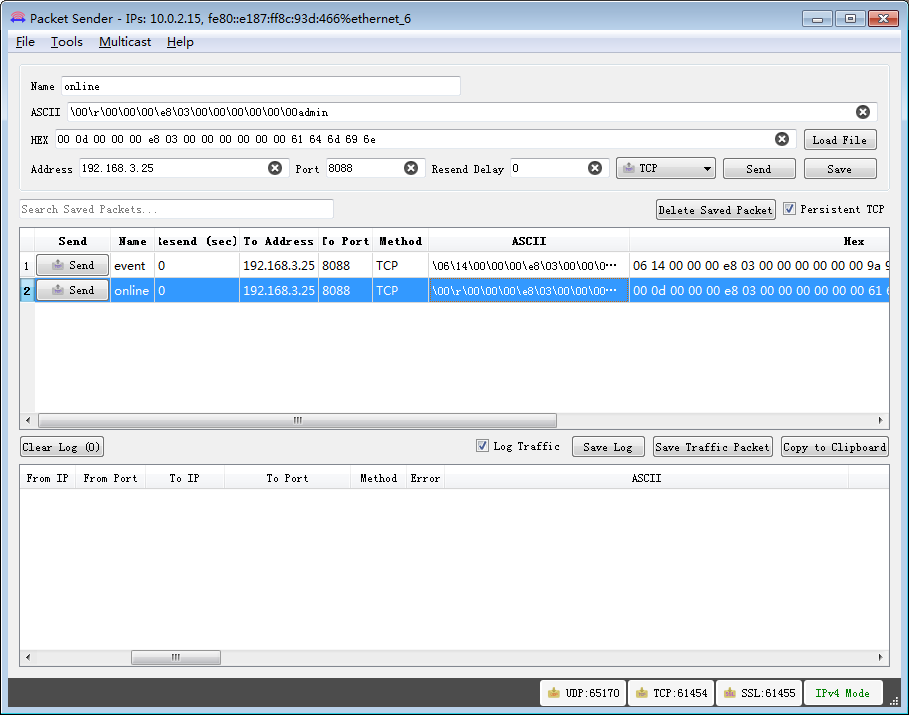

| 参数 | 说明 | | :----- | :----- | | Name | 输入您的自定义名称。 | | ASCII |
ASCII码，输入下方十六进制字符串后会自动生成。 |、 | HEX | 十六进制。 | | Address | TCP服务地址。 | | Port |
TCP服务端口。 | | Persistent TCP | 勾选之后可保持长连接。 |

::: tip 注意 设置参数时，请确保参数值中或参数值的前后均没有空格。 :::  
模式选择TCP。  
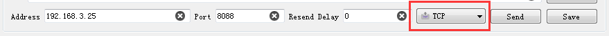

**分 别保存上线参数以及事件上报参数。**  
设备上线：  
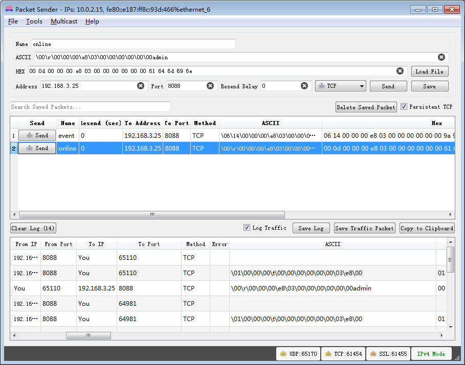  
事件上报：  
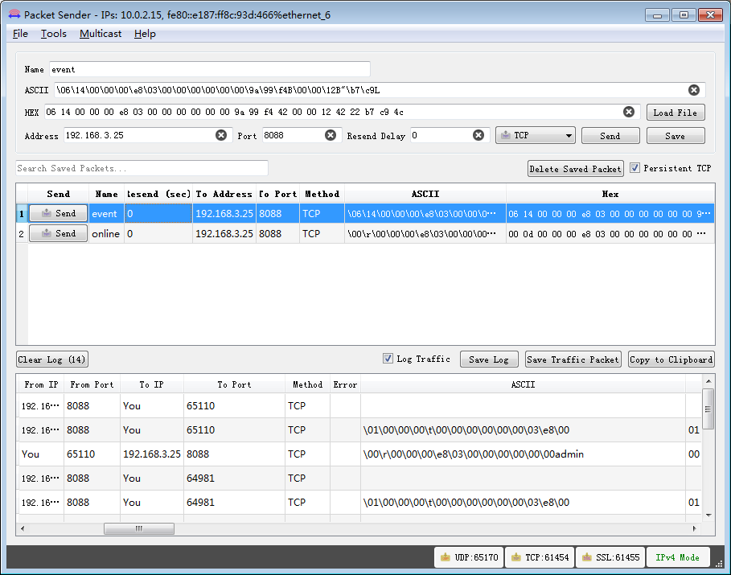

  2. 模拟设备上下线

单击packetsender工具上`Send`按钮发起请求。  
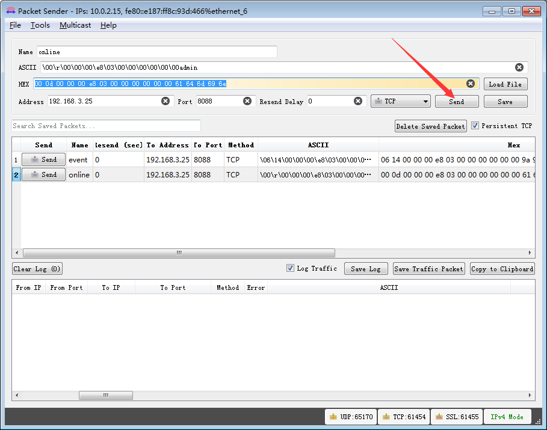

平台中设备状态变为上线即为连接成功

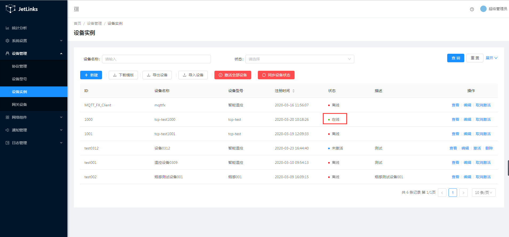

在设备日志模块可以看到设备上线日志

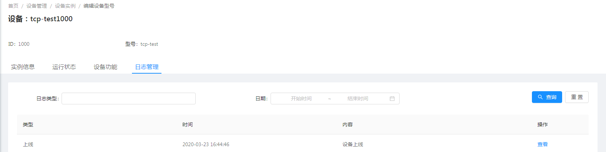

勾选`Persistent TCP`packetsender上请求成功后会打开一个新的已连接页面。

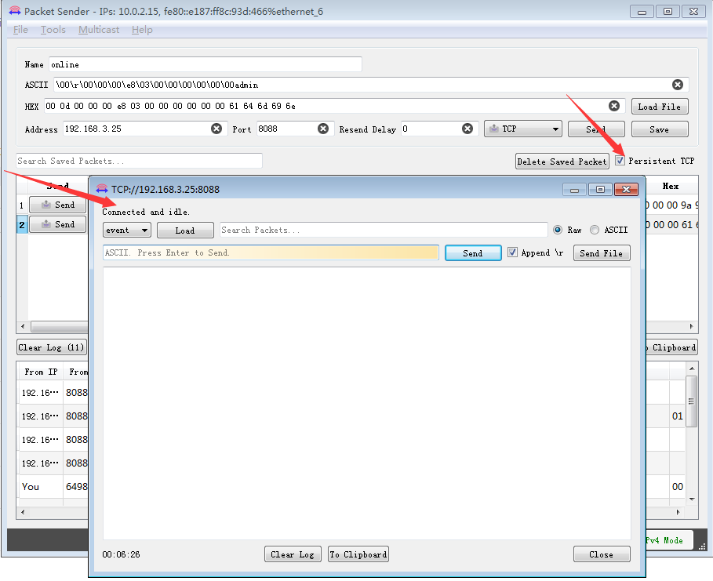

关闭这个新的已连接页面即可断开设备与平台的连接

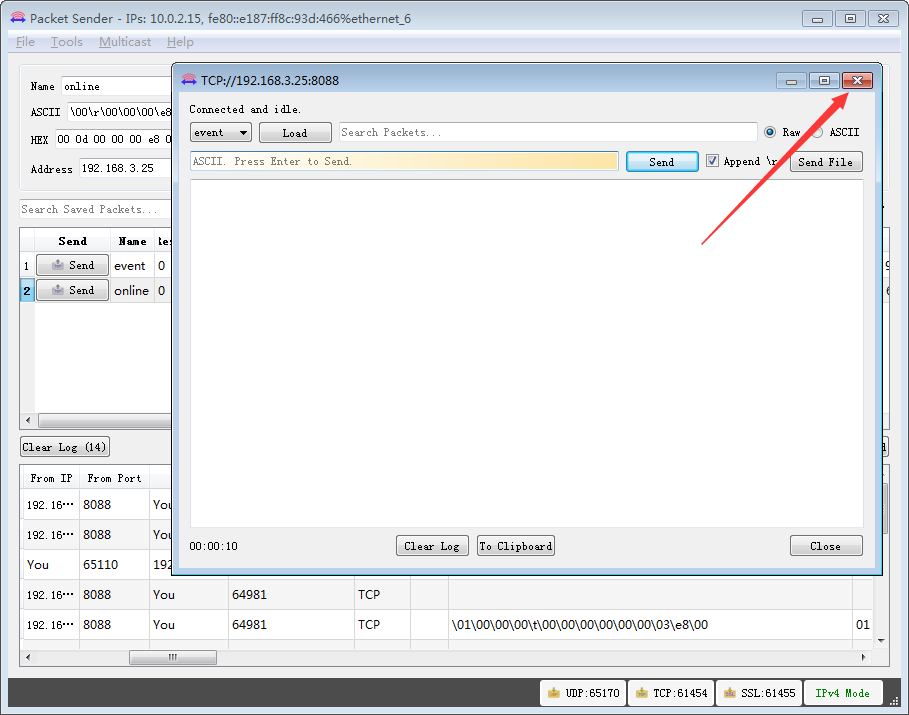

平台中设备状态变为离线即为断开连接成功

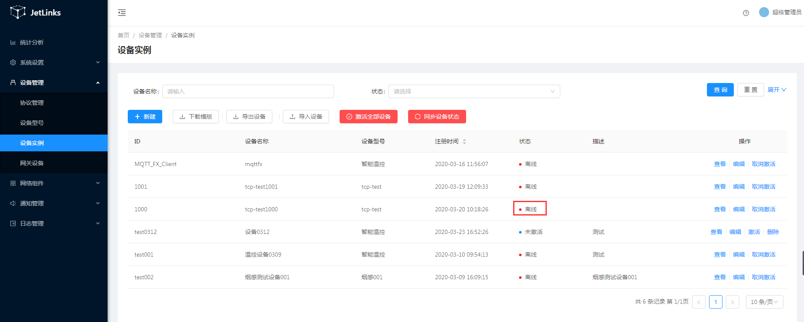

在设备日志模块可以看到设备离线日志

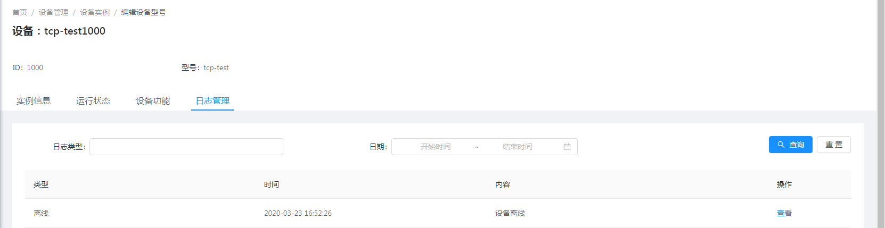

  1. 模拟设备上报事件

i. 在第4.步，设备上线成功后打开的新的已连接页面上选择第3.步保存的事件上报参数。

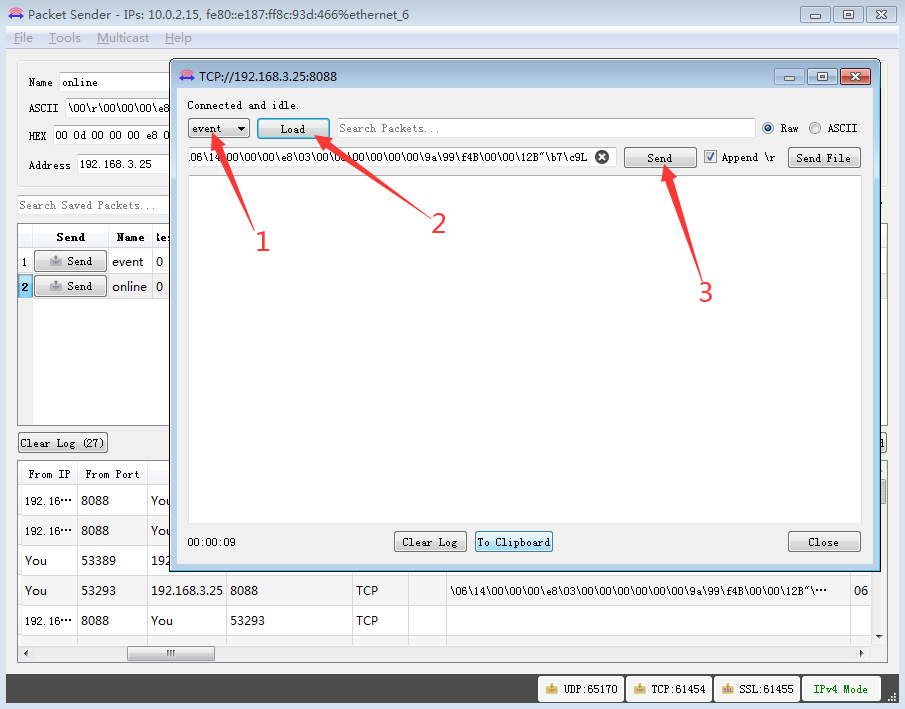

ii. 上报成功后，在页面可以查看到。

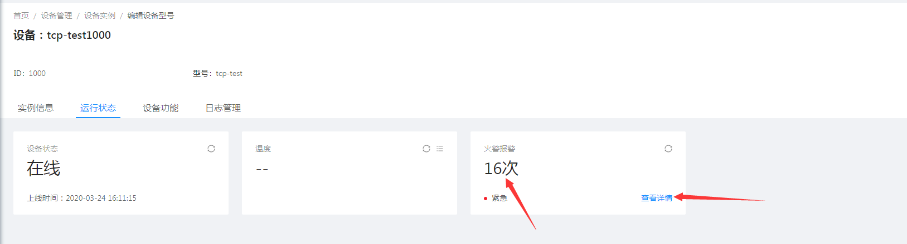

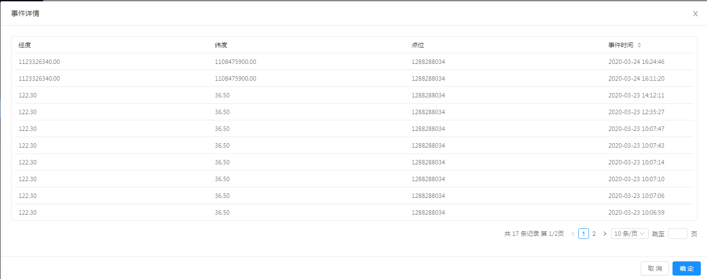

iii. 事件上报设备日志

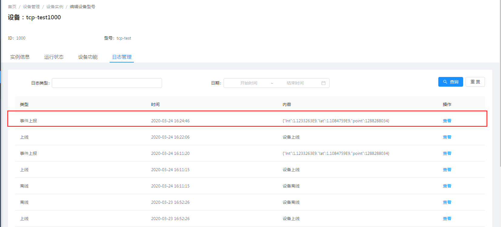

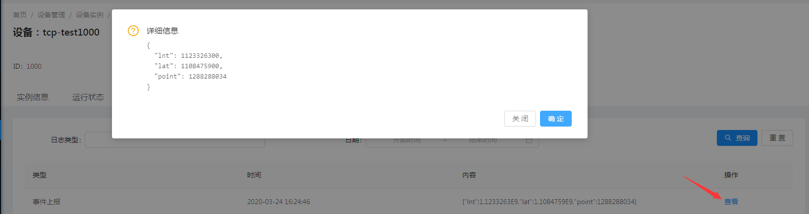

#  results matching ""

# No results matching ""

[ __](start.html) [ __](udp-connection.html)

