  * [ 前言 ](../../)
  * 物联网平台操作 
    * [ 前言 ](../)
    * 快速开始 
      * [ introduction ](../quick-start/introduction.html)
      * [ demo ](../quick-start/demo.html)
    * 开发指南 
      * [ assets ](../dev-guide/assets.html)
      * [ commons-api ](../dev-guide/commons-api.html)
      * [ crud ](../dev-guide/crud.html)
      * [ custom-sql-term ](../dev-guide/custom-sql-term.html)
      * [ dashboard ](../dev-guide/dashboard.html)
      * [ device-firmware ](../dev-guide/device-firmware.html)
      * [ mqtt-subs ](../dev-guide/mqtt-subs.html)
      * [ multi-tenant ](../dev-guide/multi-tenant.html)
      * [ websocket-subs ](../dev-guide/websocket-subs.html)
    * 最佳实践 
      * [ auto-register ](auto-register.html)
      * [ coap-connection ](coap-connection.html)
      * [ device-alarm ](device-alarm.html)
      * [ device-connection ](device-connection.html)
      * [ device-gateway-connection ](device-gateway-connection.html)
      * [ http-connection ](http-connection.html)
      * [ jetlinks对接其他云平台教程-HTTP方式 ](jetlinks对接其他云平台教程-HTTP方式.html)
      * [ open-api ](open-api.html)
      * [ sort-link ](sort-link.html)
      * [ start ](start.html)
      * [ tcp-connection ](tcp-connection.html)
      * [ udp-connection ](udp-connection.html)
    * 使用手册 
      * [ DemoDevice ](../basics-guide/DemoDevice.html)
      * [ device-manager ](../basics-guide/device-manager.html)
      * [ protocol-support ](../basics-guide/protocol-support.html)
      * [ quick-start ](../basics-guide/quick-start.html)
      * [ rule-engine ](../basics-guide/rule-engine.html)
      * [ ziduanquanxian ](../basics-guide/ziduanquanxian.html)
  * 萌蜂项目规范 
    * [ 前言 ](../../萌蜂项目规范/)
    * 一、开发项 
      * [ 快速开始 ](../../萌蜂项目规范/开发项/idea-start.html)
      * [ 环境维护 ](../../萌蜂项目规范/开发项/环境维护.html)
      * [ 代码管理 ](../../萌蜂项目规范/开发项/代码管理.html)
      * [ 后端开发 ](../../萌蜂项目规范/开发项/后端开发.html)
      * [ 前端开发 ](../../萌蜂项目规范/开发项/前端开发.html)
      * [ 工程专项 ](../../萌蜂项目规范/开发项/工程专项.html)
      * [ 其他规约 ](../../萌蜂项目规范/开发项/其他规约.html)
      * [ 流程管理 ](../../萌蜂项目规范/开发项/流程管理.html)
    * 二、知识点 
      * [ 安装 Centos7 ](../../萌蜂项目规范/知识点/install-centos7.html)
      * [ Centos 创建用户 ](../../萌蜂项目规范/知识点/centos-create-user.html)
      * [ Centos 安装桌面环境 ](../../萌蜂项目规范/知识点/centos-install-gnome.html)
      * [ Centos 安装KVM ](../../萌蜂项目规范/知识点/centos-install-kvm.html)
      * [ Centos 安装VNC ](../../萌蜂项目规范/知识点/centos-install-vnc.html)
      * [ Centos 安装Pip ](../../萌蜂项目规范/知识点/centos-install-pip.html)
      * [ Docker Compose ](../../萌蜂项目规范/知识点/docker-compose.html)
      * [ FFmpeg ](../../萌蜂项目规范/知识点/ffmpeg.html)
      * [ Nginx 代理 ](../../萌蜂项目规范/知识点/nginx-prefix.html)
      * [ Nginx Rtmp ](../../萌蜂项目规范/知识点/nginx-rtmp.html)
      * [ Nohup ](../../萌蜂项目规范/知识点/nohup.html)
      * [ NodeJs ](../../萌蜂项目规范/知识点/nodejs-upgrade.html)
      * [ Http Code ](../../萌蜂项目规范/知识点/http-code.html)
      * [ String.format() ](../../萌蜂项目规范/知识点/string-format.html)
  * JAVA开发规范 
    * [ 前言 ](../../JAVA开发规范/)
    * 一、编程规约 
      * [ （一）命名风格 ](../../JAVA开发规范/编程规约/命名风格.html)
      * [ （二）常量定义 ](../../JAVA开发规范/编程规约/常量定义.html)
      * [ （三）代码格式 ](../../JAVA开发规范/编程规约/代码格式.html)
      * [ （四）OOP规范 ](../../JAVA开发规范/编程规约/OOP规范.html)
      * [ （五）集合处理 ](../../JAVA开发规范/编程规约/集合处理.html)
      * [ （六）并发处理 ](../../JAVA开发规范/编程规约/并发处理.html)
      * [ （七）控制语句 ](../../JAVA开发规范/编程规约/控制语句.html)
      * [ （八）注释规约 ](../../JAVA开发规范/编程规约/注释规约.html)
    * 二、异常日志 
      * [ （一）异常处理 ](../../JAVA开发规范/异常日志/异常处理.html)
      * [ （二）日志规范 ](../../JAVA开发规范/异常日志/日志规约.html)
      * [ （三）其他 ](../../JAVA开发规范/异常日志/其他.html)
    * [ 三、单元测试 ](../../JAVA开发规范/单元测试.html)
    * [ 四、安全规约 ](../../JAVA开发规范/安全规约.html)
    * 五、MySQL数据库 
      * [ （一）建表规约 ](../../JAVA开发规范/MySQL数据库/建表规约.html)
      * [ （二）索引规约 ](../../JAVA开发规范/MySQL数据库/索引规约.html)
      * [ （三）SQL语句 ](../../JAVA开发规范/MySQL数据库/SQL语句.html)
      * [ （四）ORM映射 ](../../JAVA开发规范/MySQL数据库/ORM映射.html)
    * 六、工程结构 
      * [ （一）应用分层 ](../../JAVA开发规范/工程结构/应用分层.html)
      * [ （二）二方库依赖 ](../../JAVA开发规范/工程结构/二方库依赖.html)
      * [ （三）服务器 ](../../JAVA开发规范/工程结构/服务器.html)
    * [ 附：本手册专有名词 ](../../JAVA开发规范/本手册专有名词.html)
  * MIS系统操作手册 
    * [ MIS系统操作手册 ](../../用户操作手册/用户操作手册.html)
  * MIS系统环境临时记录 
    * [ MIS系统环境临时记录 ](../../MIS系统环境临时记录/组态和大屏连接地址配置.html)
  *   * [ Published with GitBook ](https://www.gitbook.com)

#  __[udp-connection](../..)

# 使用UDP服务网关接入设备

本文档使用`SocketTool4`工具模拟tcp客户端接入平台。

## 创建协议

请参考[创建协议](../advancement-guide/mqtt-connection.md#创建协议)

## 创建产品

参考[tcp接入设备示例中的创建产品](tcp-connection.html#创建产品)创建 **id 为udp-test**的产品并 **发 布**。

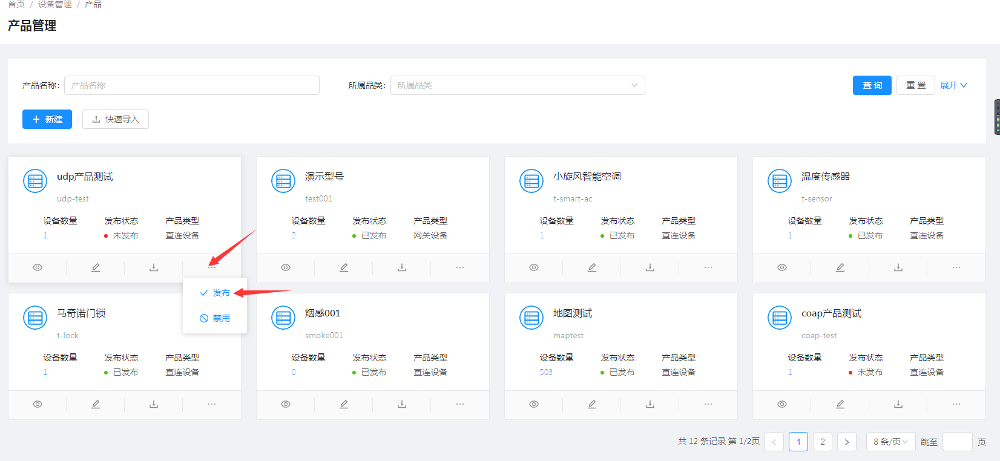

## 创建设备实例

参考[tcp接入设备示例中的创建设备](tcp-connection.html#创建设备)创建 **id 为udp-test-001**的设备并 **激
活**。

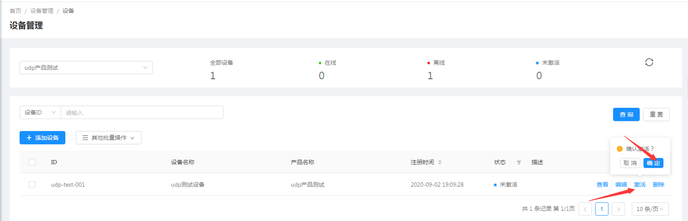

## 创建UDP服务网络组件

  1. 选择 `设备接入`\-->`网络组件`\--> 点击`新增组件`按钮。

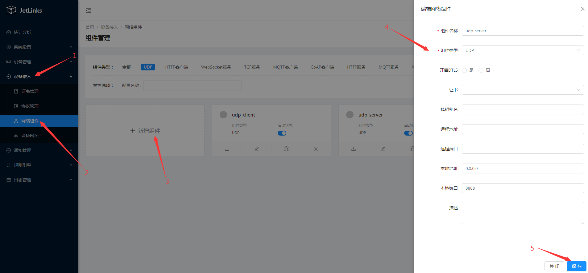

  1. 在创建完成的模块上点击`启动`按钮。

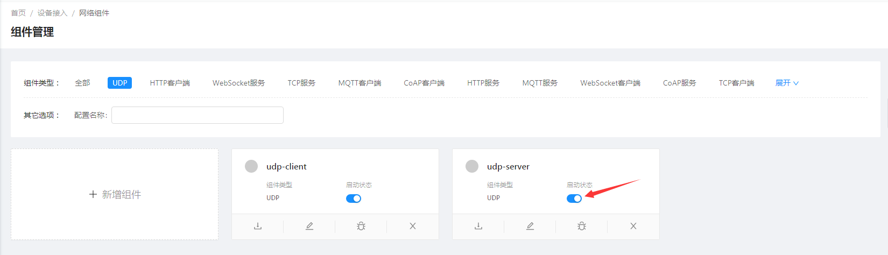

## 创建UDP服务设备网关

  1. 选择 `设备接入`\-->`设备网关`\--> 点击`新建`按钮。

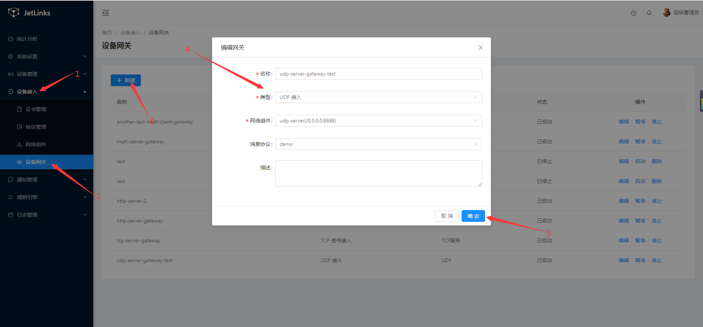  
::: tip 注意 和MQTT服务设备网关不同的是,udp必须指定消息协议,因为无法通过消息识别出对应的设备标识.
在消息解码时也无法通过上下文(`MessageDecodeContext`)获取到设备操作接口(`DeviceOperator`).
此处使用`demo`协议. :::

  1. 在操作列点击`启动`按钮启动网关。

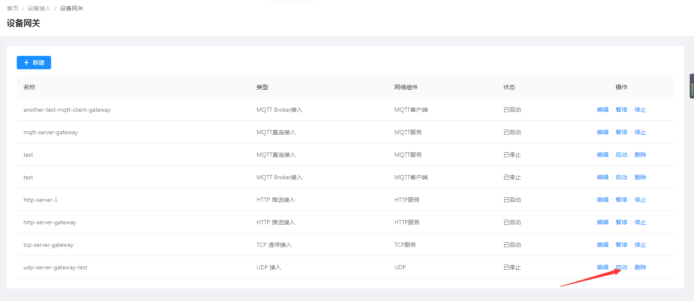

## 使用UDP模拟工具接入

  1. 下载并安装`SocketTool4`。

::: tip 注意 此处以json方式传输数据。 :::

  1. 创建udp客户端。

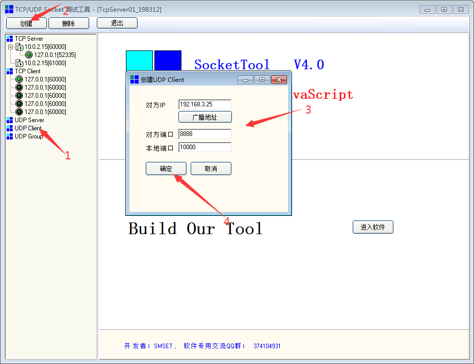

  1. 模拟设备设备属性上报

在SocketTool4工具的`数据发送窗口`填写发送的报文。  
此处使用的报文为：

    
    
    {
      "properties":{
          "temperature":36.5 //温度属性
         },
      "messageType": "REPORT_PROPERTY",//org.jetlinks.core.message.MessageType
      "deviceId": "udp-test-001",//设备id
      "key": "admin"//udp认证配置，udp_auth_key    
    }
    

单击`发送数据`按钮发起发送数据。  
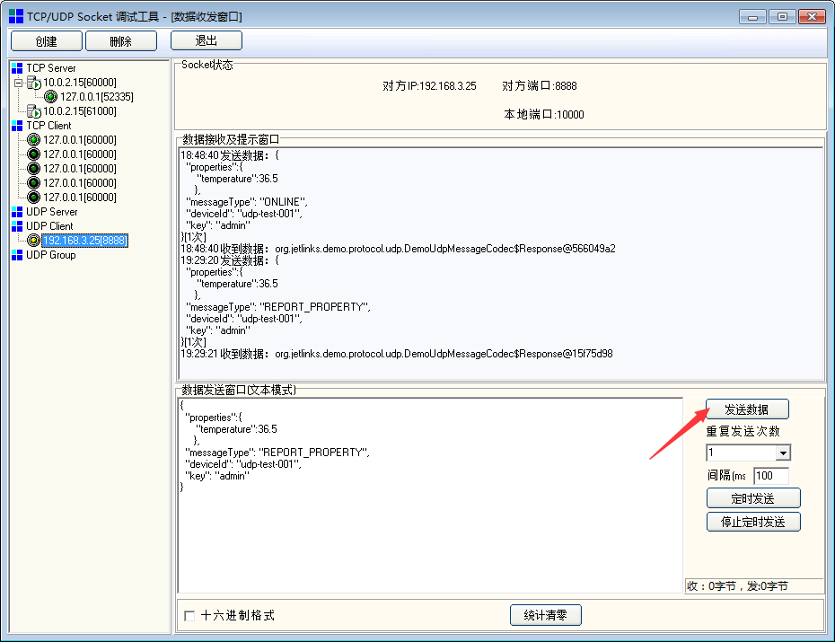

收到上报的消息后平台中设备状态将变为上线。

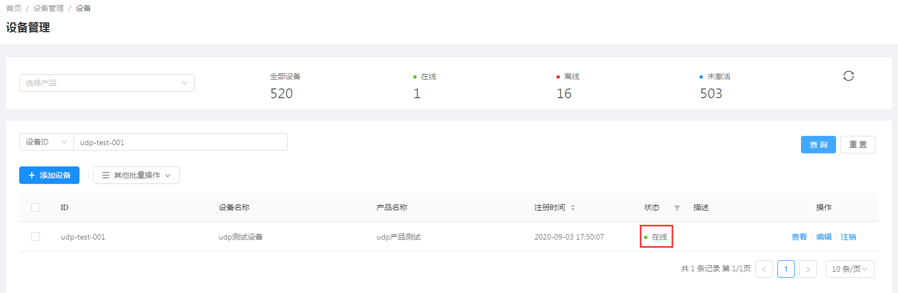

在设备`运行状态`中可以看到温度属性已发生变化。

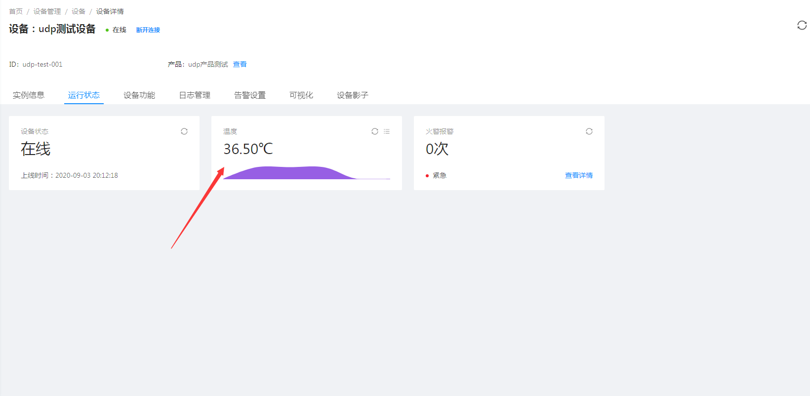

点击`详情`按钮可查看属性上报日志信息、图标展示。

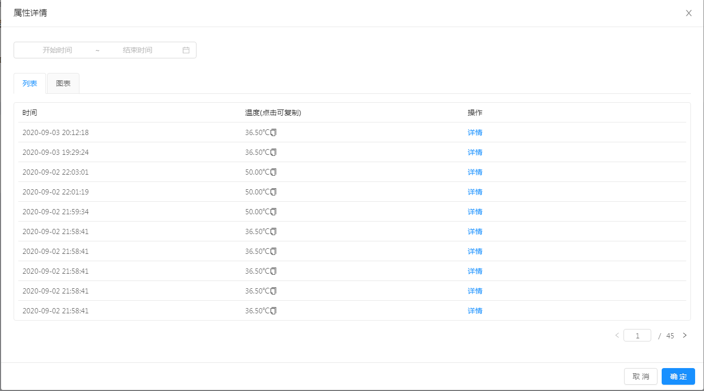

  1. 模拟设备上报事件

在SocketTool4工具的`数据发送窗口`填写发送的报文。  
此处使用的报文为：

    
    
    {
        "data": {
              "pname":"智能温控",
              "aid":105,
              "a_name":"未来科技城",
              "b_name":"C2 栋",
              "l_name":"12-05-201",
              "timestamp":"2019-11-06 16:28:50",
              "alarm_type":1,
              "alarm_describe":"火灾报警",
              "event_id":1,
              "event_count":1
        },
        "event": "fire_alarm",//事件标识
        "messageType": "EVENT",//org.jetlinks.core.message.MessageType
        "deviceId": "udp-test-001",//设备id
        "key": "admin"//udp认证配置，udp_auth_key    
    }
    

单击`发送数据`按钮发起发送数据。  
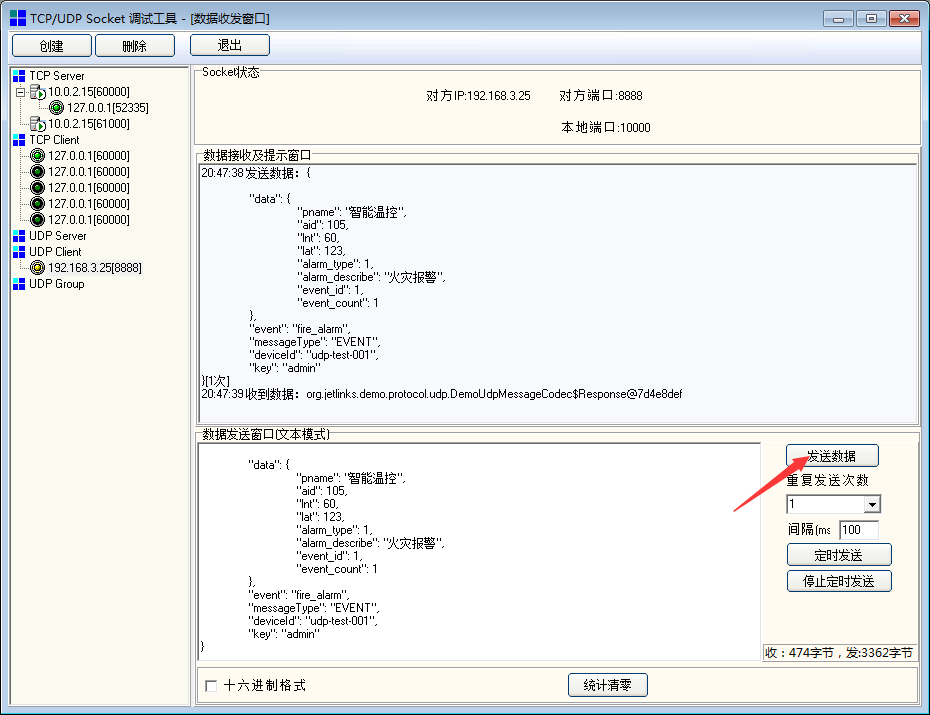

在设备`运行状态`中可以看到事件已上报。

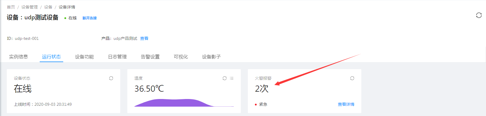

点击`详情`按钮可查看属性上报日志信息、图标展示。

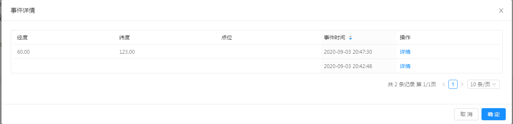

#  results matching ""

# No results matching ""

[ __](tcp-connection.html)

