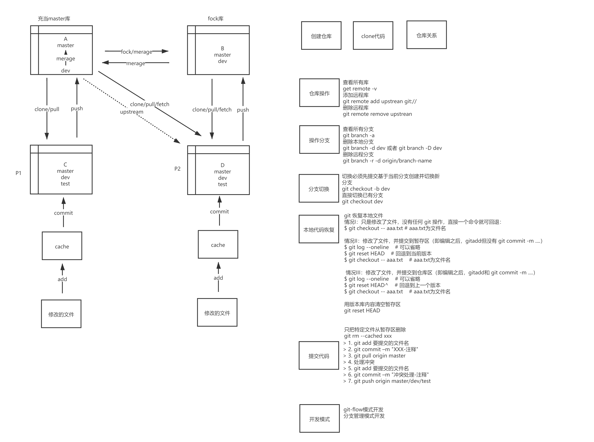
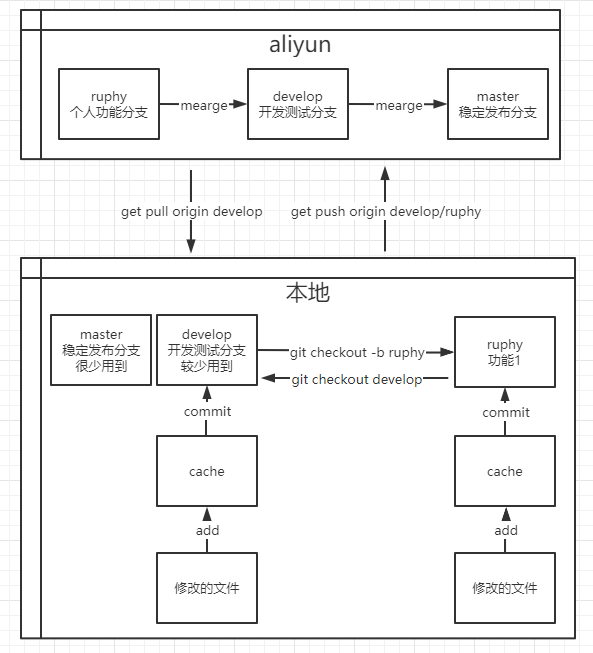

  * [ 前言 ](../../)
  * 物联网平台操作 
    * [ 前言 ](../../物联网平台/)
    * 快速开始 
      * [ introduction ](../../物联网平台/quick-start/introduction.html)
      * [ demo ](../../物联网平台/quick-start/demo.html)
    * 开发指南 
      * [ assets ](../../物联网平台/dev-guide/assets.html)
      * [ commons-api ](../../物联网平台/dev-guide/commons-api.html)
      * [ crud ](../../物联网平台/dev-guide/crud.html)
      * [ custom-sql-term ](../../物联网平台/dev-guide/custom-sql-term.html)
      * [ dashboard ](../../物联网平台/dev-guide/dashboard.html)
      * [ device-firmware ](../../物联网平台/dev-guide/device-firmware.html)
      * [ mqtt-subs ](../../物联网平台/dev-guide/mqtt-subs.html)
      * [ multi-tenant ](../../物联网平台/dev-guide/multi-tenant.html)
      * [ websocket-subs ](../../物联网平台/dev-guide/websocket-subs.html)
    * 最佳实践 
      * [ auto-register ](../../物联网平台/best-practices/auto-register.html)
      * [ coap-connection ](../../物联网平台/best-practices/coap-connection.html)
      * [ device-alarm ](../../物联网平台/best-practices/device-alarm.html)
      * [ device-connection ](../../物联网平台/best-practices/device-connection.html)
      * [ device-gateway-connection ](../../物联网平台/best-practices/device-gateway-connection.html)
      * [ http-connection ](../../物联网平台/best-practices/http-connection.html)
      * [ jetlinks对接其他云平台教程-HTTP方式 ](../../物联网平台/best-practices/jetlinks对接其他云平台教程-HTTP方式.html)
      * [ open-api ](../../物联网平台/best-practices/open-api.html)
      * [ sort-link ](../../物联网平台/best-practices/sort-link.html)
      * [ start ](../../物联网平台/best-practices/start.html)
      * [ tcp-connection ](../../物联网平台/best-practices/tcp-connection.html)
      * [ udp-connection ](../../物联网平台/best-practices/udp-connection.html)
    * 使用手册 
      * [ DemoDevice ](../../物联网平台/basics-guide/DemoDevice.html)
      * [ device-manager ](../../物联网平台/basics-guide/device-manager.html)
      * [ protocol-support ](../../物联网平台/basics-guide/protocol-support.html)
      * [ quick-start ](../../物联网平台/basics-guide/quick-start.html)
      * [ rule-engine ](../../物联网平台/basics-guide/rule-engine.html)
      * [ ziduanquanxian ](../../物联网平台/basics-guide/ziduanquanxian.html)
  * 萌蜂项目规范 
    * [ 前言 ](../)
    * 一、开发项 
      * [ 快速开始 ](idea-start.html)
      * [ 环境维护 ](环境维护.html)
      * [ 代码管理 ](代码管理.html)
      * [ 后端开发 ](后端开发.html)
      * [ 前端开发 ](前端开发.html)
      * [ 工程专项 ](工程专项.html)
      * [ 其他规约 ](其他规约.html)
      * [ 流程管理 ](流程管理.html)
    * 二、知识点 
      * [ 安装 Centos7 ](../知识点/install-centos7.html)
      * [ Centos 创建用户 ](../知识点/centos-create-user.html)
      * [ Centos 安装桌面环境 ](../知识点/centos-install-gnome.html)
      * [ Centos 安装KVM ](../知识点/centos-install-kvm.html)
      * [ Centos 安装VNC ](../知识点/centos-install-vnc.html)
      * [ Centos 安装Pip ](../知识点/centos-install-pip.html)
      * [ Docker Compose ](../知识点/docker-compose.html)
      * [ FFmpeg ](../知识点/ffmpeg.html)
      * [ Nginx 代理 ](../知识点/nginx-prefix.html)
      * [ Nginx Rtmp ](../知识点/nginx-rtmp.html)
      * [ Nohup ](../知识点/nohup.html)
      * [ NodeJs ](../知识点/nodejs-upgrade.html)
      * [ Http Code ](../知识点/http-code.html)
      * [ String.format() ](../知识点/string-format.html)
  * JAVA开发规范 
    * [ 前言 ](../../JAVA开发规范/)
    * 一、编程规约 
      * [ （一）命名风格 ](../../JAVA开发规范/编程规约/命名风格.html)
      * [ （二）常量定义 ](../../JAVA开发规范/编程规约/常量定义.html)
      * [ （三）代码格式 ](../../JAVA开发规范/编程规约/代码格式.html)
      * [ （四）OOP规范 ](../../JAVA开发规范/编程规约/OOP规范.html)
      * [ （五）集合处理 ](../../JAVA开发规范/编程规约/集合处理.html)
      * [ （六）并发处理 ](../../JAVA开发规范/编程规约/并发处理.html)
      * [ （七）控制语句 ](../../JAVA开发规范/编程规约/控制语句.html)
      * [ （八）注释规约 ](../../JAVA开发规范/编程规约/注释规约.html)
    * 二、异常日志 
      * [ （一）异常处理 ](../../JAVA开发规范/异常日志/异常处理.html)
      * [ （二）日志规范 ](../../JAVA开发规范/异常日志/日志规约.html)
      * [ （三）其他 ](../../JAVA开发规范/异常日志/其他.html)
    * [ 三、单元测试 ](../../JAVA开发规范/单元测试.html)
    * [ 四、安全规约 ](../../JAVA开发规范/安全规约.html)
    * 五、MySQL数据库 
      * [ （一）建表规约 ](../../JAVA开发规范/MySQL数据库/建表规约.html)
      * [ （二）索引规约 ](../../JAVA开发规范/MySQL数据库/索引规约.html)
      * [ （三）SQL语句 ](../../JAVA开发规范/MySQL数据库/SQL语句.html)
      * [ （四）ORM映射 ](../../JAVA开发规范/MySQL数据库/ORM映射.html)
    * 六、工程结构 
      * [ （一）应用分层 ](../../JAVA开发规范/工程结构/应用分层.html)
      * [ （二）二方库依赖 ](../../JAVA开发规范/工程结构/二方库依赖.html)
      * [ （三）服务器 ](../../JAVA开发规范/工程结构/服务器.html)
    * [ 附：本手册专有名词 ](../../JAVA开发规范/本手册专有名词.html)
  * MIS系统操作手册 
    * [ MIS系统操作手册 ](../../用户操作手册/用户操作手册.html)
  * MIS系统环境临时记录 
    * [ MIS系统环境临时记录 ](../../MIS系统环境临时记录/组态和大屏连接地址配置.html)
  *   * [ Published with GitBook ](https://www.gitbook.com)

#  __[代码管理](../..)

# 代码管理

## 目的

  * 方便代码恢复，减少冲突
  * 稳定后发布生产

## Git的优点

Git的优点很多，但是这里只列出我认为非常突出的几点。

  * 由于是分布式，所有本地库包含了远程库的所有内容，不用担心丢失
  * 优秀的分支模型，打分支以及合并分支，简单方便
  * 方便快速 , 由于代码本地都有存储 , 所以从远程拉取和分支合并时都非常快捷

## Git-Flow开发模式

就像代码需要代码规范一样，代码管理同样需要一个清晰的流程和规范，在采用 Git Flow 工作流的项目中，代码的中央仓库会一直存在以下两个长期分支：

  * master :origin/master 分支上的最新代码永远是版本发布状态
  * develop :origin／develop 分支则是最新的开发进度，达到一个稳定的状态后会以某种特别方式被合并到 master 分支上，然后标记上对应的版本标签

下面的分之是协助分之，都会合并到 develop 分支

  * feature :用来做分模块功能开发，命名看开发者喜好，从 develop 分支克隆
  * release :分支用来做版本发布的预发布分支，建议命名为 release-xxx，从 develop 分支克隆
  * hotfix :用来做线上的紧急 bug 修复的分支,建议命名为 hotfix-xxx，从 master 分支克隆

# git操作

## 分支操作

  * 查看所有分支：git branch -a
  * 删除本地分支：git branch -d dev 或者 git branch -D dev
  * 删除远程分支：git branch -r -d origin/branch-name
  * 基于当前分支创建并切换新分支：git checkout -b dev，切换必须先提交
  * 直接切换已有分支：git checkout dev，切换必须先提交

## 代码恢复

### 情况I：只是修改了文件，没有任何 git 操作，直接一个命令就可回退

> git checkout -- aaa.txt # aaa.txt为文件名

### 情况II：修改了文件，并提交到暂存区（即编辑之后，gitadd但没有 git commit -m ....）

  * git log --oneline # 可以省略
  * git reset HEAD # 回退到当前版本
  * git checkout -- aaa.txt # aaa.txt为文件名

### 情况III：修改了文件，并提交到仓库区（即编辑之后，gitadd和 git commit -m ....）

  * git log --oneline # 可以省略
  * git reset HEAD^ # 回退到上一个版本
  * git checkout -- aaa.txt # aaa.txt为文件名

### 用版本库内容清空暂存区

  * git reset HEAD

### 只把特定文件从暂存区删除

  * git rm --cached xxx

### 代码提交

  * 代码提交注释：模块名称-具体处理的事项(新需求或者BUG)
  * 为减少冲突，提升冲突处理效率，单分支代码提交步骤必须又以下几步：

>   1. git add 要提交的文件名
>   2. git commit -m "XXX-注释"
>   3. git pull origin master/git pull origin develop
>   4. 处理冲突
>   5. git add 要提交的文件名
>   6. git commit -m "冲突处理-注释"
>   7. git push origin feature
>

## 获取代码

### 分支开发方式，从主库克隆

> 克隆：git clone git@codeup.aliyun.com:60989eb758f98c9695664061/gzpjmcq/safety-
> pc.git 拉取代码：git pull origin master 推送代码：git push origin feature
> 合并到主库develop分支

### fock库开发方式，从fock库克隆

> 克隆：git clone git@codeup.aliyun.com:1304023381/gzpjmcq/safety-pc.git
> 添加主库地址：git remote add upstream
> git@codeup.aliyun.com:60989eb758f98c9695664061/gzpjmcq/safety-pc.git
> 拉取代码：git pull upstream master 推送代码：git push origin feature 合并到主库develop分支

### 开发方式

简化的git-flow，master是发布生产的稳定分支，develop是发布开发和测试的分支，只是将之前的master分支的操作习惯改成develop

#  results matching ""

# No results matching ""

[ __](环境维护.html) [ __](后端开发.html)

