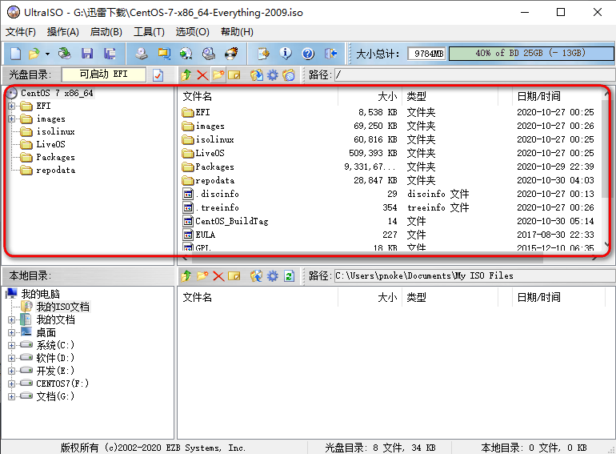
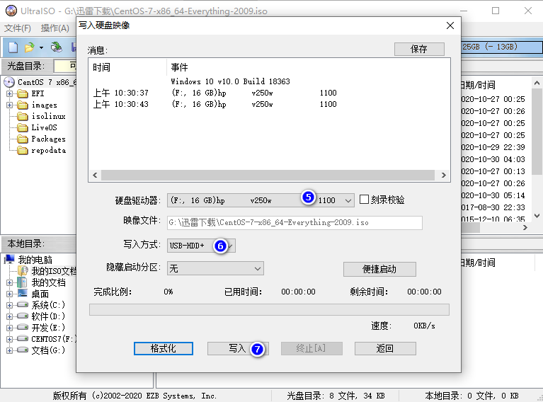
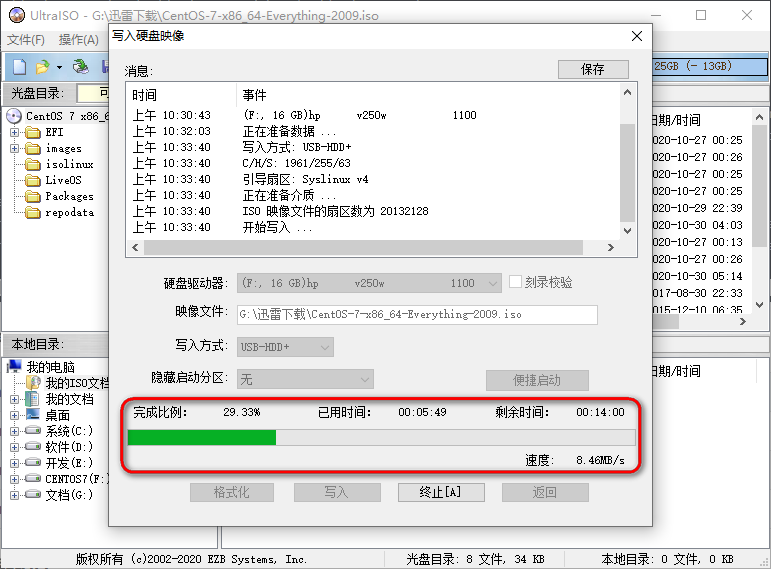
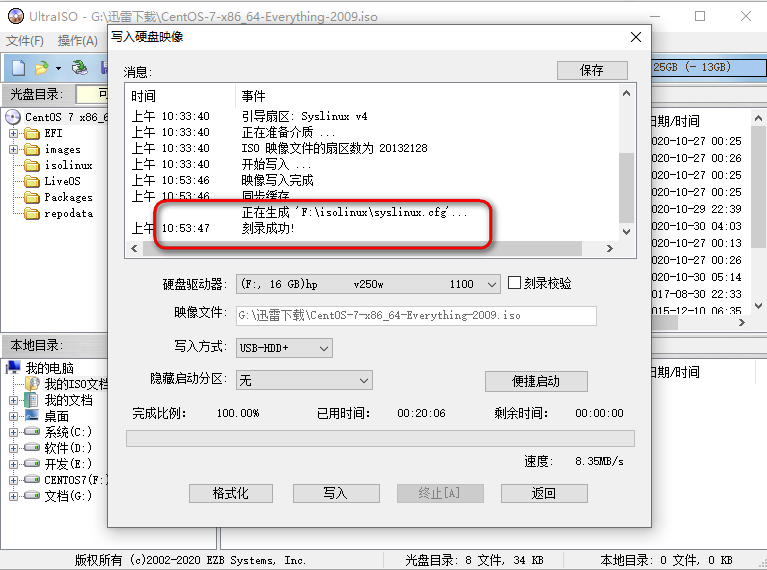

  * [ 前言 ](../../)
  * 物联网平台操作 
    * [ 前言 ](../../物联网平台/)
    * 快速开始 
      * [ introduction ](../../物联网平台/quick-start/introduction.html)
      * [ demo ](../../物联网平台/quick-start/demo.html)
    * 开发指南 
      * [ assets ](../../物联网平台/dev-guide/assets.html)
      * [ commons-api ](../../物联网平台/dev-guide/commons-api.html)
      * [ crud ](../../物联网平台/dev-guide/crud.html)
      * [ custom-sql-term ](../../物联网平台/dev-guide/custom-sql-term.html)
      * [ dashboard ](../../物联网平台/dev-guide/dashboard.html)
      * [ device-firmware ](../../物联网平台/dev-guide/device-firmware.html)
      * [ mqtt-subs ](../../物联网平台/dev-guide/mqtt-subs.html)
      * [ multi-tenant ](../../物联网平台/dev-guide/multi-tenant.html)
      * [ websocket-subs ](../../物联网平台/dev-guide/websocket-subs.html)
    * 最佳实践 
      * [ auto-register ](../../物联网平台/best-practices/auto-register.html)
      * [ coap-connection ](../../物联网平台/best-practices/coap-connection.html)
      * [ device-alarm ](../../物联网平台/best-practices/device-alarm.html)
      * [ device-connection ](../../物联网平台/best-practices/device-connection.html)
      * [ device-gateway-connection ](../../物联网平台/best-practices/device-gateway-connection.html)
      * [ http-connection ](../../物联网平台/best-practices/http-connection.html)
      * [ jetlinks对接其他云平台教程-HTTP方式 ](../../物联网平台/best-practices/jetlinks对接其他云平台教程-HTTP方式.html)
      * [ open-api ](../../物联网平台/best-practices/open-api.html)
      * [ sort-link ](../../物联网平台/best-practices/sort-link.html)
      * [ start ](../../物联网平台/best-practices/start.html)
      * [ tcp-connection ](../../物联网平台/best-practices/tcp-connection.html)
      * [ udp-connection ](../../物联网平台/best-practices/udp-connection.html)
    * 使用手册 
      * [ DemoDevice ](../../物联网平台/basics-guide/DemoDevice.html)
      * [ device-manager ](../../物联网平台/basics-guide/device-manager.html)
      * [ protocol-support ](../../物联网平台/basics-guide/protocol-support.html)
      * [ quick-start ](../../物联网平台/basics-guide/quick-start.html)
      * [ rule-engine ](../../物联网平台/basics-guide/rule-engine.html)
      * [ ziduanquanxian ](../../物联网平台/basics-guide/ziduanquanxian.html)
  * 萌蜂项目规范 
    * [ 前言 ](../)
    * 一、开发项 
      * [ 快速开始 ](../开发项/idea-start.html)
      * [ 环境维护 ](../开发项/环境维护.html)
      * [ 代码管理 ](../开发项/代码管理.html)
      * [ 后端开发 ](../开发项/后端开发.html)
      * [ 前端开发 ](../开发项/前端开发.html)
      * [ 工程专项 ](../开发项/工程专项.html)
      * [ 其他规约 ](../开发项/其他规约.html)
      * [ 流程管理 ](../开发项/流程管理.html)
    * 二、知识点 
      * [ 安装 Centos7 ](install-centos7.html)
      * [ Centos 创建用户 ](centos-create-user.html)
      * [ Centos 安装桌面环境 ](centos-install-gnome.html)
      * [ Centos 安装KVM ](centos-install-kvm.html)
      * [ Centos 安装VNC ](centos-install-vnc.html)
      * [ Centos 安装Pip ](centos-install-pip.html)
      * [ Docker Compose ](docker-compose.html)
      * [ FFmpeg ](ffmpeg.html)
      * [ Nginx 代理 ](nginx-prefix.html)
      * [ Nginx Rtmp ](nginx-rtmp.html)
      * [ Nohup ](nohup.html)
      * [ NodeJs ](nodejs-upgrade.html)
      * [ Http Code ](http-code.html)
      * [ String.format() ](string-format.html)
  * JAVA开发规范 
    * [ 前言 ](../../JAVA开发规范/)
    * 一、编程规约 
      * [ （一）命名风格 ](../../JAVA开发规范/编程规约/命名风格.html)
      * [ （二）常量定义 ](../../JAVA开发规范/编程规约/常量定义.html)
      * [ （三）代码格式 ](../../JAVA开发规范/编程规约/代码格式.html)
      * [ （四）OOP规范 ](../../JAVA开发规范/编程规约/OOP规范.html)
      * [ （五）集合处理 ](../../JAVA开发规范/编程规约/集合处理.html)
      * [ （六）并发处理 ](../../JAVA开发规范/编程规约/并发处理.html)
      * [ （七）控制语句 ](../../JAVA开发规范/编程规约/控制语句.html)
      * [ （八）注释规约 ](../../JAVA开发规范/编程规约/注释规约.html)
    * 二、异常日志 
      * [ （一）异常处理 ](../../JAVA开发规范/异常日志/异常处理.html)
      * [ （二）日志规范 ](../../JAVA开发规范/异常日志/日志规约.html)
      * [ （三）其他 ](../../JAVA开发规范/异常日志/其他.html)
    * [ 三、单元测试 ](../../JAVA开发规范/单元测试.html)
    * [ 四、安全规约 ](../../JAVA开发规范/安全规约.html)
    * 五、MySQL数据库 
      * [ （一）建表规约 ](../../JAVA开发规范/MySQL数据库/建表规约.html)
      * [ （二）索引规约 ](../../JAVA开发规范/MySQL数据库/索引规约.html)
      * [ （三）SQL语句 ](../../JAVA开发规范/MySQL数据库/SQL语句.html)
      * [ （四）ORM映射 ](../../JAVA开发规范/MySQL数据库/ORM映射.html)
    * 六、工程结构 
      * [ （一）应用分层 ](../../JAVA开发规范/工程结构/应用分层.html)
      * [ （二）二方库依赖 ](../../JAVA开发规范/工程结构/二方库依赖.html)
      * [ （三）服务器 ](../../JAVA开发规范/工程结构/服务器.html)
    * [ 附：本手册专有名词 ](../../JAVA开发规范/本手册专有名词.html)
  * MIS系统操作手册 
    * [ MIS系统操作手册 ](../../用户操作手册/用户操作手册.html)
  * MIS系统环境临时记录 
    * [ MIS系统环境临时记录 ](../../MIS系统环境临时记录/组态和大屏连接地址配置.html)
  *   * [ Published with GitBook ](https://www.gitbook.com)

#  __[安装 Centos7](../..)

### 1.安装UltraISO

> **下 载地址**：<https://cn.ultraiso.net/uiso9_cn.exe>
>
> **激 活**：
>
>   * 注册名：Guanjiu
>   * 注册码：A06C-83A7-701D-6CFC
>

### 2.下载 Centos7 镜像

> 以下载最新 centos7 镜像为例
>
> **下 载地址**：<https://www.centos.org/centos-linux/>
>
> **版 本**：以实际机器类型为主，例如x64架构，下载 `CentOS-7-x86_64-Everything-2009.iso`镜像

### 3.制作启动U盘

> **请 将 U盘 安装以下配置进行格式化**
>
>   * 文件系统：FAT32（默认）
>   * 至少10G以上
>   * 重要数据请提前备份好
>

插入U盘，启动UltraISO，然后操作步骤，如图所示：

  * **3.1** 选择 ' **文 件**' -> ' **打 开**'，选择已经下载的 ' **CentOS-7-x86_64-Everything-2009.iso** ' 镜像

  * **3.2** 选择 ' **启 动**' -> ' **写 入硬盘映像...**'
    * ' **硬 件驱动器**' 选择已经插入的 ' **U 盘**'
    * ' **写 入方式**' 选择 ' **USB-HDD+** '
    * 确认无误之后，点击 ' **写 入**'，该过程非常漫长，耐心等待完成即可

### 4.安装 Centos7 系统

> 将制作好的 `Centos7` 启动 `U 盘` 插入到待安装的机器上，进入`BIOS` 设置从 `U盘` 启动，即可开始安装

#  results matching ""

# No results matching ""

[ __](centos-create-user.html)

