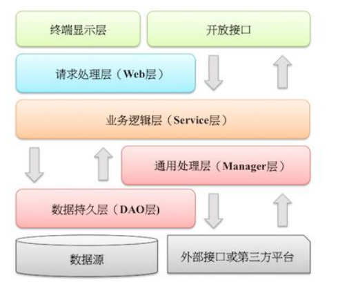

  * [ 前言 ](../../)
  * 物联网平台操作 
    * [ 前言 ](../../物联网平台/)
    * 快速开始 
      * [ introduction ](../../物联网平台/quick-start/introduction.html)
      * [ demo ](../../物联网平台/quick-start/demo.html)
    * 开发指南 
      * [ assets ](../../物联网平台/dev-guide/assets.html)
      * [ commons-api ](../../物联网平台/dev-guide/commons-api.html)
      * [ crud ](../../物联网平台/dev-guide/crud.html)
      * [ custom-sql-term ](../../物联网平台/dev-guide/custom-sql-term.html)
      * [ dashboard ](../../物联网平台/dev-guide/dashboard.html)
      * [ device-firmware ](../../物联网平台/dev-guide/device-firmware.html)
      * [ mqtt-subs ](../../物联网平台/dev-guide/mqtt-subs.html)
      * [ multi-tenant ](../../物联网平台/dev-guide/multi-tenant.html)
      * [ websocket-subs ](../../物联网平台/dev-guide/websocket-subs.html)
    * 最佳实践 
      * [ auto-register ](../../物联网平台/best-practices/auto-register.html)
      * [ coap-connection ](../../物联网平台/best-practices/coap-connection.html)
      * [ device-alarm ](../../物联网平台/best-practices/device-alarm.html)
      * [ device-connection ](../../物联网平台/best-practices/device-connection.html)
      * [ device-gateway-connection ](../../物联网平台/best-practices/device-gateway-connection.html)
      * [ http-connection ](../../物联网平台/best-practices/http-connection.html)
      * [ jetlinks对接其他云平台教程-HTTP方式 ](../../物联网平台/best-practices/jetlinks对接其他云平台教程-HTTP方式.html)
      * [ open-api ](../../物联网平台/best-practices/open-api.html)
      * [ sort-link ](../../物联网平台/best-practices/sort-link.html)
      * [ start ](../../物联网平台/best-practices/start.html)
      * [ tcp-connection ](../../物联网平台/best-practices/tcp-connection.html)
      * [ udp-connection ](../../物联网平台/best-practices/udp-connection.html)
    * 使用手册 
      * [ DemoDevice ](../../物联网平台/basics-guide/DemoDevice.html)
      * [ device-manager ](../../物联网平台/basics-guide/device-manager.html)
      * [ protocol-support ](../../物联网平台/basics-guide/protocol-support.html)
      * [ quick-start ](../../物联网平台/basics-guide/quick-start.html)
      * [ rule-engine ](../../物联网平台/basics-guide/rule-engine.html)
      * [ ziduanquanxian ](../../物联网平台/basics-guide/ziduanquanxian.html)
  * 萌蜂项目规范 
    * [ 前言 ](../../萌蜂项目规范/)
    * 一、开发项 
      * [ 快速开始 ](../../萌蜂项目规范/开发项/idea-start.html)
      * [ 环境维护 ](../../萌蜂项目规范/开发项/环境维护.html)
      * [ 代码管理 ](../../萌蜂项目规范/开发项/代码管理.html)
      * [ 后端开发 ](../../萌蜂项目规范/开发项/后端开发.html)
      * [ 前端开发 ](../../萌蜂项目规范/开发项/前端开发.html)
      * [ 工程专项 ](../../萌蜂项目规范/开发项/工程专项.html)
      * [ 其他规约 ](../../萌蜂项目规范/开发项/其他规约.html)
      * [ 流程管理 ](../../萌蜂项目规范/开发项/流程管理.html)
    * 二、知识点 
      * [ 安装 Centos7 ](../../萌蜂项目规范/知识点/install-centos7.html)
      * [ Centos 创建用户 ](../../萌蜂项目规范/知识点/centos-create-user.html)
      * [ Centos 安装桌面环境 ](../../萌蜂项目规范/知识点/centos-install-gnome.html)
      * [ Centos 安装KVM ](../../萌蜂项目规范/知识点/centos-install-kvm.html)
      * [ Centos 安装VNC ](../../萌蜂项目规范/知识点/centos-install-vnc.html)
      * [ Centos 安装Pip ](../../萌蜂项目规范/知识点/centos-install-pip.html)
      * [ Docker Compose ](../../萌蜂项目规范/知识点/docker-compose.html)
      * [ FFmpeg ](../../萌蜂项目规范/知识点/ffmpeg.html)
      * [ Nginx 代理 ](../../萌蜂项目规范/知识点/nginx-prefix.html)
      * [ Nginx Rtmp ](../../萌蜂项目规范/知识点/nginx-rtmp.html)
      * [ Nohup ](../../萌蜂项目规范/知识点/nohup.html)
      * [ NodeJs ](../../萌蜂项目规范/知识点/nodejs-upgrade.html)
      * [ Http Code ](../../萌蜂项目规范/知识点/http-code.html)
      * [ String.format() ](../../萌蜂项目规范/知识点/string-format.html)
  * JAVA开发规范 
    * [ 前言 ](../)
    * 一、编程规约 
      * [ （一）命名风格 ](../编程规约/命名风格.html)
      * [ （二）常量定义 ](../编程规约/常量定义.html)
      * [ （三）代码格式 ](../编程规约/代码格式.html)
      * [ （四）OOP规范 ](../编程规约/OOP规范.html)
      * [ （五）集合处理 ](../编程规约/集合处理.html)
      * [ （六）并发处理 ](../编程规约/并发处理.html)
      * [ （七）控制语句 ](../编程规约/控制语句.html)
      * [ （八）注释规约 ](../编程规约/注释规约.html)
    * 二、异常日志 
      * [ （一）异常处理 ](../异常日志/异常处理.html)
      * [ （二）日志规范 ](../异常日志/日志规约.html)
      * [ （三）其他 ](../异常日志/其他.html)
    * [ 三、单元测试 ](../单元测试.html)
    * [ 四、安全规约 ](../安全规约.html)
    * 五、MySQL数据库 
      * [ （一）建表规约 ](../MySQL数据库/建表规约.html)
      * [ （二）索引规约 ](../MySQL数据库/索引规约.html)
      * [ （三）SQL语句 ](../MySQL数据库/SQL语句.html)
      * [ （四）ORM映射 ](../MySQL数据库/ORM映射.html)
    * 六、工程结构 
      * [ （一）应用分层 ](应用分层.html)
      * [ （二）二方库依赖 ](二方库依赖.html)
      * [ （三）服务器 ](服务器.html)
    * [ 附：本手册专有名词 ](../本手册专有名词.html)
  * MIS系统操作手册 
    * [ MIS系统操作手册 ](../../用户操作手册/用户操作手册.html)
  * MIS系统环境临时记录 
    * [ MIS系统环境临时记录 ](../../MIS系统环境临时记录/组态和大屏连接地址配置.html)
  *   * [ Published with GitBook ](https://www.gitbook.com)

#  __[（一）应用分层](../..)

# 六、工程结构

## (一) 应用分层

  1. 【推荐】图中默认上层依赖于下层，箭头关系表示可直接依赖，如：开放接口层可以依赖于Web层，也可以直接依赖于Service层，依此类推： 

    * 开放接口层：可直接封装Service方法暴露成RPC接口；通过Web封装成http接口；进行网关安全控制、流量控制等。
    * 终端显示层：各个端的模板渲染并执行显示的层。当前主要是velocity渲染，JS渲染，JSP渲染，移动端展示等。
    * Web层：主要是对访问控制进行转发，各类基本参数校验，或者不复用的业务简单处理等。
    * Service层：相对具体的业务逻辑服务层。
    * Manager层：通用业务处理层，它有如下特征：   
1） 对第三方平台封装的层，预处理返回结果及转化异常信息；  
2） 对Service层通用能力的下沉，如缓存方案、中间件通用处理；  
3） 与DAO层交互，对多个DAO的组合复用。

    * DAO层：数据访问层，与底层MySQL、Oracle、Hbase等进行数据交互。
    * 外部接口或第三方平台：包括其它部门RPC开放接口，基础平台，其它公司的HTTP接口。
  2. 【参考】（分层异常处理规约）在DAO层，产生的异常类型有很多，无法用细粒度的异常进行catch，使用catch(Exception e)方式，并throw new DAOException(e)，不需要打印日志，因为日志在Manager/Service层一定需要捕获并打印到日志文件中去，如果同台服务器再打日志，浪费性能和存储。在Service层出现异常时，必须记录出错日志到磁盘，尽可能带上参数信息，相当于保护案发现场。如果Manager层与Service同机部署，日志方式与DAO层处理一致，如果是单独部署，则采用与Service一致的处理方式。Web层绝不应该继续往上抛异常，因为已经处于顶层，如果意识到这个异常将导致页面无法正常渲染，那么就应该跳转到友好错误页面，加上用户容易理解的错误提示信息。开放接口层要将异常处理成错误码和错误信息方式返回。

  3. 【参考】分层领域模型规约：

    * DO（Data Object）：与数据库表结构一一对应，通过DAO层向上传输数据源对象。
    * DTO（Data Transfer Object）：数据传输对象，Service或Manager向外传输的对象。
    * BO（Business Object）：业务对象。由Service层输出的封装业务逻辑的对象。
    * AO（Application Object）：应用对象。在Web层与Service层之间抽象的复用对象模型，极为贴近展示层，复用度不高。
    * VO（View Object）：显示层对象，通常是Web向模板渲染引擎层传输的对象。
    * Query：数据查询对象，各层接收上层的查询请求。注意超过2个参数的查询封装，禁止使用Map类来传输。

#  results matching ""

# No results matching ""

[ __](二方库依赖.html)

