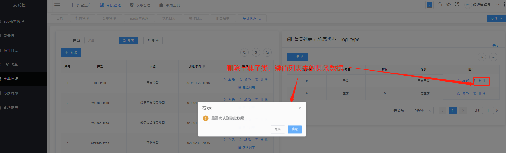
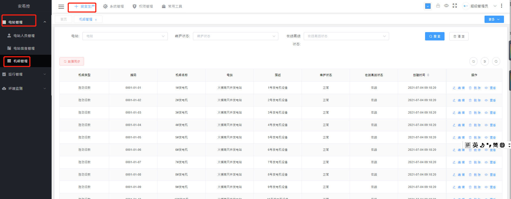
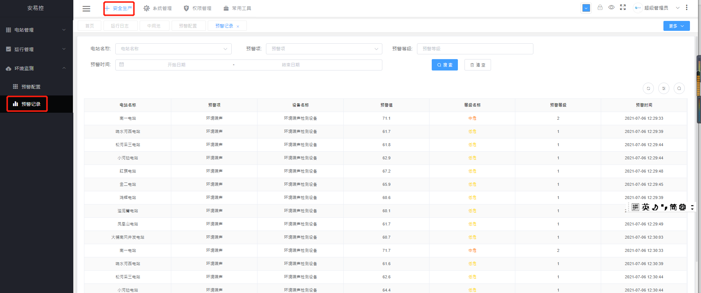

  * [ 前言 ](../)
  * 物联网平台操作 
    * [ 前言 ](../物联网平台/)
    * 快速开始 
      * [ introduction ](../物联网平台/quick-start/introduction.html)
      * [ demo ](../物联网平台/quick-start/demo.html)
    * 开发指南 
      * [ assets ](../物联网平台/dev-guide/assets.html)
      * [ commons-api ](../物联网平台/dev-guide/commons-api.html)
      * [ crud ](../物联网平台/dev-guide/crud.html)
      * [ custom-sql-term ](../物联网平台/dev-guide/custom-sql-term.html)
      * [ dashboard ](../物联网平台/dev-guide/dashboard.html)
      * [ device-firmware ](../物联网平台/dev-guide/device-firmware.html)
      * [ mqtt-subs ](../物联网平台/dev-guide/mqtt-subs.html)
      * [ multi-tenant ](../物联网平台/dev-guide/multi-tenant.html)
      * [ websocket-subs ](../物联网平台/dev-guide/websocket-subs.html)
    * 最佳实践 
      * [ auto-register ](../物联网平台/best-practices/auto-register.html)
      * [ coap-connection ](../物联网平台/best-practices/coap-connection.html)
      * [ device-alarm ](../物联网平台/best-practices/device-alarm.html)
      * [ device-connection ](../物联网平台/best-practices/device-connection.html)
      * [ device-gateway-connection ](../物联网平台/best-practices/device-gateway-connection.html)
      * [ http-connection ](../物联网平台/best-practices/http-connection.html)
      * [ jetlinks对接其他云平台教程-HTTP方式 ](../物联网平台/best-practices/jetlinks对接其他云平台教程-HTTP方式.html)
      * [ open-api ](../物联网平台/best-practices/open-api.html)
      * [ sort-link ](../物联网平台/best-practices/sort-link.html)
      * [ start ](../物联网平台/best-practices/start.html)
      * [ tcp-connection ](../物联网平台/best-practices/tcp-connection.html)
      * [ udp-connection ](../物联网平台/best-practices/udp-connection.html)
    * 使用手册 
      * [ DemoDevice ](../物联网平台/basics-guide/DemoDevice.html)
      * [ device-manager ](../物联网平台/basics-guide/device-manager.html)
      * [ protocol-support ](../物联网平台/basics-guide/protocol-support.html)
      * [ quick-start ](../物联网平台/basics-guide/quick-start.html)
      * [ rule-engine ](../物联网平台/basics-guide/rule-engine.html)
      * [ ziduanquanxian ](../物联网平台/basics-guide/ziduanquanxian.html)
  * 萌蜂项目规范 
    * [ 前言 ](../萌蜂项目规范/)
    * 一、开发项 
      * [ 快速开始 ](../萌蜂项目规范/开发项/idea-start.html)
      * [ 环境维护 ](../萌蜂项目规范/开发项/环境维护.html)
      * [ 代码管理 ](../萌蜂项目规范/开发项/代码管理.html)
      * [ 后端开发 ](../萌蜂项目规范/开发项/后端开发.html)
      * [ 前端开发 ](../萌蜂项目规范/开发项/前端开发.html)
      * [ 工程专项 ](../萌蜂项目规范/开发项/工程专项.html)
      * [ 其他规约 ](../萌蜂项目规范/开发项/其他规约.html)
      * [ 流程管理 ](../萌蜂项目规范/开发项/流程管理.html)
    * 二、知识点 
      * [ 安装 Centos7 ](../萌蜂项目规范/知识点/install-centos7.html)
      * [ Centos 创建用户 ](../萌蜂项目规范/知识点/centos-create-user.html)
      * [ Centos 安装桌面环境 ](../萌蜂项目规范/知识点/centos-install-gnome.html)
      * [ Centos 安装KVM ](../萌蜂项目规范/知识点/centos-install-kvm.html)
      * [ Centos 安装VNC ](../萌蜂项目规范/知识点/centos-install-vnc.html)
      * [ Centos 安装Pip ](../萌蜂项目规范/知识点/centos-install-pip.html)
      * [ Docker Compose ](../萌蜂项目规范/知识点/docker-compose.html)
      * [ FFmpeg ](../萌蜂项目规范/知识点/ffmpeg.html)
      * [ Nginx 代理 ](../萌蜂项目规范/知识点/nginx-prefix.html)
      * [ Nginx Rtmp ](../萌蜂项目规范/知识点/nginx-rtmp.html)
      * [ Nohup ](../萌蜂项目规范/知识点/nohup.html)
      * [ NodeJs ](../萌蜂项目规范/知识点/nodejs-upgrade.html)
      * [ Http Code ](../萌蜂项目规范/知识点/http-code.html)
      * [ String.format() ](../萌蜂项目规范/知识点/string-format.html)
  * JAVA开发规范 
    * [ 前言 ](../JAVA开发规范/)
    * 一、编程规约 
      * [ （一）命名风格 ](../JAVA开发规范/编程规约/命名风格.html)
      * [ （二）常量定义 ](../JAVA开发规范/编程规约/常量定义.html)
      * [ （三）代码格式 ](../JAVA开发规范/编程规约/代码格式.html)
      * [ （四）OOP规范 ](../JAVA开发规范/编程规约/OOP规范.html)
      * [ （五）集合处理 ](../JAVA开发规范/编程规约/集合处理.html)
      * [ （六）并发处理 ](../JAVA开发规范/编程规约/并发处理.html)
      * [ （七）控制语句 ](../JAVA开发规范/编程规约/控制语句.html)
      * [ （八）注释规约 ](../JAVA开发规范/编程规约/注释规约.html)
    * 二、异常日志 
      * [ （一）异常处理 ](../JAVA开发规范/异常日志/异常处理.html)
      * [ （二）日志规范 ](../JAVA开发规范/异常日志/日志规约.html)
      * [ （三）其他 ](../JAVA开发规范/异常日志/其他.html)
    * [ 三、单元测试 ](../JAVA开发规范/单元测试.html)
    * [ 四、安全规约 ](../JAVA开发规范/安全规约.html)
    * 五、MySQL数据库 
      * [ （一）建表规约 ](../JAVA开发规范/MySQL数据库/建表规约.html)
      * [ （二）索引规约 ](../JAVA开发规范/MySQL数据库/索引规约.html)
      * [ （三）SQL语句 ](../JAVA开发规范/MySQL数据库/SQL语句.html)
      * [ （四）ORM映射 ](../JAVA开发规范/MySQL数据库/ORM映射.html)
    * 六、工程结构 
      * [ （一）应用分层 ](../JAVA开发规范/工程结构/应用分层.html)
      * [ （二）二方库依赖 ](../JAVA开发规范/工程结构/二方库依赖.html)
      * [ （三）服务器 ](../JAVA开发规范/工程结构/服务器.html)
    * [ 附：本手册专有名词 ](../JAVA开发规范/本手册专有名词.html)
  * MIS系统操作手册 
    * [ MIS系统操作手册 ](用户操作手册.html)
  * MIS系统环境临时记录 
    * [ MIS系统环境临时记录 ](../MIS系统环境临时记录/组态和大屏连接地址配置.html)
  *   * [ Published with GitBook ](https://www.gitbook.com)

#  __[MIS系统操作手册](..)

## 权限管理

### 1【用户管理】

#### 1.1 功能介绍

    
    
    该功能主要针对系统中的用户进行操作，拥有该功能的角色，可查询系统中的用户信息，登录日志，新增用户，编辑用户，删除用户，修改密码等操作 
    

#### 1.2 操作

##### (1) 查看

    
    
    用户登录后选择权限管理下的用户管理，可查询用户信息，左边栏为所属部门，可选择所属部门查询当前部门下的人员
    

##### (2) 新增

    
    
    新增系统中的用户
    

##### (3) 编辑

    
    
    编辑系统已有用户部分信息
    

##### (4) 删除

    
    
    删除系统中用户，注：删除后不可恢复
    

##### (5) 修改密码

    
    
    可通过该功能进行修改用户密码
    

##### (6) 登录日志

    
    
    可查看当前用户的登录数据
    

### 2【角色管理】

#### 2.1 功能介绍

    
    
    该功能主要用于管理系统中的角色，包含子功能：列表查询，新增，编辑，删除，权限等功能对系统中的角色进行操作
    

#### 2.2 操作

##### (1) 列表查询

    
    
    拥有该功能权限的用户，可查看所有角色信息
    

##### (2) 新增

    
    
    拥有该功能权限的用户，可新增系统中角色（注：数据权限选择为查询数据的权限）
    

##### (3) 编辑

    
    
    拥有该功能权限的用户，可编辑现有角色的信息
    

##### (4) 删除

    
    
    删除系统中已创建的角色，注：删除后不可恢复
    

##### (5) 权限

    
    
    可给当前角色分配菜单，按钮权限
    

### 3【机构管理】

#### 3.1 功能介绍

    
    
    该功能主要用于管理系统中的机构（部门），该功能也作为数据权限控制的功能，包含子功能：列表查询，新增，编辑，删除，查看等功能对系统中的机构进行操作
    

#### 3.2 操作

##### (1) 列表查询

    
    
    查询机构列表，树型表单结构展示
    

##### (2) 新增

    
    
    新增机构信息
    

##### (3) 编辑

    
    
    编辑已有机构信息
    

##### (4) 删除

    
    
    删除系统中已创建的机构，注：删除后不可恢复
    

##### (5) 查看

    
    
    查看当前机构的详细信息
    

### 4【菜单管理】

#### 4.1 功能介绍

    
    
    该功能主要用于管理系统中菜单，包含子功能：列表查询，新增，编辑，删除，查看，添加下级菜单等功能对系统中的机构进行操作
    

#### 4.2 操作

##### (1) 列表查询

    
    
    查询菜单列表，树型表单结构展示
    

##### (2) 新增

    
    
    新增菜单信息
    

##### (3) 编辑

    
    
    编辑已有菜单信息
    

##### (4) 删除

    
    
    删除系统中已创建的菜单，注：删除后不可恢复
    

##### (5) 查看

    
    
    查看当前菜单的详细信息
    

##### (6) 添加下级菜单

    
    
    该功能可在已新增的菜单下添加子菜单或按钮
    

## 系统管理

### 2【登录日志】

#### 2.1 功能介绍

    
    
    登录日志功能主要用于查看所有用户的登录信息如ip，登录地址等信息，包含子功能：列表查询，查看详情
    

#### 2.2 操作

##### (1) 列表查询

    
    
    查看所有用户登录信息列表,如登录人，ip，登录地址等信息
    

##### 

##### (2) 查看详情

    
    
    登录信息详情查看
    

### 3【操作日志】

#### 3.1 功能介绍

    
    
    操作日志功能主要用于查看所有用户的操作记录，如操作了什么功能，操作时间等信息，包含子功能：列表查询，查看详情，删除
    

#### 3.2 操作

##### (1) 列表查询

    
    
    查看所有用户登录信息列表,如登录人，ip，登录地址等信息
    

##### (2) 查看详情

    
    
    操作信息详情查看
    

##### (3) 删除

    
    
    删除操作信息
    

### 4【ip白名单管理】

#### 4.1 功能介绍

    
    
    ip白名单功能主要用于管理使用系统的ip是否在ip白名单中配置，如果未配置则不允许使用功能，包含子功能：列表查询，新增，编辑，删除
    

#### 4.2 操作

##### (1) 列表查询

    
    
    查看所有配置了ip白名单的ip，是否启用等信息
    

##### (2) 新增

    
    
    新增ip白名单，含内外网ip，是否启用
    

##### (3) 修改

    
    
    修改已新增的ip白名单信息
    

##### (4) 删除

    
    
    删除ip白名单，注：删除后不可恢复
    

### 5【字典管理】

#### 5.1 功能介绍

**注 ：运维人员使用**

    
    
    字典管理，是一种用户可以访问的记录数据库和应用程序源数据的目录。主动数据字典是指在对数据库或应用程序结构进行修改时，其内容可以由DBMS自动更新的
    

#### 5.2 操作

##### (1) 列表查询

    
    
    查询所有配置的字典，可通过类型查询
    

##### (2) 新增

    
    
    新增字典信息，类型，描述
    

##### (3) 修改

    
    
    修改字典信息，类型，描述，注：修改会同步修改键值列表中对应的字典父类
    

##### (4) 删除

    
    
    删除字典信息，注删除后不可恢复，删除后会同步删除键值列表对应的字典父类
    

##### (5) 查看

    
    
    查看字典配置的信息
    

##### (6) 键值列表

    
    
    键值列表为字典中的子类，子功能：列表，新增，修改，删除。一对多的情况
    

 
 

## 安全生产

### 1 电站管理

#### 1.1【电站信息管理】

##### 1.1.1 功能介绍

    
    
    电站信息管理功能主要用于管理所有电站，该功能与机构管理相关联进行数据权限管控，包含子功能：列表查看，新增，编辑，删除，任务配置
    

##### 1.1.2 操作

###### (1) 列表查询

    
    
    查询所有电站信息，可通过所属机构，站长，名称等信息进行查询（注：列表数据会根据用户的所属角色的数据权限来查询数据）
    

###### (2) 新增

    
    
    新增电站，下拉选择电站，所属机构等信息
    

###### (3) 修改

    
    
    修改电站部分信息：如所属机构，全称，坐标等信息，注：修改电站所属机构时，机构管理同时也会变化
    

###### (4) 删除

    
    
    删除电站，注：删除后不可恢复，同时删除机构管理中的该信息
    

###### (5) 任务配置

    
    
    任务配置主要用于配置该电站年月的发电任务
    

#### 1.2【电站人员管理】

##### 1.2.1 功能介绍

    
    
    电站人员管理功能主要用于管理每个电站的人员信息，包含子功能：列表查看，新增，编辑，删除
    

##### 1.2.2 操作

###### (1) 列表查询

    
    
    查询电站人员信息，如姓名，所属电站，人员类型，等等（注：列表数据会根据用户的所属角色的数据权限来查询数据）
    

###### (2) 新增

    
    
    新增人员时可选择已存在系统中的用户，也可以输入不存在的用户进行新增，新增时会同时创建账号，角色
    

###### (3) 修改

    
    
    修改人员信息：如姓名，手机号，角色等信息，注：修改人员时会同步修改系统管理中的用户管理中该人员信息
    

###### (4) 删除

    
    
    删除电站人员，注：删除后不可恢复，同步删除系统管理中的用户管理中该人员信息
    

#### 1.3【机组管理】

##### 1.3.1 功能介绍

    
    
    机组管理功能主要用于管理所有机组信息，包含子功能：列表查看，数据同步，编辑，删除，查看
    

##### 1.3.2 操作

###### (1) 列表查询

    
    
    查询机组信息，如机组类型，编码，名称，所属电站，在线离线等等（注：列表数据会根据用户的所属角色的数据权限来查询数据）
    

###### (2) 数据同步

    
    
    数据同步功能会把jetlinks中机组数据同步过来，存在的不同步，不存在的则同步
    

###### (3) 编辑

    
    
    可编辑机组部分数据，如机组类型，维护状态信息
    

###### (4) 删除

    
    
    删除机组数据
    

###### (5) 查看

    
    
    可查看选择的机组的，原动机，从动机数据状态
    

### 2 运行管理

#### 2.1 交接班管理

##### 2.1.1【交班评估】

###### 2.1.1.1 功能介绍

    
    
     交班评估功能主要用于电站操作员进行交接班数据上报，如：当班数据，电能表数据，机组数据，安全评估等数据交班时进行上报，接班时进行核对，包含子功能：交班，接班
    

###### 2.1.1.2操作

###### (1) 交班

​ 操作员进行交班填写当班数据，电能表数据，安全评估数据等信息进行交班，已交班不能重复交班，需等其他人员交班后才可接班交班
 
 

###### (2) 接班

​ 操作员接班时需确认信息无误后进行接班，接班后可交班 

#### 2.1.2【交班记录】

##### 2.2.1.1 功能介绍

    
    
    交班记录功能主要用于查看所有交接班记录，包含子功能：列表查询，详情，图像报表展示
    

##### 2.2.2.2 操作

###### (1) 列表查询

    
    
    可通过电站，日期查询交班记录（注：列表数据会根据用户的所属角色的数据权限来查询数据）
    

 

###### (2) 详情

    
    
    可查看当前班次的当班数据，电能表数据，机组数据，安全评估数据
    

#### 2.2【危险源管理】

##### 2.2.1 功能介绍

    
    
    危险源主要用于操作员进行上报危险隐患数据，包含子功能：列表查询，上报数据，详情，已处理，无法处理
    

##### 2.2.2 操作

###### (1) 列表查询

    
    
    查询所有上报的危险源数据（注：列表数据会根据用户的所属角色的数据权限来查询数据）
    

###### (2) 上报数据

    
    
    操作员可上报危险源数据，附件，发生部位，发生原因等信息
    

###### (3) 详情

    
    
    查看上报危险源数据详情，如谁提的，谁处理的
    

###### (4) 已处理

    
    
    填写意见，附件上传进行登记
    

###### (5) 无法修复

    
    
    填写意见，附件上传，进行登记
    

#### 2.3【污染源管理】

##### 2.3.1 功能介绍

    
    
    污染源主要用于操作员进行上报污染隐患数据，包含子功能：列表查询，上报数据，详情，已处理，无法处理
    

##### 2.3.2 操作

###### (1) 列表查询

    
    
    查询所有上报的危险源数据（注：列表数据会根据用户的所属角色的数据权限来查询数据）
    

###### (2) 上报数据

    
    
    操作员可上报危险源数据，附件，造成结果，发生原因等信息
    

###### (3) 详情

    
    
    查看上报污染源数据详情，如谁提的，谁处理的，意见，附件等信息
    

###### (4) 已处理

    
    
    填写意见，附件上传进行登记
    

###### (5) 无法修复

    
    
    填写意见，附件上传，进行登记
    

#### 2.4【运行日志】

##### 2.4.1 功能介绍

    
    
    运行日志功能 主要用于查看系统中运行功能模块的数据报表，如安全评估，包含子功能：列表查询，导出
    

##### 2.4.2 操作

###### (1) 列表查询

    
    
    查询运行功能模块相关数据，如安全评估，可根据电站，交班人，检查结果进行查询（注：列表数据会根据用户的所属角色的数据权限来查询数据）
    

###### (2) 导出

    
    
    可使用该功能导出当前页的excel文件数据
    

#### 2.5【中间池】

##### 2.5.1 功能介绍

    
    
    中间池功能 主要用于修改大屏展示数据，如机组数据，发电量数据，如果启用大屏则使用中间池填写的数据，包含子功能：保存
    

##### 2.5.2 操作

###### (1) 机组数据保存

    
    
    机组总数，机组开机数，是否启用，启用后大屏机组数据则为当前中间池输入的值
    

###### (2) 发电量数据保存

    
    
    当日发电量，年发电量，每个电站的月发电量，启用后大屏发电量数据则为当前中间池输入的值
    

## 环境监测

### 1【预警配置】

#### 1.1 功能介绍

    
    
    该功能主要用于jetlinks传入到系统中一些告警数据（如：环境噪声，环境温度，可燃气体）与预警配置中的值匹配，如果匹配则展示到大屏工作提示中，系统中的预警记录中，包含子功能：预警项新增，编辑，删除，查看
    

#### 1.2 操作

##### (1) 预警项树型结构查询

    
    
    查询新增的预警项名称：如环境噪声等
    

##### (2) 预警项新增

    
    
    通过数据字典配置预警项，然后通过下拉进行选择
    

##### (3) 预警项编辑

    
    
    编辑预警项
    

##### (4) 预警项删除

    
    
    删除预警项，注：删除后不可恢复，同时删除预警项下配置的预警值
    

##### (5) 预警值列表查询

    
    
    选择某个预警项可查询出当前预警项的所有预警值，如预警等级，预警名称，预警最小值，预警最大值等信息
    

##### (6) 预警值新增

    
    
    选择某个预警项，添加预警值，如预警等级，颜色，预警最大值等信息。注：预警范围不能存在已配置的区间内
    

##### (7) 预警值修改

    
    
    修改已新增的预警值，如预警等级等信息。注：预警范围不能存在已配置的区间内
    

##### (8) 预警值删除

    
    
    删除预警值，注：删除后不可恢复
    

### 2 【预警记录】

#### 2.1 功能介绍

    
    
     预警记录功能主要用于记录jetlinks发送设备的预警信息与预警配置中的值进行匹配后进行展示，包含子功能：列表查询
    

#### 2.2 操作

##### (1) 列表查询

    
    
    记录jetlinks发送设备的预警信息与预警配置中的值进行匹配后进行展示，可通过电站，预警项，预警等级，预警时间进行查询预警数据
    

## 视屏

### 1【站长使用操作说明】

### 2【操作员使用操作说明】

#  results matching ""

# No results matching ""

